# 每个企业家都容易忘记的 10 条商业原则

> 原文：<https://medium.com/swlh/10-business-principles-every-entrepreneur-tends-to-forget-2bde052c872f>

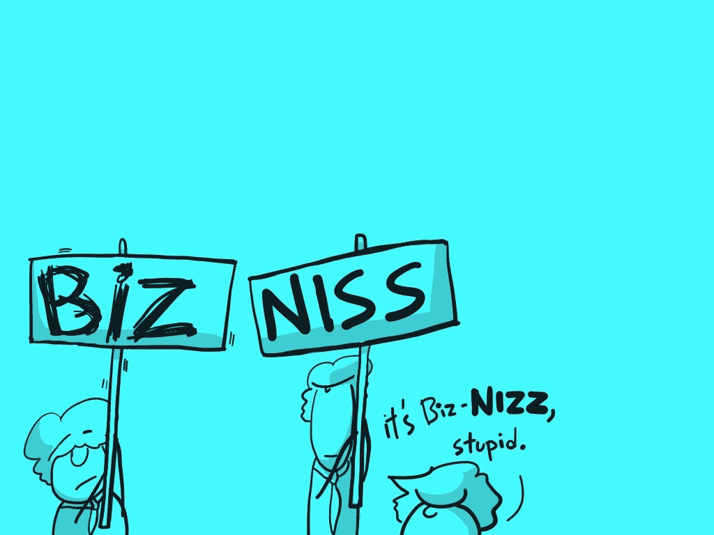

## 伴随着适度幽默的漫画

> 如果你不能简单地解释它，你理解得不够好
> 
> ——阿尔伯特·爱因斯坦

我们得到了很多建议。我们应该如何买车、系鞋带、做生意、倒立等等。最具挑战性但也是最重要的一件事是，你可以用这个建议来弄清楚什么是事实，什么是观点。

尤其是涉及到商业的时候，有很多*的观点在那里流传，比如:“**第一**最*最重要*的商业事情你现在需要专注于**并且放下其他一切，因为如果你不这样做，你会比你拼写 *clickbait 还快*破产*”。****

***正因为如此，我决定抛开噪音，重新主持我认为任何人都需要记住的关于商业的唯一课程。令人惊讶的是，像这样的列表真的很难找到，尝试谷歌“基本商业原则”，你会得到难以置信的建议，如“拥有伟大的领导力”和“创造伟大的数字”。***

***如果有的话，希望通读漫画至少会有点娱乐性。***

# ***原则***

## ***1.企业需要把有价值的东西卖给从中受益的人。***

***我们经常忘记，在某些时候我们需要一些人为我们提供的东西付费，为了让他们这样做，我们需要做一些对他们有利的事情，而不是对我们有利的事情。***

******

## ***2.一个企业需要赚的钱(收入)比花的钱(费用)多。最终，无论如何。***

***剩下的叫利润。如果做不到这一点，企业就会消亡。对于刚起步的新企业来说，赔钱比赚钱多是很常见的。然而，如果这种情况持续太久，那企业就有大麻烦了。***

***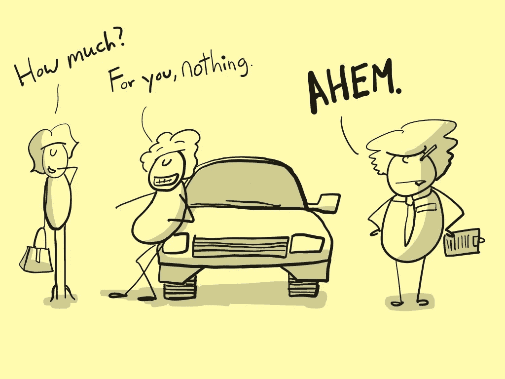***

## ***3.有时，企业从其他人那里赚钱开始，希望企业将来能赚更多的钱。***

***但是从其他人那里拿钱是很危险的。当这种情况发生时，许多企业会庆祝，即使这真的意味着他们有更大的压力来实现疯狂的期望。参见规则 1。***

***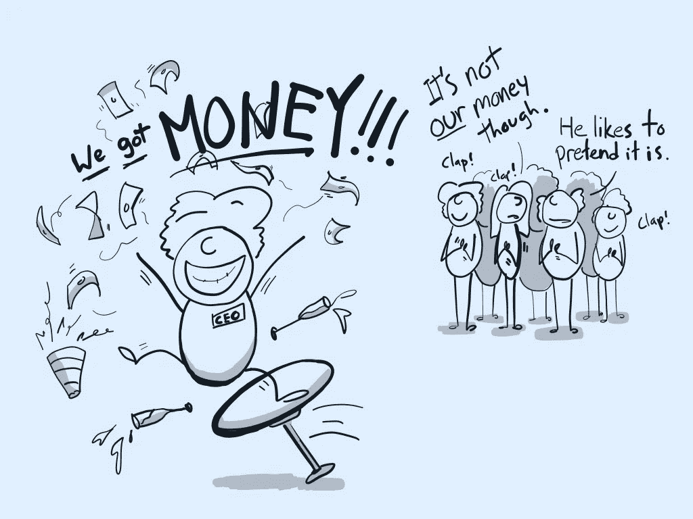***

## ***4.这些企业经常每年花很多钱而不会花光，希望以后能赚很多钱。***

***他们花了很多钱，因为如果他们迈出了第一步，其他人以后就很难模仿他们，这样他们就可以从容不迫地赚很多钱。***

***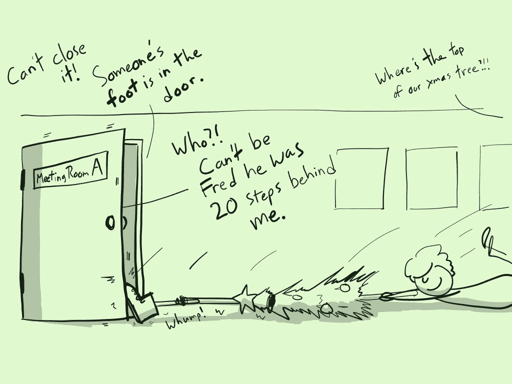***

## ***5.最好的商业策略是利用你拥有的每一块钱，尽可能多赚些额外的钱。***

***如果你把 1 美元变成 2 美元，你就相当不错了。如果你能把一美元变成 100 美元，你真的很棒。如果你把 1 美元变成 10 美分，你就完蛋了。***

***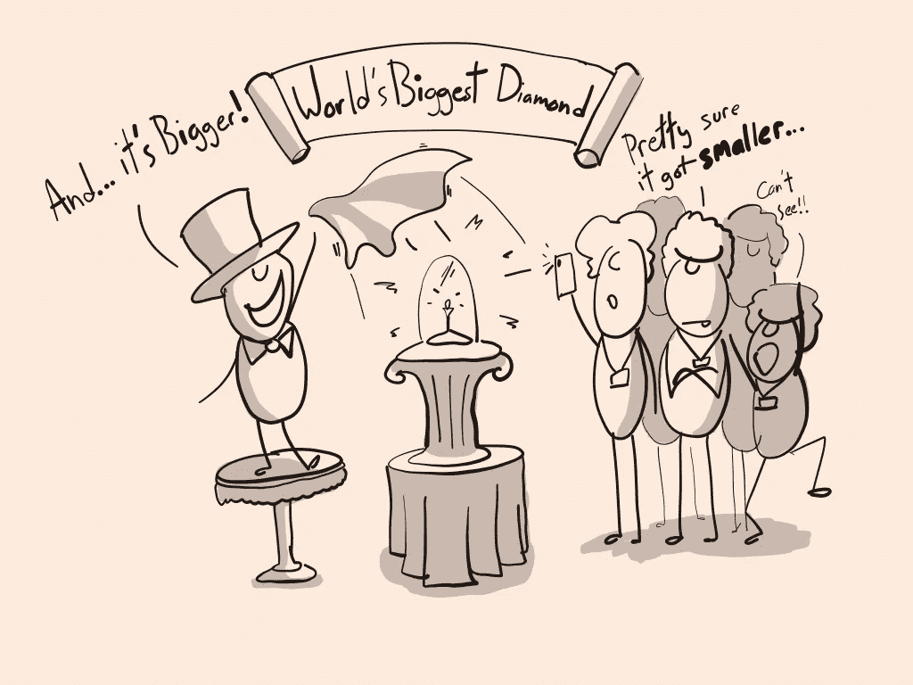***

## ***5a。顺便提一下，软件产品通常很擅长把一美元变成许多美元，因为生产一个额外单位的产品成本很低，不像汽车。***

***这是过去几百年来商业运作方式的巨大转变。这也是为什么现在有这么多的人试图建立软件业务！***

***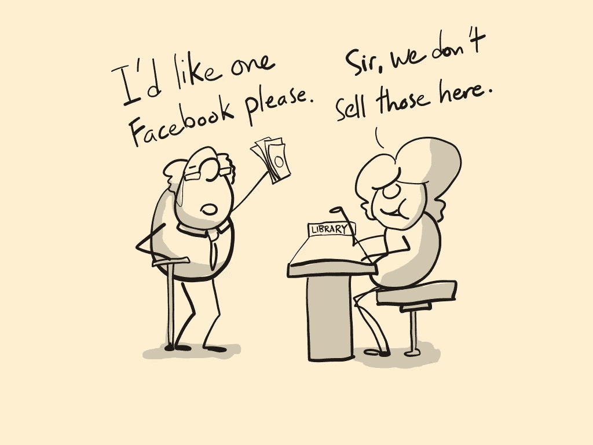***

## ***6.任何员工花费的每一美元或每一分钟最终都应该为企业赚取更多收入或降低成本。***

***投资一个更好的标志？有人需要能够证明一个更好的商标最终会以某种方式带来更多的收入。收购另一家企业？同样的事情。如今，许多企业会收购其他企业(其中一些企业的收入为零)，希望这些企业拥有的免费东西能帮助他们赚更多的钱。***

***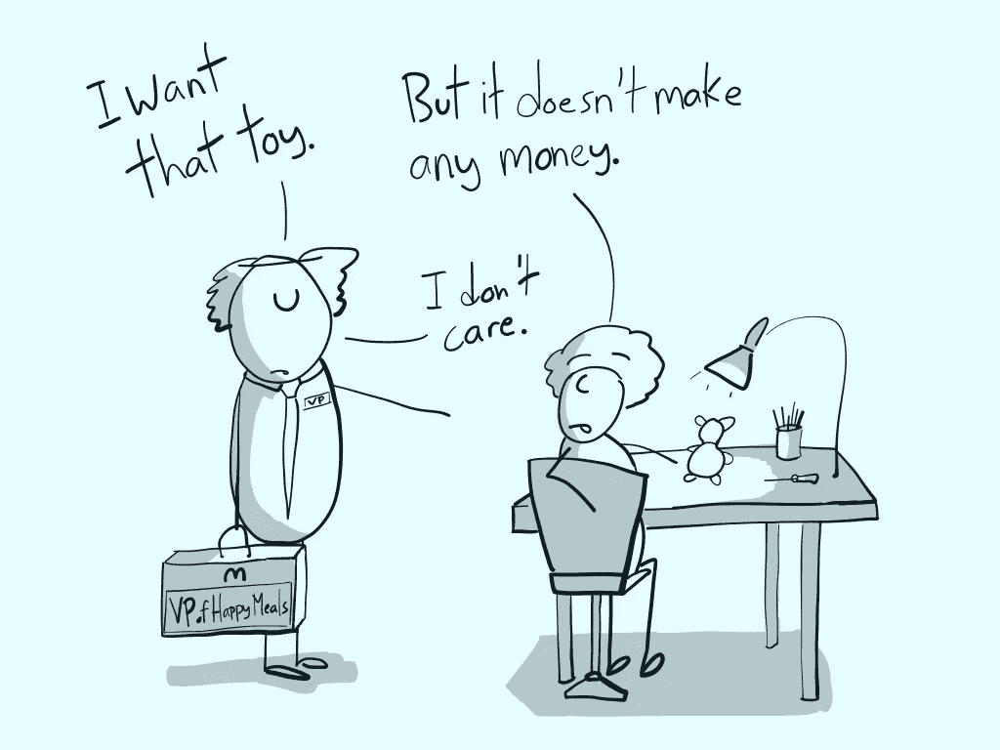***

## ***7.企业应该专注于能在人们睡觉时赚钱的活动。***

***产品通常在这方面做得更好，因为它们不睡觉。如果你卖的是服务(你自己)，你一天只能卖 24 小时。如果你喜欢睡觉，那就更不用说了。需要说明的是，你出售的一些服务可以给你的客户将来赚的钱的一定比例，这些钱在你睡觉的时候仍然可以赚钱！***

***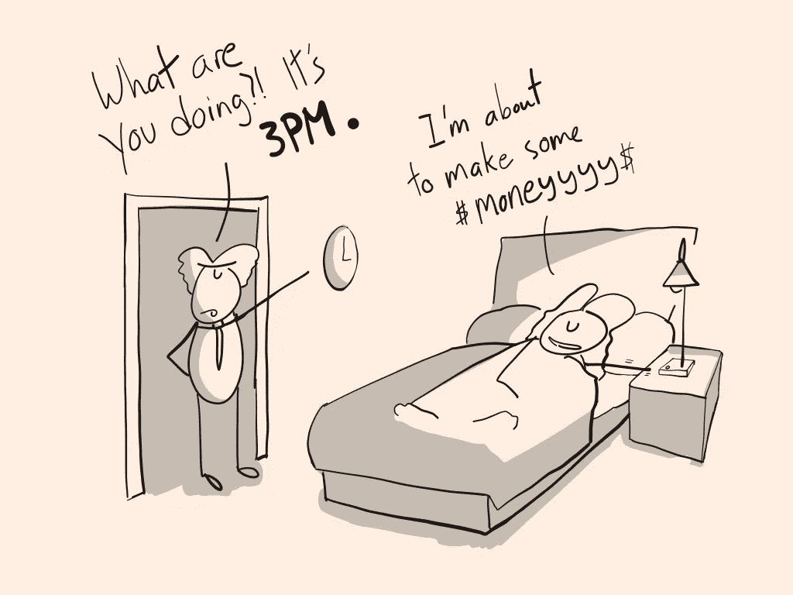***

***This list wouldn’t be complete without a Chines proverb. Here’s one — 手停口停 (if your hand stops moving your mouth stops eating). AKA — try and do things that can still feed you/pay for your food even if you’re no longer capable of using your hands for labour.***

## ***8.要想在商业上取得成功，就要做出人们真正想要的东西。***

***如果你能让某人想要他们甚至还不完全理解的东西，你就有所发现了。事实上，一些企业非常擅长制造人们想要的东西，以至于他们的顾客会想出各种理由来证明为什么购买是合乎逻辑的。***

***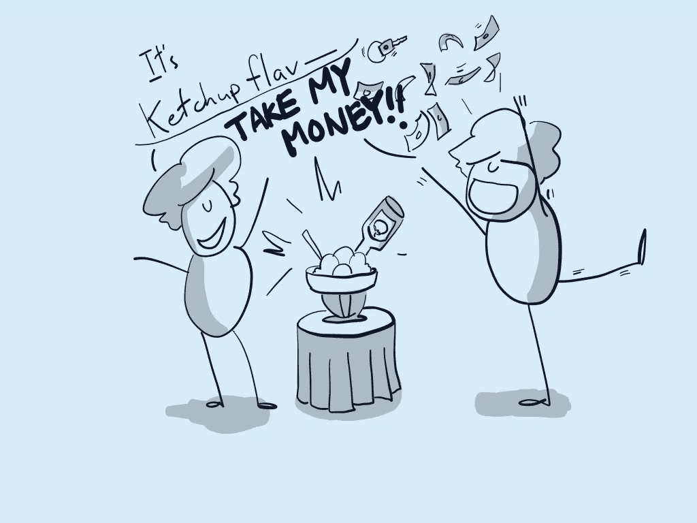***

## ***9.如果你发现了一个很好的机会，并增加资金，它会暴涨。***

***如果你发现了一些平庸的东西并增加了金钱，这只会让那些平庸的东西变得更多。在添加燃料之前花时间寻找合适的机会，否则你只是在浪费时间、金钱和资源。***

***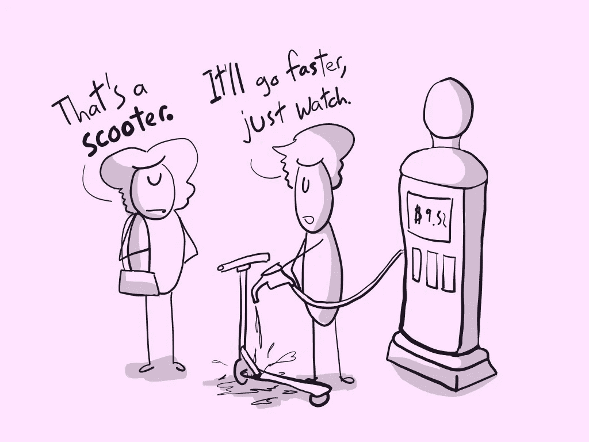***

## ***10.基于产品的企业只做三件事。他们制造人们想要的东西，说服人们想要它，然后把这些东西给那些人。***

***有些人喜欢为这三种活动取一些花里胡哨的名字。他们称“制造东西”为新奇的东西，如产品开发、工程设计和 T2 设计。他们称之为“令人信服的人”的东西有*销售*、*营销*、*领导一代*等等。最后，他们称之为“把东西送到人们手中”的东西有*分销*、*供应链管理*和*物流*等等。***

***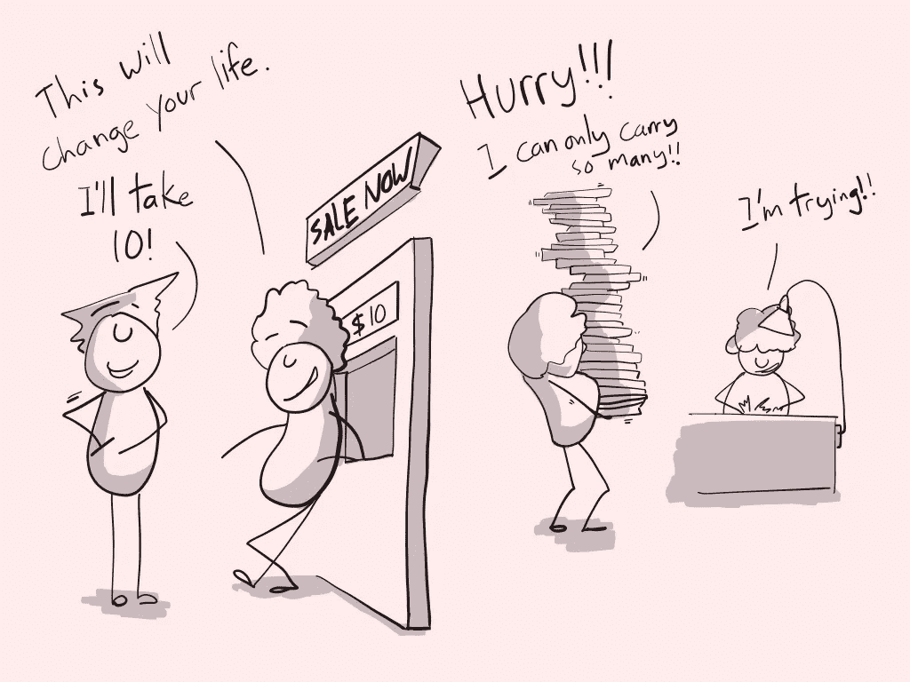***

***就是这样！***

***随着围绕着尽可能多的筹集资金，不赚钱的公司退出，我们忘记了这些是规则的例外，而不是规范。希望这是一个很好的提醒——有时，面对所有疯狂的媒体头条，我们忘记了我们试图实现的基本目标。***

***祝你好运，生意兴隆！***

***有创业想法？我正在开发一个产品，人们可以在投入数千美元开发之前测试他们的想法。**如果你想要一个负担得起的方法来测试想法，** [**在这里问一个关于 Scoops 的问题！花 12 美元，你可以向 100 个人提一个问题，然后对以某种方式回答的人进行跟进。**](https://scoops.io/)***

******

## ***这篇文章发表在 [The Startup](https://medium.com/swlh) 上，这是 Medium 最大的创业刊物，拥有+438，678 读者。***

## ***订阅接收[我们的头条新闻](https://growthsupply.com/the-startup-newsletter/)。***

******