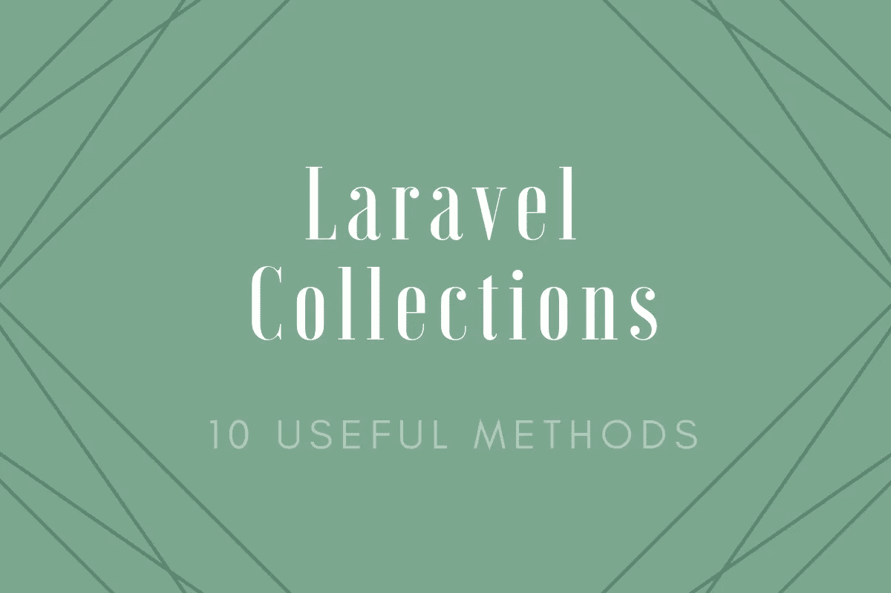

# 10 个有用的方法，你可以用在 Laravel 系列上

> 原文：<https://medium.com/swlh/10-helpful-methods-that-you-can-use-on-laravel-collections-e167e742dc37>

## 方便的方法，可以让你充分利用 Laravel 系列

Laravel 中的 Collection 类为处理数组提供了一个非常好的包装器。每个 Laravel 开发人员都不止一次地使用过 Collection 类，尤其是在使用口才的时候。在这篇文章中，我会给你 10 个…