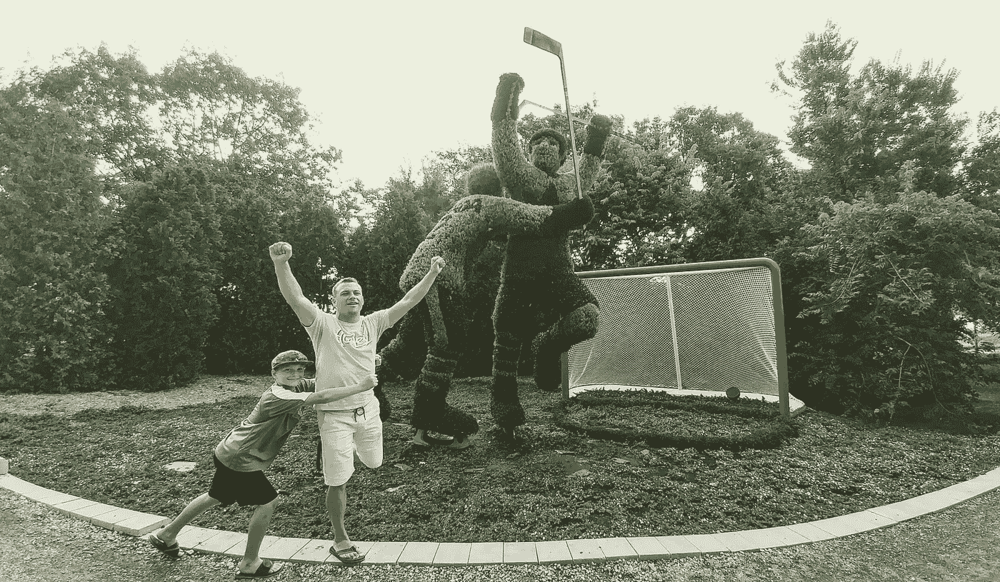

# 在你的生活和事业中获得成功的 10 堂宝贵的人际技巧课

> 原文：<https://medium.com/swlh/10-invaluable-people-skills-lessons-to-succeed-in-your-life-and-career-d16476a3789f>

社会交往是我们生活中至关重要的一部分。单独监禁在监狱中被用作最糟糕的惩罚形式之一，因为长时间不能与他人见面或交谈的精神痛苦在许多方面比实际的身体痛苦更糟糕。

但是与人打交道不一定容易，因为人都是……人。这意味着我们都是独特的，不同的，并不都有相同的价值观，背景和个性。

另一方面，学习如何与人相处对我们的幸福、总体幸福感和事业成功极其重要。

更具体地说，职业成功很大程度上是由于人际交往技巧和与他人相处的能力。研究表明，职业生涯中只有 15%的成功是由于技术能力和训练，而 85%是由于与他人打交道的能力。

艾伯特·维格姆博士对 4000 名失业者进行了研究。他们中只有 10%(或 400 人)因为不能从技术角度恰当地完成工作而失业，90% (3600 人)因为与他人相处的问题而失业。

让我们先来看看你能与人打交道的 **3 种方式**。

1.  **你可以通过武力、威胁、恐吓或智取他人来获取你需要的东西。罪犯肯定属于这一类，恶霸，但有些人更狡猾，会为了自己的利益而这样做。**

**2。你可以成为一个人际关系乞丐，乞求别人给你想要的东西。**这与接受者相反，他们宁愿安抚并失去所有选择的自由来换取对方喜欢他们。

**3。你可以在公平交换、互让……或者我喜欢称之为“双赢”的基础上运作。你把给别人他们想要和需要的东西当作自己的事业，作为回报，他们也给你你想要和需要的东西。**

武力夺取可能会在短时间内奏效，但是你交不到任何朋友，任何时候你在一种双赢的关系中运作，最终，你们都是输家。

当乞丐也一样。如果你在一种双输的关系中运作，你总是放弃让别人喜欢你，最终你会耗尽你的付出，同时你也会失去尊重。

> 关于人际交往技巧，你可以阅读的最重要的两本书是戴尔·卡耐基的《如何赢得朋友和影响他人》和莱斯·吉卜林的《如何拥有与人交往的信心和力量》。

在我看来，这两本书应该是每个高中生的必读之作，当然也是任何想在事业上取得成功并在生活中与人保持良好关系的人的必读之作。

除了这两本经典书籍，我还从许多其他读物、研讨会和领导力研习班中吸取了经验教训，来汇编我的**十大宝贵的人际技能课程清单，以在你的人生&职业生涯中取得成功。**

# **1。理解其他人感到重要的需求**

我想这应该是最容易理解的一个……因为我们都有一种天生的渴望，觉得自己很重要。虽然有时候，人们认为让自己变得重要的唯一方法是让别人失望，让自己开心。

但是，如果你能克服自己觉得自己重要的需要，并帮助别人觉得自己重要……猜猜会发生什么？他们通常会回报你的。

**让他人感到重要的三个步骤。**

**第一步** —觉得别人其实很重要……疯狂的对，什么概念！其实足够关心别人。如果你不是真的相信人很重要，那就很难伪装。这是第一步

第二步——注意其他人。注意他们的感受，他们的态度，努力成为一个好的发现者，并向他们提供真诚的赞美。又一次令人兴奋……花时间想想别人，而不仅仅是你自己？抱歉，我知道这些观点是不言而喻的，但我不得不艰难地学习它们。

**第三步** —不要试图给他们留下印象……被他们留下印象。现在，这并不意味着给予虚假的赞美或试图讨好别人只是为了从他们那里得到一些东西。这可以归结为简单地试图找到他们身上让你印象深刻的东西，并让他们知道。遇到真正成功的人，他们很可能会努力帮助你，谈论你多于谈论他们自己。

# **2。** **不要试图赢得所有的小战役**

这也是一个难题，尤其是对某些特定的人来说。如果你倾向于对自己和对别人都很苛刻，坚持规则，没有灵活性，那就很难长期维持良好的关系。

你可能会让人们暂时做你想让他们做的事情，但他们不会做很久。我记得在高中的时候和一个体育老师就网球问题发生了争执。他说某个镜头以某种方式命名。作为一名网球运动员，同时也是这项运动的忠实追随者，我在全班同学面前纠正了他三次。

现在我是对的…但有时你可能是对的，但同时也可能是错的。我让老师在全班面前出丑，也失去了他的尊重。

不仅对老师和班级没有帮助，而且那场小战斗的重要性也毫无意义。我必须学会放下那些在大局中无关紧要的小事。

# **3** 。**故事置顶**

你是否曾经在晚宴、聚会或社交场合中，有人总是试图超越其他人的故事？如果不是…那么也许你就是那个人！哎哟…

故事排行榜总会有比你更好的东西。主题无关紧要。你买了一辆车…他们有一辆更好的。你建了一栋房子…他们有一栋更好更大的房子。你的孩子打水平曲棍球…但是他们的孩子打 AA 曲棍球。

如果他们不能超越你的故事…他们知道更好的人已经做到了，他们会告诉你的。

只是…不要…请。

为你的孩子感到骄傲是完全可以的，作为父母，我认为我们大多数人甚至没有意识到这一点。我们想鼓励他们，吹嘘他们，以建立他们的信心。

但是相信我，我妈妈经常在家庭聚会上分享我和我姐姐的成就，尽管她是出于好意，因为她为我们俩感到骄傲…这让我非常不舒服，可能对我的阿姨、叔叔和堂兄弟来说就像故事一样，他们不得不听着并与我们进行比较(妈妈，如果你看到这封信，爱你…你是最棒的)！

为你所取得的成就感到骄傲是可以的，但是吹嘘它不会用赞美来吸引你。这是谦虚的地方。真诚的赞美和认可会让你更加感激。

另外，没人想和一个无所不知的人在一起。

# **4。** **做个好听众**

你有两只耳朵和一张嘴，要按比例使用。成为一个好的倾听者是可以学习和培养的。这是解药的故事。

要成为一个好的倾听者，从观察他人开始。如果你在和别人说话，看着你的手机、电视或周围的环境，你对对方到底有多感兴趣？

实际上，要感兴趣…即使谈话的主题不是…试着参与进来。

友好地向他们倾斜，问一些问题来保持对话并表现出兴趣，不要打断他们，而是让他们多讲一些。我记得我第一次知道这个概念的时候，我想尝试一下。

我参加了一个商务会议，和一个我刚刚通过一个共同的朋友认识的新朋友进行了交谈。我的朋友不得不离开一会儿，只留下我们两个在一起。

30 分钟，我根本没有机会谈论我…我问问题，表现出兴趣，让对话继续。30 分钟后，他终于问了一些关于我的事情，当我去回答时，我的朋友出现了。

我以为他不会把我看得很重……但是第二天我发现那个人打电话给我们共同的朋友，告诉他他多么喜欢我们的谈话，他认为我有多聪明。

记住…我真的什么都没说！但是因为我同意了他，让他说他喜欢的话题……他，他觉得我一定是个聪明人。

# 5.**AAA 公式——接受、认可、欣赏**

这来源于《T2》一书《如何拥有与人相处的信心和力量》。莱斯·吉卜林总结了我们到目前为止讨论的很多内容，但它是一个很好的提醒。

当我们不加评判地接受他人时，当其他人能感觉到我们认可他们的为人，我们欣赏他们的为人时，很有可能在任何情况下都更容易与他们相处。

所以，记住你与他人关系中的三 A 公式…接受、认可、欣赏，你将成为人际交往技能的全明星。

# 6.**三重 C 公式**

这一条来自戴尔·卡耐基的《如何赢得朋友和影响他人》，是 AAA 公式的另一面。

3c 从不批评、谴责、抱怨。

这里有一个小挑战:

> 试着连续 24 小时不对任何人批评、谴责或抱怨任何事…相信我…这比看起来要难多了。我打赌你会在一天中的某个时间点对自己思考…我不能说话！！！

现在这对其他人有效，但对我们自己也有效。我们自言自语的次数比任何人都多。

如果我们不停地批评、谴责和抱怨自己，我们就不能指望对别人积极。所以从我们开始，然后是其他人。

# **7** 。**让别人挽回面子**。

想象一下你正处于这样一种情况，你要么在争论，要么在“我告诉过你”的时刻，你建议某人做或不做某事，而他们却反其道而行之。

现在他们失败了，而你有吹牛的权利把它放回他们面前…对吗？…错了！

看，人们在试图赢得争论时犯的最大错误是攻击对方的自我。不管我们愿不愿意承认，我们的自我是一个极其强大的动力。

人们会因为争论而记仇几十年，甚至几代人。

离婚，公司解散。报复通常是对受伤自我的回应。

所以让对方挽回面子，不要吹嘘自己是对的，尤其不要说“我早就告诉过你了”。

在与人谈判时，你要给他们留一个后门，同时还要保护他们的自我，这样才能与人保持良好的关系。

# **8** 。一个被说服违背自己意愿的人仍然持有同样的观点。

这又回到了最初与人交往的方式。如果你处于权威或权力的位置，你可以很容易地让人们出于恐惧或恐吓去做事情。

但这并不意味着它会持续下去。一旦你离开，或者不再掌权，你对他们的影响也随之消失。

我记得我 5 岁的儿子是一个典型的男孩，对他的姐妹们很讨厌，我们让他暂停上楼。

他不想坐下来，最后在足够的威胁和提高我们的声音下，他终于坐下来了。几分钟后，我们回来让他继续玩，我问他是否吸取了教训。他的答复如下:

> 嗯…我坐在外面，但我仍然站在里面。

他屈服于我的权威，但他丝毫没有改变他的想法或对形势的看法。

让别人觉得这个主意是他们首先想到的，并让他们把它归功于自己，这比试图把你的观点强加给别人要容易得多。

# **9** 。**表扬和赞赏**

在 20 世纪早期的一系列实验中，亨利·戈达德博士使用了一种叫做测力计的仪器来测量疲劳。

他发现，当孩子们进来并表现出一定程度的活力，并得到真诚的赞美和鼓励时，他们的活力水平会突然上升并保持在更高的水平。

然而，每当对同一个孩子说了一句批评的话，他们的精力水平就会下降。

我们对自己说的话对我们自己的态度和我们对别人的态度有很大的影响。

如果你想在你的学校、你的家庭、你的工作场所与他人保持良好和谐的关系，做一个好的发现者，并真诚地赞美他人。你会发现人们会想在你身边获得那种能量。

但是如果你总是批评一切，他们会像躲避瘟疫一样躲避你。有些人当他们走进一个房间时，灯就亮了…其他人，当他们离开时灯就亮了。

我宁愿你点亮房间。如果你必须提供建设性的批评，那么只在必要的时候少量提供。

私下做，不要在别人面前。

> **总是批评行动…而不是人。**

Bob，我很感激你最近所做的一切，但是上班迟到(行动)是不可接受的。我相信你会进步并准时前进。

这被称为[三明治技巧](https://youtu.be/nsinjYr7CYI)…夹在两个积极肯定之间的建设性批评。

# **10** 。**电子邮件&消息**

最后，我会给你的书面交流提供一些建议。在一个短信、即时通讯和电子邮件的世界里，很容易在这方面犯关系错误。

> 第一个建议是当你写信息的时候… **不要全部用大写字母**…听起来像是你在大喊大叫。

我记得在一份新工作中，销售代表一直用大写字母给我写信……几天后，我把他带到我的办公室，问他是否生我的气？他不知道。

请注意，当打字时，如果全部使用大写字母，会传递错误的信息…除非这是你的目标。

当收到一条让你的压力因为某种原因而上升的信息时…在回答之前花点时间。太多时候，我们看到人们读了一条信息，以错误的方式理解它，然后马上回复。当错误的动机被应用时，事情会很快升级，人们会感到被冒犯。

当我们通过短信交流时，很难看出对方的感受，他们的语调，语调，身体姿势。

此外，我们在那一刻的感受会影响我们对信息的解读，并开始赋予信息动机。

通常我会让其他人先阅读信息，然后再发送我的回答，以确保我们看到的是同一件事。

很多时候，中立的人会以一种完全不同于我的方式看待信息，当情绪不在其中的时候。

一旦一条信息消失并被阅读…就很难把它带走。如果你觉得在几个回复之后，对话就偏离了轨道…拿起智能手机，通过与他人交谈来使用智能手机的智能部分…是的，他们仍然可以这样做！通过应用这些简单的规则，你会节省很多人际关系。

这就是你想要的……提高人际交往技巧的 10 堂课。

还有很多，我们可以对每一个进行长期扩展，但这是一个很好的开始！

我向你保证，如果你开始在生活中运用它们，你在家里、工作中、学校中的人际关系都将得到改善，你将成为人际交往技能的全明星！

[**www.careeryearacademy.com**](http://www.careeryearacademy.com)