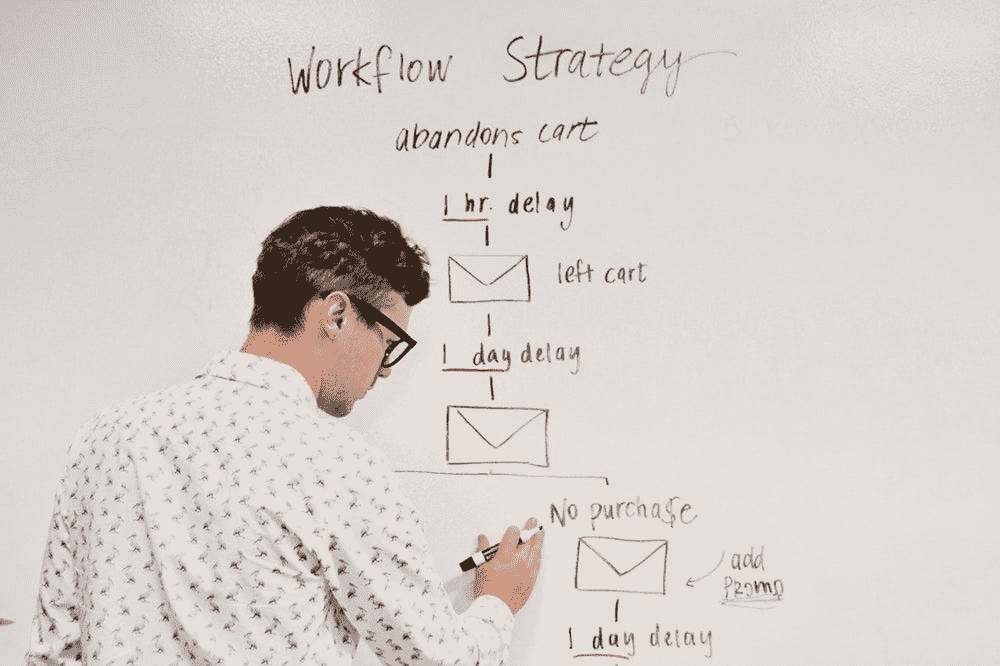
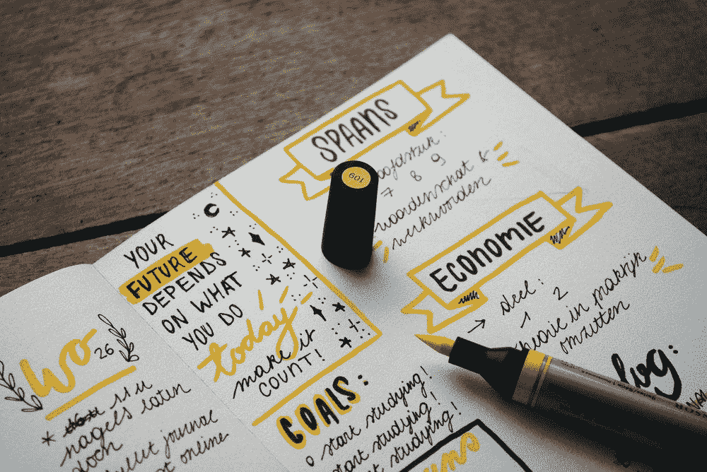

# 10 个可能埋葬你与影响者关系的错误

> 原文：<https://medium.com/swlh/10-mistakes-which-can-bury-your-relationships-with-influencers-400cd25e5de3>

特定社会或专业群体中的意见塑造者可以成为你的长期投资，成为你品牌的律师或大使。在业内思想领袖的帮助下花费在推广上的资金将帮助你获得惊人的效果。如果因为你粗心大意犯下的某一种错误而失去这些人的好感并停止与他们做生意，那将是令人遗憾的。在这种情况下，与舆论塑造者建立互利的合作关系是一项非常可行的任务。

有一次《赫芬顿邮报》发表了一篇文章，其中营销人员自己列举并评论了他们在与思想领袖合作时所犯的错误。考虑到他们表达的有价值的想法，NinjaPromo 编制了一份完整的清单，列出了与有影响力的代理人建立密切联系需要知道的一切。

# 错误#1:你不提供交叉使用的合作

舆论塑造者可以为你的品牌提出许多令人兴奋且有利可图的建议。但是他们会期望得到一些回报。公司经常低估他们的工作，并为他们的工作提供尽可能低的报酬。

但是随着市场营销越来越受欢迎和有用，思想领袖被宠坏了。如果你的提议只考虑你的利益，只对你有利，他们就不会和你算账。

> ***只有 25%的微观领导者认为品牌了解质量影响力营销计划的真正价值。***

**如何避免那种**

*   在提出建议之前，对意见塑造者和他以前的工作成果进行研究；
*   评估后，给他/她一份体面的工作报酬；
*   询问他/她对与你合作的期望，如果他/她真的能帮助你实现目标，提供同样有益的合作。

Photo by [Brooke Cagle](https://unsplash.com/photos/g1Kr4Ozfoac?utm_source=unsplash&utm_medium=referral&utm_content=creditCopyText) on [Unsplash](https://unsplash.com/search/photos/cowork?utm_source=unsplash&utm_medium=referral&utm_content=creditCopyText)

# 错误 2:你不断改变你的营销计划

对于营销人员来说，这个话题是没有线索的。有些时候，你的营销计划会突然改变，正因为如此，你可能会失去一些人的兴趣。

与你一起工作的意见领袖应该知道你的营销议程，以便能够创建一个有效的内容计划:图像、博客帖子、视频或评论。

> 如果你继续这样改变你的营销计划，从长远来看，这可能会危及你和他们的关系。

**如何避免这种情况**

影响者需要了解你的营销计划:

*   促进新产品的推出；
*   推广一项活动；
*   推广竞赛或提供折扣；
*   提高品牌知名度；
*   增加转换或流量的数量。

无论你设定什么目标，你最好提前知道；在你开始与思想领袖谈判之前。

Photo by [Campaign Creators](https://unsplash.com/photos/--kQ4tBklJI?utm_source=unsplash&utm_medium=referral&utm_content=creditCopyText) on [Unsplash](https://unsplash.com/search/photos/marketing-plan?utm_source=unsplash&utm_medium=referral&utm_content=creditCopyText)

# 错误 3:你低估了他们的创造力

思想领袖可以创造高质量的内容，可以显著增加你的流量，提高搜索引擎优化性能。他们很清楚他们的观众喜欢什么，不喜欢什么，这有助于他们更有效地计划和创造内容。

当然，你可以要求他们根据你公司的需求和特点改编内容，但当然，你不应该压制他们所有的创作潜力。

> 请记住，有影响力的代理人不会发布可能损害其声誉或令其受众不愉快的内容。

强迫他们这么做，会毁了和他们的关系。

**如何避免那个**

*   看看影响力的代理人目前在做什么，弄清楚你如何让你的品牌融入这个过程；
*   观察其他公司如何使用其代理的内容；
*   给影响力的代理人创造的自由，看看他们能创造什么。

# 错误 4:缺乏激励

影响力营销是一个永久的过程。只要思想领袖对你有益，你就会一次又一次地想和他/她一起工作。然而，有效营销的关键也是积极的沟通。

> 根据 Linqia 的调查，只有 50%的营销人员在影响者营销项目上花费超过 25 小时。

给你的影响力代理人足够的时间是与他发展关系的第一步。

**如何避免那种**

*   将影响力代理添加到您的邮件列表中。通知他们新产品、公司事件等。如果能给他们发一封亲笔信，那就更好了；
*   推出新产品时，给他们打折券或提供免费样品。他们会觉得有特权并融入到你的公司中。

Photo by [Priscilla Du Preez](https://unsplash.com/photos/XkKCui44iM0?utm_source=unsplash&utm_medium=referral&utm_content=creditCopyText) on [Unsplash](https://unsplash.com/search/photos/cowork?utm_source=unsplash&utm_medium=referral&utm_content=creditCopyText)

# 错误 5:你要求没有经验的员工与他们保持一致

营销人员同时参与几个项目的情况并不少见。很有可能，他们会将与一个或另一个意见塑造者合作的责任委派给一些还没有足够经验的年轻员工。他/她可以不给予思想领袖应有的尊重和关注。

**如何避免这种情况**

*   告诉工作人员通知你与有影响力的代理人谈判的所有方面，以便你消息灵通；
*   不时与有影响力的代理人取得联系；
*   要求您的团队为代理提供清晰的说明以及在创建内容的过程中可能对他们有用的所有材料。

# 错误 6:你设定了不切实际的目标，并期待快速的结果

听起来很熟悉？受我们竞选理念的启发，我们倾向于设定不切实际的目标，然后期待立竿见影的效果。由于难以衡量营销影响力的投资回报，你可能会不耐烦，并开始向你的思想领袖施加压力。

> ***评估意见塑造者营销活动成功与否的指标:影响范围、参与度、受众情绪、流量、转化数、销售额、其他。***

**如何避免那个**

提前决定你将如何衡量影响力营销活动的盈利能力。这包括你将如何跟踪来自你的影响力代理的线索。您可以:

*   给每个代理分配一个唯一的代码；
*   为活动推出新的品牌标签；
*   给每个意见塑造者一个独特的、可追踪的链接。

Photo by [Estée Janssens](https://unsplash.com/photos/zEqkUMiMxMI?utm_source=unsplash&utm_medium=referral&utm_content=creditCopyText) on [Unsplash](https://unsplash.com/search/photos/goal?utm_source=unsplash&utm_medium=referral&utm_content=creditCopyText)

# 错误 7:延迟付款或违反合同

不幸的是，代理商往往会对某些在交易结束后拒绝向代理商支付全额费用的公司写下疯狂的评论。 类似的关于与贵公司合作的报道不会给你带来任何好处。

**如何避免那种**

*   在合同中明确你所期望的结果，以及如果事情按照另一种情况发展，会有哪些改变。

# 错误 8:你使用了意见塑造者的内容，但不信任作者

使用他人的内容而不指明作者是一个相当严重的错误，即使这是由于疏忽造成的。

> ***无论您在何处使用您代理的材料(电子邮件列表、博客、社交媒体)，您只需指明其作者。***

**如何避免那种**

*   如果您分享您的影响力代理人的文字出版物、视频或图像，请确保在社交媒体上发布他们的网站或个人资料的链接；
*   感谢他们同意分享他们的内容。

Photo by [Tyler Franta](https://unsplash.com/photos/iusJ25iYu1c?utm_source=unsplash&utm_medium=referral&utm_content=creditCopyText) on [Unsplash](https://unsplash.com/search/photos/author?utm_source=unsplash&utm_medium=referral&utm_content=creditCopyText)

# 错误 9:你认为与代理商的合作是一次性的

在一份合同之后，不继续与思想领袖合作将是你的一个大错误。同意:既然你花了这么多时间去找适合你的经纪人，那就花时间和他维持关系吧。

**如何避免那种**

*   和他们讨论你的长期营销计划和他们的成长前景；
*   邀请他们参加庆典和其他活动，让他们成为你公司的一部分。

# 错误 10:你不信任他们

当然，你不能盲目相信所有新的意见塑造者，但这并不意味着你需要质疑他们的每一步。信任必须是相互的。

> 他们必须相信你的品牌，你——相信他们的影响力和他们的内容。

**如何避免那种**

*   信守承诺；
*   不要对人有偏见。允许他们证明自己的有用性。

# 输出

影响力营销的势头越来越大，上面提到的规则会让你获得这个策略的所有好处。你与有影响力的代理人的关系的基础应该是诚实和尊重。我们认为只有这样你才能建立双赢的合作关系，这将有助于你的业务发展。

*感谢您阅读这篇文章！如果您喜欢它，请分享它，并告诉我们您对影响者营销的看法。另外，你可能会喜欢我们的其他故事:*

> — [微影响者营销:2019 年如何运作？](/@NinjaPromoAgency/micro-influencer-marketing-how-does-it-work-in-2019-cfde970ae74f)
> 
> — [你想知道的关于社区管理的一切](https://hackernoon.com/how-to-move-crowds-or-all-about-community-management-27e56cceb7dc)
> 
> —[2019 年影响者营销趋势](/@NinjaPromoAgency/trends-of-influencer-marketing-for-2019-3396c0e2e000)
> 
> — [为什么微影响者和区块链项目属于一起](https://hackernoon.com/why-micro-influencers-and-blockchain-projects-belong-together-e1194e4cb2bd)

## 这篇文章发表在 [The Startup](https://medium.com/swlh) 上，这是 Medium 最大的创业刊物，拥有+444，678 读者。

## 在此订阅接收[我们的头条新闻](https://growthsupply.com/the-startup-newsletter/)。

