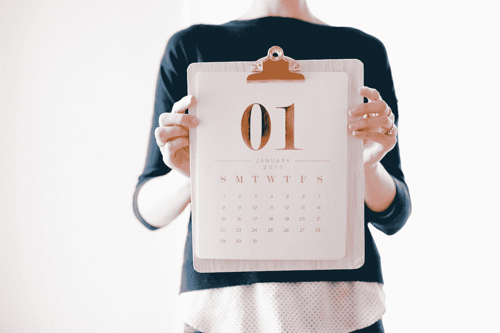

# 我在 2018 年学到的 10 个痛苦的教训让我成为一个更好的人

> 原文：<https://medium.com/swlh/10-painful-lessons-i-learned-in-2018-that-made-me-a-better-person-19522ac9f074>

Photo by [Brooke Lark](https://unsplash.com/@brookelark?utm_source=medium&utm_medium=referral) on [Unsplash](https://unsplash.com?utm_source=medium&utm_medium=referral)

如果我能在 2018 年 1 月 1 日给自己发一篇博文，它会这么说..

汤姆，你需要学习一些东西。

这里有 10 条经验可以让你今年的压力小很多..

# 1.事情会变的，笨蛋

Medium 在 7 月份对他们的算法进行了大规模的修改。影响广泛而深远。各种各样的作家尖叫着，叫喊着，像没头苍蝇一样跑来跑去。

我意识到我太依赖 Medium wayyy 来表达我的观点，并且作为一个创作者来“接触”它。

> 这个故事的寓意是:事物是会变化的。平台转换它们的算法。不要躺在功劳簿上，期望事情总是一成不变。

解决方法:**分散投资。**

# 2.现在就做出艰难的决定

去年我犯了一个可怕的错误，把一些“艰难的决定”推迟到以后，以便给自己更多的时间。

不过，我内心深处知道需要发生什么。

随着邦德变得越来越强大，越来越成熟，我意识到我会飞得越来越高，而不会去想如果我让某些人离开，我会掉下来。

> 故事的寓意:“决策拖延”持续的时间越长，就会导致更多的内疚、痛苦和心痛。

解决方案:**现在就做出艰难的决定。尤其是涉及到人的时候。**

# 3.欢迎朋友的批评(即使你不想)

我讨厌被告知如何变得更好。不是因为我认为自己是完美的，而是因为我觉得这让我与他人相比处于弱势。

好像他们比我强——居高临下地跟我说话。

> 但我们都搞砸了，对吧？

我在 2018 年底意识到，如果你每次都像个婴儿一样，没有人会告诉你哪里错了。

女士们先生们，这是停滞和衰退的公式。我不擅长这个，但是我正在努力认识到没有人真的比其他人“更好”。事实上，如果你乐于接受批评，那已经让你凌驾于大多数人之上，因为我们很多人讨厌听到我们如何做得更好。

> 这个故事的寓意:你并不完美。但你也喜欢你的自负。

解决方案:**认识到每个人都是一团糟。我们都有问题。告诉你你的问题的人也有他们的问题。变好！**

# 4.不要什么都告诉所有人

你的生活就是你的生活。

你不需要在社交媒体上广播一切/告诉父母你生活中的每一个小细节。

> 为什么？因为你感受到的很多情绪都是转瞬即逝的东西。

当你在每一个特定的机会让每个人都知道你的每一种感受时，就开始感觉像“喊狼来了的男孩”

> 这个故事的寓意是:在同样的 4 小时内，我们中的许多人会感到快乐，然后极度紧张。😆它能让人坐上过山车，让任何观看的人都感到厌烦。

解决方法:**做你就行。把优柔寡断留给自己。如果你这样做，人们会更加尊重你的决定。**

# 5.如果你们相隔 10 英里——走 9 英里

今年我意识到我们都搞砸了。老师、叔叔、父母、政客(yikes)，以及许多我们尊敬的人。还有我们。

> 在我的一生中，很多次我都在想为什么我的朋友不为我做更多的事情。

他们为什么不给我打电话？当我遇到好事时，为什么他们不像我为他们做的那样表示支持？

为什么他们不喜欢我的女朋友——或者至少试着像我为他们做的那样喜欢我的女朋友？😆

> 好吧，如果我一生都在抛弃每一个不做我认为我应得的事情的人，我可能会在没有朋友的情况下结束生命。

这并不能抹杀你应该得到更多的事实，但这也是一种相当孤独的生活，不是吗？

老实说，我们都比自己想象的更糟糕。

所以我的建议是，当你和别人相距 10 英里时，走 9 英里去找他们，然后闭嘴。他们会走另一英里。

> 这个故事的寓意:你应该得到一些东西，但要意识到，我们面对的人并没有走完他们的 5 英里，因为他们缺乏安全感，而且像世界上许多人一样有缺陷。不是因为你做错了什么。这应该会让 9 英里的旅程变得更容易忍受。

解决方法:**步行 9 英里。**

# 6.不要因为别人做某事而去做

> 今年，我发现脸书视频取得了一点成功，11 月，我在马尼拉举行了第一次面对面的“聚会”。

太棒了！我玩得很开心..

但是我很紧张，因为所有人都在活动前离开。

> 在去那里的路上，我想知道为什么我一开始就安排了一次会面(因为我是一个受惊吓的小孩)。我不介意拥有它，但我想知道为什么我一开始就想要一个。

我意识到这是因为这是许多其他脸书视频创作者所做的，而我，在自动驾驶仪上，决定跟随他们的领导。

我最近意识到，不做别人正在做的事情也没关系。

> 这个故事的寓意:聚会没关系，我会做更多！但是，不要在没有意识到的情况下变成你崇拜的人的复制品，这也很重要。

解决方法:**自我意识意识到自己到底想要什么。自信地只做你需要的事情..仅此而已。**

# 7.你 90%的担忧都不重要

> 今年我花了很多时间担心财务状况。我像老鹰一样追踪支出和收入——每月花 5-10 个小时担心我的未来和“净值”

想知道一个有趣的故事吗？

我在 12 月比 2018 年的任何一个月都做得多——而且我制作的视频更少，发布的博客更少，基本上把它视为“重建”的一个月。

很疯狂，对吧？

就像，我不在乎的那个月，我的票房比以往任何时候都高。感谢生活。

> 这个故事的寓意:担心，但不要太担心。

解决方案:**未来充满了能帮你摆脱烦恼的事情。只是太模糊了，现在看不清它们到底是什么。**

# 8.事情会发生变化——朝着好的方向

> 这与第一点相反。就像我们无法预见的坏事一样，好的事情也会发生，这是我们从未预料到的。

我从没想过我的脸书主页会在今年爆掉。从来没有。

我想我会在 Youtube 上成为一名视频创作者。

> 我也从未想过通过视频广告从脸书赚钱。

这些事情是我从来没有预料到的。

所以只要留意地平线，你也永远不知道会有什么好事情发生。

> 这个故事的寓意:坏事会发生，但好事也会凭空出现。

解决方案:**无—这是一件好事！😉**

# 9.你不会永远做不好事情

我在菲律宾的头几天，我很不安。我从来没有觉得不安全，真的，我只是觉得每个人都在盯着我看。

> 我觉得自己一个人来这里是个错误..

然后我就安顿下来了。我交了很多朋友。我参加聚会。我“成熟了”

很多次，当我们尝试新的东西时，它让我们燃烧，然后我们立刻认为它不适合我们。但事实是，我们只需要给自己多一些“代表”

我觉得什么都可以学。只是需要一些时间。

> 这个故事的寓意是:如果你做不好某件事，你最终会做得更好。不要气馁。

**解决方法:忍耐。对过程的信念。**

# 10.你应该优先考虑生活方式而不是成长

我度过了难忘的 2018 年。真的。

但是我一年中的大部分时间都在埋头工作。至少有半年时间是独自在我的房间里被炸成碎片的。

> 没成功。饮食不正确。是的，作为一名创作者，我成长了很多，我的技艺也变得更好了，但是如果我的月份就这样消失了，我变得更好又有什么关系呢？

生活就是为了活着。

2019 年，我希望生活方式优先于成长。健康——身心健康。幸福。正念。

> 故事的寓意:雄心是伟大的，但生活方式是真正幸福的关键——而不是一些崇高的目标。

解决方法:**给自己更多的时间停下来+凝视。**

感谢您的阅读！

*想在 Medium 上赚点外快吗？本周我将主持一些免费培训，题目是“* ***如何在 Medium 上每月额外挣 900 美元****”*[*在这里获得免费座位*](https://events.genndi.com/register/169105139238473045/da2e6c5a01) *！*

## 这篇文章发表在 [The Startup](https://medium.com/swlh) 上，这是 Medium 最大的创业刊物，拥有+405，714 读者。

## 在这里订阅接收[我们的头条新闻](http://growthsupply.com/the-startup-newsletter/)。

