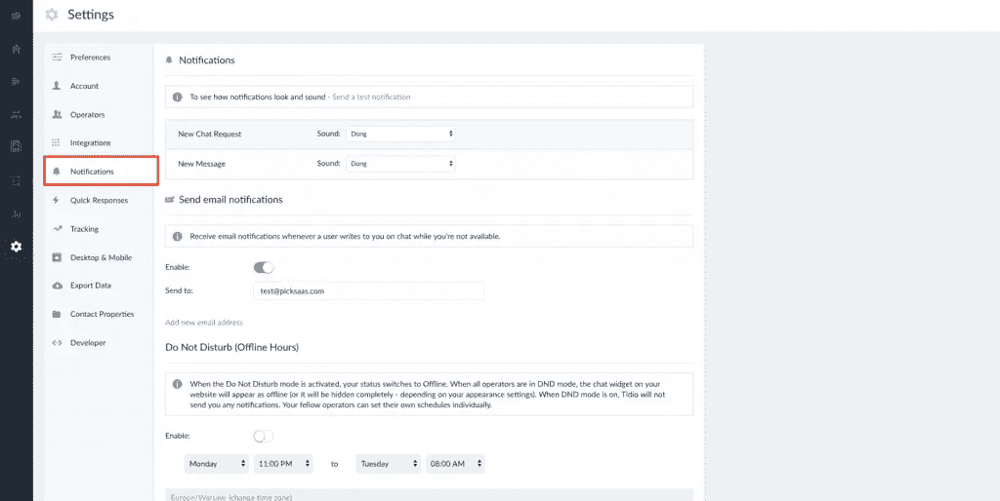

# 使用实时聊天技术获得类似亚马逊的客户服务的 10 个步骤

> 原文：<https://medium.com/swlh/10-steps-to-amazon-like-customer-service-by-using-live-chat-technology-a0dae27373c0>

为什么做优秀的客服这么难？

看起来这是关于我们反应的速度和质量。但是是吗？尽管如此，大多数公司未能提供最高的客户服务标准，最终只能提供平庸的客户支持。

原因是**不仅仅是你向客户提供支持的方式**。这也是你的顾客在遇到你的品牌时的体验，包括**速度、质量、价格或个人态度**。

***如***

*我最近预订了瑞安航空公司的航班，但在购买机票时误输入了错误的姓名信息。在支付预订费用几分钟后意识到这一点后，我用了不到几分钟的时间就连接上了瑞安航空的实时聊天客户支持，速度快得惊人。*

*经过简短的解释，我得知更改机票上的姓名将花费我大约 15 美元。我在订票时输入了错误的名字，所以付款似乎是合理的。*

*但是，我在瑞安航空的客户服务体验*会在我的脑海中保持*卓越吗？肯定不是。毕竟，我不得不额外支付 15 美元，尽管我在购买后立即报告了这个问题。*

现代技术对我们的客户支持工作非常有帮助，如果没有合适的技术，它很可能无法正常工作。然而，准备好所有的技术，如实时聊天软件，还需要**每天每分钟都付出额外的努力，让您的客户体验越来越好**，有时会以牺牲您和您的企业的短期利益为代价。

因此，在我们研究如何在您的业务中使用技术之前，让我们来看看一些提供顶级客户服务的顶级品牌。

# 顶级品牌以卓越的方式提供客户支持

这些品牌因其向客户提供客户支持的方式而闻名。

## 亚马孙

Amazon’s customer service

亚马逊最重要的座右铭一直是将客户的利益放在第一位，这体现在日常工作的每一小步中。没有太多的公司准备将他们的运营效率置于风险之中，甚至在他们收到回报之前就将新产品发送给客户。

那么亚马逊的客服如何脱颖而出呢？

*   每当你的产品坏了，亚马逊会在你把当前的产品寄给他们之前给你提供一个新的
*   全天候实时聊天，任何问题都可以在聊天时立即解决

## 捷步达康

Zappos Customer Service

Zappos 的故事在客户服务方面非常有名，因为它提供了客户支持，甚至超出了公司的核心运营活动。

那么 Zappos 客服是如何脱颖而出的呢？

*   如果竞争对手的网站上没有某个产品，Zappos 会向其推荐
*   如果你提出要求，Zappos 会帮你订一份披萨(至少 Zappos 首席执行官谢家华在他的传记中是这么说的)

## 购物化

Shopify customer service

尽管 Shopify 是一家纯在线企业，没有任何实物产品交付，但它也凭借出色的客户体验脱颖而出，这主要归功于它用于提供正确客户支持的渠道数量。

那么 Shopify 客服如何脱颖而出呢？

*   Shopify 使用多种容易获得的客户支持渠道——电话、Twitter、实时聊天和电子邮件
*   Shopify 可以远程登录到您的商店，更改您的商店中的任何设置

# 在客户服务中使用实时聊天的品牌

实时聊天是快速便捷地提供客户服务的最受欢迎的渠道之一。它设置简单(至少在技术上)，易于使用，最重要的是，允许一定程度的自动化。

毫不奇怪，实时聊天已经成为零售商、服务公司或初创公司常用的[渠道，约有](https://econsultancy.com/seven-retailers-that-use-live-chat-to-improve-customer-service/) [33%的初创公司在客户支持中使用实时聊天软件](https://picksaas.com/blog/live-chat-for-startups/)。

在这里，我将向您展示一些使用实时聊天更好地服务客户的知名品牌。

## 苹果

Apple’s live chat service

苹果使用实时聊天作为其客户支持渠道之一。它的实时聊天只针对当前的客户，所以你不能谈论公司的优惠或促销。要开始聊天，你需要你的设备的序列号，反过来，你将获得与你当前遇到的任何问题相关的技术支持。

# 瑞安航空公司

RyanAir’s live chat service

瑞安航空是为数不多的将实时聊天作为主要客户服务渠道的航空公司之一。要开始对话，你需要向瑞安航空提供一些关于你自己的信息，包括你的姓名、电子邮件和预订号码。

## 电子艺术

Electronic Arts live chat service

寻求与你刚买的新游戏相关的技术支持并不是最常见的事情。尽管如此，最大的游戏制作商之一的电子艺界仍然提供与你的游戏问题相关的即时实时聊天支持服务。

# 如何使用实时聊天让您的客户服务更加出色

那么，如何利用现代软件技术让你的客户服务高于平均水平，并在你所在的任何行业中名列前 1%呢？

让我们来看看如何使用实时聊天软件，使其在您的业务中正常工作。

# 1.设置实时聊天服务

在市场上，有相当多的[几种不同的实时聊天解决方案](https://picksaas.com/live-chats)可供你在设置实时聊天服务时选择。

在为您的特定业务需求选择合适的实时聊天软件时，值得考虑几个因素:

*   软件与你正在使用的平台的整合，比如 WordPress、 [Shopify](https://picksaas.com/e-commerce-platforms/shopify) 、 [WIX](https://picksaas.com/website-builders/wix) 或 [Weebly](https://picksaas.com/website-builders/weebly)
*   **用户友好性和特性**满足您的特定需求，如移动应用或报告
*   **自动化**潜力——能够自动让访问者参与到对话中，并自动做出一些回应

Installing Tidio live chat service

市场上最好的实时聊天解决方案之一是[ti dio Chat](https://picksaas.com/live-chats/tidio-chat)——一款以免费增值模式销售的实时聊天软件。它免费提供所有最重要的功能，并在高级计划中提供无限数量的自动化选项，起价为每月 15 美元。

Tidio 就像其他软件解决方案一样易于安装，因为它唯一需要你做的就是复制代码并粘贴到你的网站上。当谈到消息自动化时，它肯定比任何其他软件解决方案都突出。使用拖放编辑器，您可以轻松定制发送给客户的消息，这取决于他们的网站活动，如废弃的购物车或访客在您的网站上停留更长时间。

# 2.建立一个实时聊天团队

一旦你的实时聊天软件准备就绪，你需要建立一个团队来处理来自你的用户和客户的任何请求。

那么，如何知道你的团队需要多少人来处理聊天问题和请求呢？

嗯，这很大程度上取决于你目前在网站上产生的流量。

比方说，大约 20%的访问者实际上对你的产品感兴趣。在这种可能性中，不超过 10%的人会有兴趣和你开始真正的聊天。

因此，如果你的网站每月有 10 万的流量，那就意味着:

100k * 20% * 10% =每月 2k 次聊天=每天 70 次聊天。

如果你的目标不是一个极其高效的客户服务团队，我们可以说一个普通人一小时可以处理大约 10 次聊天对话。因此，有了这么多的聊天量，我们可以说，你需要雇用一个额外的人来处理你的业务的聊天请求。

***提示！*** *建立聊天后，您应该持续监控聊天的结果和统计数据，并管理团队内的任何工作量。例如，假设您发现您的聊天次数在增加，而您的代理的反应速度变慢了。这是考虑为您的业务雇佣额外的实时聊天支持的正确信号。*

常见问题解答

*   你应该提供 24/7 实时聊天支持吗？

这在很大程度上取决于你的业务性质。如果你在经营一家国际大规模的电子商务商店，也许值得考虑建立一个全天候的实时聊天支持。然而，如果你只在当地市场销售，it 部门可能不需要一直提供实时聊天支持。不过，你可以收集访问者的电子邮件地址，然后通过电子邮件回复。

*   您是否应该让专门的客户支持代表仅处理实时聊天查询？

这取决于你的聊天量，然而，为你的团队提供一定程度的灵活性**，让他们处理实时聊天、电子邮件&和其他沟通渠道，这可能是明智的。这可能有助于保持你的团队的积极性，这样他们就不会无聊地花时间和客户聊天。**

# **3.配置实时聊天服务**

**嗯，在你的网站上安装一个实时聊天软件并雇佣一个团队来提供客户支持是一个好的开始，但这仅仅是你的实时聊天客户支持之旅的开始。**

**现在是时候让这一切发挥作用了，方法是:**

**a)您的团队通过实时聊天提供出色的客户服务**

**b)以正确的方式配置您的实时聊天支持，以帮助您的客户并支持您的代理开展工作**

**那么，提供顶级客户服务的秘诀是什么呢？根据来自 customerservicemanager.com 的 Bill Hogg 的说法，一些值得记住的事情是:**

*   **永远超越最低限度，让你的客户爱你**

> ***如果真的有问题，你可以再多做一点，让顾客开心一天，他/她会记住的。***

*   **倾听客户的心声**

> **不要以为你知道他们想要什么。即使他们不是专家，他们也可能有一些好的东西要说。**

*   **后续行动**

> ***在问题解决后，或者在客户收到一份特别大的订单后，打电话或发电子邮件，了解事情的进展。***

**培训你的团队提供支持是 80%的工作，但是使用合适的软件和技术更容易做到。因此，让我们来看看如何建立实时聊天，以帮助您解决客户服务问题。**

# **4.适时设置自动聊天邀请，吸引访客**

**浏览您网站的人可能不是在寻找实时聊天客户支持，但有时他或她可能甚至不知道他们实际上需要一个。**

**你可以设置一个非侵入式的聊天邀请，试图在适当的时候让你的访客加入对话。**

****

**Automated messages in Tidio Chat**

**Tidio 聊天中的自动消息**

**记住，每次聊天都会增加你销售产品或服务的机会。根据 Emarketer 的调查，一旦你的顾客通过实时聊天与你互动，他们就更有可能再次光顾你的商店[。](https://www.emarketer.com/Article/How-Helpful-Live-Chat/1007235)**

**邀请您的客户聊天可能会增加您的聊天次数。**

****常见问题解答****

*   **聊天邀请应该什么时候弹出？**

> **访问者来到您的网站后，聊天邀请不应立即显示。你最好让你的访问者熟悉你实际提供的东西。一个好的建议是 **+15 秒**。**

*   **聊天邀请的文案应该包括哪些内容？**

> **这很大程度上取决于你的业务类型，但请记住，你的目标只是**参与对话**。你最好用一些简单的话，比如:“我能帮你找产品吗？”或者“我们有空，现在就和我们聊天”。**

*   **我应该为不同的子页面设置不同的聊天邀请吗？**

> **根据访问者当前浏览的网站个性化你的邀请可能是一个聪明的策略。例如，你可以用邀请的方式:“你在找特定的尺寸和颜色吗？”在你的产品页面上。但是你需要测试它是否适用于你的情况。有时候，一般的聊天邀请可能和个性化的一样有效。**

# **5.为您的团队设定工作时间**

**当你的团队一天 24 小时都可以聊天的时候，那真是太好了。但是很有可能，你需要设定你的团队何时有空聊天。**

****

**Setting do not disturb mode in Tidio Chat**

**您可以通过设置预定义的可用时间来做到这一点。在此之后，您的聊天窗口将切换到离线状态，聊天将切换到机器人，自动回答客户的问题，或者只是试图收集访问者的电子邮件地址，以便稍后作出回应。**

# **6.监控聊天对话并自动回答**

**通过查看您的聊天代理的响应，您将很容易识别一些重复的答案，并使用 bot 功能自动执行它们。**

****

**Automating replies in Tidio Chat**

**想知道你会如何具体自动化你的回答？让我们来看一些您可以在业务中使用的自动化示例:**

*   **向您的客户提供预定义的最受欢迎的问题，以引发特定的答案**

**使用 bot 功能，让您的访问者只需点击按钮**即可快速询问最常见的问题**。**

*   **自动回复错过的对话**

**每当你没有回复你的客户，设置一个自动回复功能，然后**收集你的访客的电子邮件地址**以便稍后回复。**

*   **自动为回头客提供折扣**

**关心你当前的客户对你的长期成功至关重要。为什么不向你的回头客/顾客自动提供折扣呢？**

**有许多[方法可以自动回复你的客户](https://www.tidiochat.com/en/blog/top-12-tricks-to-generate-leads-with-live-chat-and-chatbots/)，但你决定这样做的方式将高度依赖于你的业务的特殊性。**

# **7.连接不同的支持渠道，提供多渠道客户支持**

**今天，客户将在多个不同层面上接触你的品牌。**

**在您的网站上进行实时聊天是一种选择，但客户也可能希望通过 FB Messenger、电子邮件或 Twitter 联系您。**

**借助今天的实时聊天技术，你可以轻松地将你的实时聊天服务连接到**其他渠道，如你的脸书粉丝页面或邮箱**。**

****

**Setting communication channels in Tidio Chat**

**然后，您就可以使用您的实时聊天软件作为您业务的主要交流中心。**

# **8.在任何谈话和结案后，跟进并寻求反馈**

**您的实时聊天对话只是与客户建立关系的开始。**

**当您看到聊天量增加时，您可能很难保持适当的客户满意度。**

**从一开始就实施最佳反馈收集流程非常重要。不管你的客户是否真的回答了你的问题，他/她都会因为被要求提供反馈而感到感激，从长远来看，这实际上建立了你出色的客户支持。**

****

**Integrating Tidio & MailChimp to automatically send follow-ups**

**如何让它以自动化的方式工作？您可以将您的实时聊天服务与 [MailChimp](https://picksaas.com/mailing-automation/mailchimp) 整合在一起，为在对话后加入您的邮件列表的客户设置后续消息。**

# **9.聊天后向客户提供折扣和促销**

**利用聊天的机会让你的用户回到你的网站。**

**这样做的一个很好的机会是在一段特定的时间后提供折扣，例如 2 周。**

****

**Sending discounts automatically in Tidio Chat**

**这不仅可以帮助你销售更多的产品和服务，更重要的是，这可能会引起顾客的积极反应，让他们觉得自己很特别，并享受到折扣。**

# **10.设置通知以尽快响应**

**有时，我们会迷失在日常任务和职责中，忘记聊天和客户支持并不困难。**

**因此，无论是在移动设备上还是在桌面上工作，及时了解新消息都是至关重要的。**

****

**Setting notifications in Tidio Chat**

**使用通知不会错过任何聊天，并确保您尽快回复任何查询。**

****提示！** *不仅仅是快速反应。如果您需要对您的答案做更多的研究，只需告诉您的客户您马上回来，慢慢寻找问题的正确答案。***

# **从今天开始提供卓越的客户服务**

**如果你服务的是 B2B 客户，可能会发现你的客户也在他们的网站上安装了实时聊天软件。**

**发挥你的优势，通过他们的实时聊天与**联系，并在交谈后使用实时聊天服务寻求反馈**。这比写电子邮件要快得多。**

**你越早开始提供出色的客户支持，你就能越快看到效果。建立卓越的客户服务需要几个月甚至几年的时间，但绝对值得付出努力。毕竟，如果你的品牌最终决定为你提供的任何东西付钱，你的顾客在每个接触点的感受将是关键因素之一。**

**今天的技术为我们提供了合适的工具和解决方案，让它在您的业务中发挥作用。实际上， [77%的企业声称，如果你的网站没有实时聊天支持，他们不会购买](https://www.furstperson.com/blog/8-essential-live-chat-customer-support-statistics)，即使他们实际上并不使用它。**

**使用实时聊天软件来帮助您自动执行一些任务，并统一客户支持渠道。节省时间，早点回家，利用出色的客户支持和现代云技术，见证您的业务增长。**

**—**

***本文得到了实时聊天软件提供商之一 Tidio Chat 的支持***

***- >* [*免费试用提迪奥聊天*](https://www.tidiochat.com/en/?ref=mattpliszka)**

***- >* [*体校聊天简介*-](https://picksaas.com/live-chats/tidio-chat)**

**在 pickSaaS 中，我们提供了一种更快找到最好软件的方法。**

**我们研究软件解决方案，并通过网站*、实时聊天和电子邮件提供在线软件咨询。***

***搜索或开始与我们聊天，找到发展您业务的最佳软件。***

****

## **这篇文章发表在 [The Startup](https://medium.com/swlh) 上，这是 Medium 最大的创业刊物，拥有+437，678 名读者。**

## **在这里订阅接收[我们的头条新闻](https://growthsupply.com/the-startup-newsletter/)。**

****