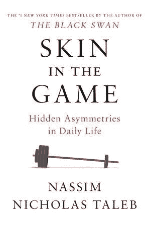

# 从游戏本的皮肤中给思考者的 10 点建议

> 原文：<https://medium.com/swlh/10-takeaways-from-skin-in-the-game-book-eb7fd214cd8f>

## 日常生活中隐藏的不对称

刚看完游戏里的[皮肤。我想分享一些对我有帮助的笔记，也许对你也有帮助。](https://amzn.to/2PTbepE)

如果你没有听说过纳西姆·塔勒布，他是一个真正的哲学家。塔勒布有一个独特的技能，通过他的力量和独创性来改变我们看待世界的方式…