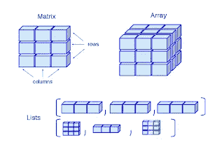
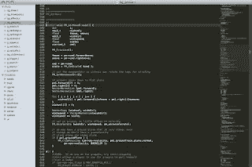
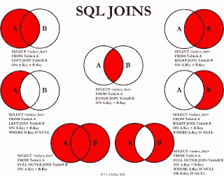
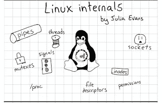
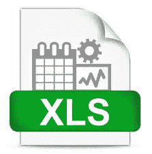
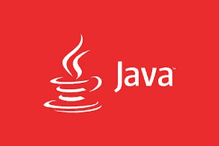
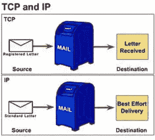
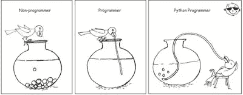

# 每个程序员都应该知道的 10 件事

> 原文：<https://medium.com/swlh/10-things-every-programmer-should-know-26ba37cfcaf4>

## 了解作为一名新的或探索性的程序员应该知道和学习的更多内容，以及在哪里可以学到这些技能

如果你从事编程已经有一段时间了，并且打算学习编程，那么你可能会考虑怎样才能成为一名优秀的程序员。

计算机科学毕业生可以做些什么来为软件开发和编程的职业生涯做准备？

我从脸书的许多学生和关注我的电子邮件中收到了一些常见的问题，这些问题是对初级开发人员的期望。

这些人大多是大学生，由于互联网，他们现在可以获得丰富的信息，并渴望提前学习知识，为编程工作面试做准备。

在这篇文章中，我将分享我认为每个程序员都应该知道的 10 件事。

这包括像 [C++](http://www.java67.com/2018/02/5-free-cpp-courses-to-learn-programming.html) 或 [Java](https://javarevisited.blogspot.com/2018/05/top-5-java-courses-for-beginners-to-learn-online.html) 这样的编程语言，像[数据结构](https://javarevisited.blogspot.com/2018/01/top-5-free-data-structure-and-algorithm-courses-java--c-programmers.html)、[算法](https://javarevisited.blogspot.com/2018/11/top-5-data-structures-and-algorithm-online-courses.html#axzz5fKHU123K)和计算机网络基础知识这样的基本计算机科学概念，像 [Git](https://javarevisited.blogspot.com/2018/01/5-free-git-courses-for-programmers-to-learn-online.html) 、Microsoft Word 和 Excel 这样的基本工具，像 [SQL](https://javarevisited.blogspot.com/2018/05/top-5-sql-and-database-courses-to-learn-online.html) 和 [UNIX](http://www.java67.com/2018/02/5-free-linux-unix-courses-for-programmers-learn-online.html) 这样的技能，像 Eclipse 或 Visual Studio 这样的编辑器，以及文本编辑器。

这个列表并不完整，但是它为程序员应该知道的事情提供了一个很好的起点。

> 如果你的目标是软件开发职业，并寻找一份编程工作，那么这些都是你可以学习和提高的东西，以便在竞争中保持领先。

# 每个程序员和开发人员都应该知道的事情

事不宜迟，这里列出了我个人认为每个程序员都应该知道的事情，不管他做的是什么工作。这些都是基本功，会长期为你服务。

在这些技能上投入的时间、金钱和努力将有助于你在职业生涯中获得回报。

## 1.数据结构和算法

如果你想成为一名程序员，那么你应该很好地了解数据结构和算法；这是没有办法的。

这是任何[编程工作面试](https://javarevisited.blogspot.com/2011/06/top-programming-interview-questions.html)的重要话题之一，如果你不知道基本的数据结构(例如[数组](https://javarevisited.blogspot.com/2015/06/top-20-array-interview-questions-and-answers.html)、[链表](http://javarevisited.blogspot.sg/2017/07/top-10-linked-list-coding-questions-and.html#axzz4xXS86IVo)、[映射](http://www.java67.com/2017/08/top-10-java-hashmap-interview-questions.html)、set)，就不可能写出真实世界的应用程序。

这就是为什么每个程序员都应该在他们的计算机科学课程中认真学习数据结构和算法。

即使你是一个自学成才的程序员，你也必须知道数据结构和算法；其实很多编程 bootcamp 第一件事都会教你数据结构和算法。

如果你想自己学习，那么 [**数据结构和算法:使用 Java**](https://click.linksynergy.com/fs-bin/click?id=JVFxdTr9V80&subid=0&offerid=323058.1&type=10&tmpid=14538&RD_PARM1=https%3A%2F%2Fwww.udemy.com%2Fdata-structures-and-algorithms-deep-dive-using-java%2F) 深入学习是一个很好的起点。

## 2.源代码控制或版本控制系统

源代码控制是用来存储代码的，如果你想成为一名程序员或软件开发人员，你必须知道像 Git 和 SVN 这样的版本控制工具。

谢天谢地 [Git](https://dzone.com/articles/top-5-free-courses-to-learn-git-and-github-in-2019) 和 [Github](https://hackernoon.com/top-5-free-courses-to-learn-git-and-github-best-of-lot-2f394c6533b0) 已经简化了市场，现在超过 70%的组织使用 Git，所以你可能只需要学习 Git 就可以了。

顺便说一下，您应该花些精力学好 Git，并且应该熟悉高级版本控制概念，如分支和合并，以及使用命令行和 GUI 的工具本身。

对于初学者来说，[**《GitHub 终极版:主 Git》和 GitHub**](https://click.linksynergy.com/fs-bin/click?id=JVFxdTr9V80&subid=0&offerid=634352.1&type=10&tmpid=14538&RD_PARM1=https%3A%2F%2Fwww.udemy.com%2Fgithub-ultimate%2F) 是一个很好的起点。

## 3.文本编辑器

作为程序员，我没有一天不使用文本编辑器。即使对于非程序员和任何使用计算机的人来说，它也是必不可少的工具。

我主要在 Windows 上使用记事本，在 [Linux](http://www.java67.com/2018/02/5-free-linux-unix-courses-for-programmers-learn-online.html) 上使用 VI，但是在高级编辑器方面有很多选择，比如 Sublime 和 NotePad++，它们提供了类似 ide 的功能。

我建议你花些时间学习你最喜欢的编辑器和键盘快捷键，生产力提示是你可以学习的。如果你喜欢 Sublime，那么[Sublime Text for Rapid Web Development](https://click.linksynergy.com/fs-bin/click?id=JVFxdTr9V80&subid=0&offerid=634352.1&type=10&tmpid=14538&RD_PARM1=https%3A%2F%2Fwww.udemy.com%2Fsublime-text-for-rapid-web-development%2F)是学习这些东西的好课程。

## 4.5 月

现代 IDE 是任何程序员最重要的工具。对于 [C](/javarevisited/9-free-c-programming-courses-for-beginners-2486dff74065) 、 [C++](/javarevisited/top-10-courses-to-learn-c-for-beginners-best-and-free-4afc262a544e) 、 [C#](/javarevisited/5-best-c-c-sharp-programming-courses-for-beginners-in-2020-494f7afc7a5c) 程序员来说，选择很明确:Visual Studio。而且对于 Python 开发者来说，Jupiter Notebook 一天比一天好。

对于 Java 程序员来说，有三大 ide 可供选择: [Eclipse](http://www.java67.com/2018/02/5-free-eclipse-and-junit-online-courses-java-developers.html) ，NetBeans， [IntelliJ IDEA](https://javarevisited.blogspot.com/2018/09/top-5-courses-to-learn-intellij-idea-java-and-android-development.html) 。

虽然 Eclipse 是我最喜欢的，但 IntelliJ IDEA 可能是其中最强大的。如果你碰巧是 IntelliJ IDEA 的粉丝，那么我建议你通过 [**IntelliJ IDEA 技巧来提高 Java 开发人员的生产力**](https://click.linksynergy.com/fs-bin/click?id=JVFxdTr9V80&subid=0&offerid=634352.1&type=10&tmpid=14538&RD_PARM1=https%3A%2F%2Fwww.udemy.com%2Fintellij-idea-secrets-double-your-coding-speed-in-2-hours%2F) 来更好地学习你的 IDE。

## 5.数据库和 SQL

SQL 很经典。它已经存在了 30 多年，我认为它还会存在 30 年。鉴于[数据库](https://javarevisited.blogspot.com/2019/01/top-6-free-database-and-sql-courses-to-learn-online.html)的无处不在，程序员应该熟悉基本的数据库概念，如规范化和表设计以及 [SQL](https://javarevisited.blogspot.com/2018/05/top-5-sql-and-database-courses-to-learn-online.html) 。

有许多数据库，但只知道一个就足够了。关键是你要熟悉数据库。您应该知道如何插入/更新/删除数据，并编写 SQL 查询来检索数据。

像加入聚合函数这样的高级概念的知识是一个很大的奖励，如果你想得到它，那么 [**完整的 SQL BootCamp**](http://bit.ly/2yoX0mI%20https://click.linksynergy.com/fs-bin/click?id=JVFxdTr9V80&subid=0&offerid=323058.1&type=10&tmpid=14538&RD_PARM1=https%3A%2F%2Fwww.udemy.com%2Fthe-complete-sql-bootcamp%2F) 是一个很好的起点。

## 6.UNIX 或 Linux

和 SQL 一样，UNIX 也经受住了时间的考验。它也已经存在了 30 多年，我希望在未来的许多年里它还会存在。

由于大多数程序员在某个时候不得不在 Linux 机器上工作，所以对[Linux 命令行](https://hackernoon.com/top-5-free-linux-courses-for-programmers-4a433b4edade)的良好了解大有帮助。

它让你有效地工作。您可以搜索文件，通过检查系统的 CPU 和内存使用情况来了解系统的情况，并执行基本和高级任务。

如果你想学习 Linux 命令，我建议你在 5 天内通过 [**学习 Linux，并在 Udemy 上升级**](https://click.linksynergy.com/fs-bin/click?id=JVFxdTr9V80&subid=0&offerid=562016.1&type=10&tmpid=14538&RD_PARM1=https%3A%2F%2Fwww.udemy.com%2Flearn-linux-in-5-days%2F) 你的职业课程。

## 7.微软优越试算表

Excel 是程序员、软件开发人员、项目经理、交易员和商务人士的主要工具之一。它不仅仅是电子表格软件。

它提供了许多有用的特性和功能来执行复杂的数据分析。

我使用 Excel 来跟踪进度、核对数据、数据分析、数据质量检查和项目规划。

它有多种用途，这也是我敦促每个程序员深入学习 Excel 的原因。除了复制和粘贴数据，你还应该知道一些基本的功能，比如搜索、排序、过滤和 VLOOKUP 来比较东西。

如果你想从零开始学习 Excel 或者想提高自己的知识， [**微软 Excel — Excel 从初级到高级**](https://click.linksynergy.com/fs-bin/click?id=JVFxdTr9V80&subid=0&offerid=323058.1&type=10&tmpid=14538&RD_PARM1=https%3A%2F%2Fwww.udemy.com%2Fmicrosoft-excel-2013-from-beginner-to-advanced-and-beyond%2F) 是一个很好的入门课程。

## 8.编程语言

作为一个程序员，你必须知道一门编程语言: [C++](https://hackernoon.com/top-5-free-c-courses-to-learn-programming-in-2019-d27352277da0) 或者 [Java](https://javarevisited.blogspot.com/2018/08/top-5-free-java-8-and-9-courses-for-programmers.html) ，也可能是 [Python](http://www.java67.com/2018/02/5-free-python-online-courses-for-beginners.html) 或者 [JavaScript](http://www.java67.com/2018/04/top-5-free-javascript-courses-to-learn.html) 。你可以选择任何你想要的，但我个人的建议是，你至少应该知道 Java。

它很容易开始，这就是为什么初学者的好选择。它也非常强大，允许你做几乎任何事情。

它有很多库，从做像 web 开发这样的基础工作到处理大数据等更复杂的任务。如果你决定学习 Java，那么 [**完整的 Java MasterClass**](https://click.linksynergy.com/fs-bin/click?id=JVFxdTr9V80&subid=0&offerid=323058.1&type=10&tmpid=14538&RD_PARM1=https%3A%2F%2Fwww.udemy.com%2Fjava-the-complete-java-developer-course%2F) 可能是最好的起点。

[**The Complete Java MasterClass**](https://click.linksynergy.com/fs-bin/click?id=JVFxdTr9V80&subid=0&offerid=323058.1&type=10&tmpid=14538&RD_PARM1=https%3A%2F%2Fwww.udemy.com%2Fjava-the-complete-java-developer-course%2F)

## 9.网络基础

当今的世界是一个互联的世界，无论你走到哪里，你都会发现计算机网络，从你的家中开始，你在许多设备上使用 Wi-Fi，到使用局域网(LAN)连接到互联网的学校、学院和办公室。

您将编写的大多数应用程序也不是独立的，而是一种客户端-服务器类型的应用程序，其中请求将通过网络到达服务器。客户将从世界任何地方访问您的应用程序。

底线是您必须了解网络基础知识，以理解、开发和支持您的应用程序。如果你想了解更多，我建议你参加 Udemy 上的 [**完整的网络基础**](https://click.linksynergy.com/fs-bin/click?id=JVFxdTr9V80&subid=0&offerid=634352.1&type=10&tmpid=14538&RD_PARM1=https%3A%2F%2Fwww.udemy.com%2Fcomplete-networking-fundamentals-course-ccna-start%2F) 课程。对于初学者来说，这是一个很好的起点。

[**The Complete Networking Fundamentals**](https://click.linksynergy.com/fs-bin/click?id=JVFxdTr9V80&subid=0&offerid=634352.1&type=10&tmpid=14538&RD_PARM1=https%3A%2F%2Fwww.udemy.com%2Fcomplete-networking-fundamentals-course-ccna-start%2F)

## 10.脚本语言

在第 8 点中，我要求你学习一门编程语言，然而在这里，我要求你学习一门脚本语言？为什么？同一个编程语言能不能不做脚本语言？

嗯，当然有一些语言既适合于面向对象编程，也适合于脚本编写，比如 Python，这就是为什么我要求你至少学习它。但是如果你碰巧学了 C/C++或 Java，你就不能像 Python 或 Perl 开发人员那样快速地写出东西。

如果你想学习 Python 并且需要一门课程， [**完整的 Python Bootcamp**](https://click.linksynergy.com/fs-bin/click?id=JVFxdTr9V80&subid=0&offerid=634352.1&type=10&tmpid=14538&RD_PARM1=https%3A%2F%2Fwww.udemy.com%2Fcomplete-python-bootcamp%2F) 是一门很好的入门课程。

[**The Complete Python Bootcamp**](https://click.linksynergy.com/fs-bin/click?id=JVFxdTr9V80&subid=0&offerid=634352.1&type=10&tmpid=14538&RD_PARM1=https%3A%2F%2Fwww.udemy.com%2Fcomplete-python-bootcamp%2F)

脚本语言使得创建工具和脚本来解决编程世界中的常见问题变得容易。如果你对像 Python 这样的脚本语言有很好的掌握，那么你可以很容易地自动化普通的东西。

再次建议你学习 Python 一举两得，如果你需要更多的资源，这个[免费 Python 课程列表](https://javarevisited.blogspot.com/2018/12/10-free-python-courses-for-programmers.html)也很有帮助

计算机科学毕业生和渴望成为程序员的人可以使用这个列表来找到成为一名成功的程序员所需的东西、工具和技能。

顺便说一下，如果你有兴趣了解更多程序员应该知道的事情，有很多关于程序员重要事情的指导，你可以在互联网上找到很好的建议，如 [**程序员应该知道的 97 件事情**](https://www.amazon.com/Things-Every-Programmer-Should-Know/dp/0596809484/?tag=javamysqlanta-20) ，这是每个认真的程序员的必读之作。

## 您可能喜欢的其他媒体文章:

 [## 破解任何编程和技术面试的 25 个软件设计面试问题

### 常见系统设计问题和有用资源的链接

medium.com](/javarevisited/25-software-design-interview-questions-to-crack-any-programming-and-technical-interviews-4b8237942db0)  [## 十大 Coursera 证书，开启你在云计算、数据科学、人工智能、大型机和 IT 领域的职业生涯…

### 大家好，如果你想在信息技术、数据科学和 IT 支持领域开始或发展你的职业生涯…

medium.com](/javarevisited/top-10-coursera-certificates-to-start-your-career-in-cloud-data-science-ai-mainframe-and-it-558690c83587)  [## 15 门免费 Python 课程，供初学者在线学习

### 学习 Python 的一些免费在线课程的精选列表。

medium.com](/swlh/5-free-python-courses-for-beginners-to-learn-online-e1ca90687caf) 

## 这篇文章发表在[《创业](https://medium.com/swlh)》上，这是 Medium 最大的创业刊物，有+423，678 人关注。

## 在这里订阅接收[我们的头条新闻](https://growthsupply.com/the-startup-newsletter/)。

