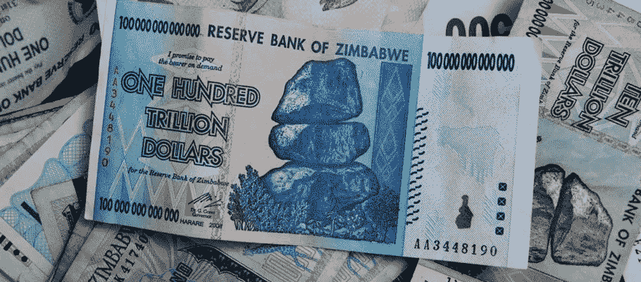
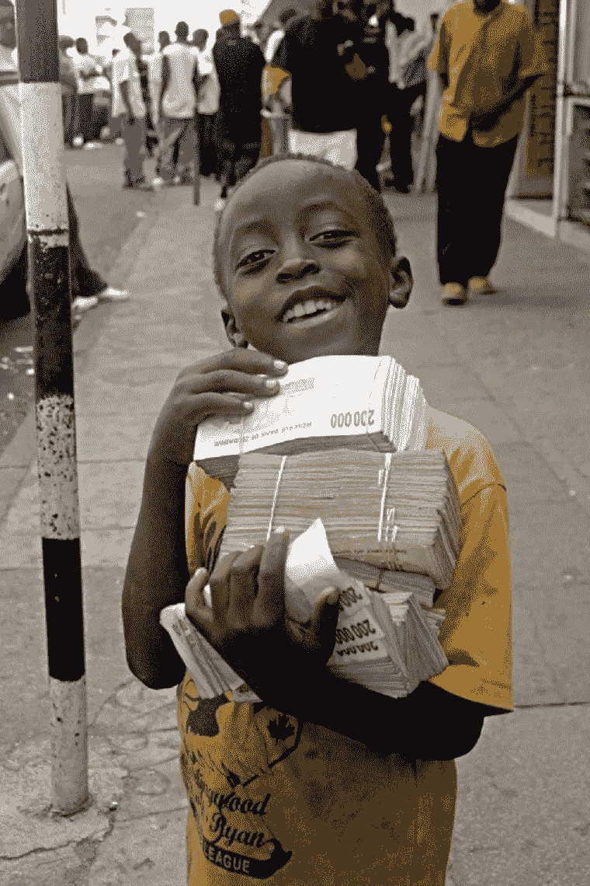

# 我在高通胀国家学到的 10 件事

> 原文：<https://medium.com/swlh/10-things-i-learnt-while-living-in-a-hyper-inflationary-country-1a4d5a8c3219>

## 当你的国家通货膨胀率达到 60%时，如何生存！

2008 年你在忙什么？

2008 年，中国有史以来第一次举办了夏季奥运会，这一历史性事件的主要亮点是运动员和观众爱上了壮观的开幕式和许多体育场馆令人难忘的建筑，同时批评北京的空气污染。

俄罗斯第一副总理、即将离任的总统弗拉基米尔·普京亲手挑选的继任者德米特里·梅德韦杰夫(Dmitry Medvedev)以压倒性胜利当选为俄罗斯下一任领导人。

还记得引发全球经济衰退的雷曼兄弟破产案吗？美国股市崩盘——到 2008 年底，道琼斯指数下跌 34%，收于 8816.62 点，其他指数表现更差。

这是奥巴马赢得美国总统大选的一年。巴拉克·奥巴马于 2008 年 11 月 3 日赢得总统大选，他承诺提供急需的希望来启动停滞的经济。

他的提议帮助恢复了金融市场的信心。

## 津巴布韦人要忘记的一年

2008 年是大多数津巴布韦人希望他们能够忘记的一年。现已被罢黜的独裁者罗伯特·穆加贝(Robert Mugabe)是当时的津巴布韦总统，但操纵这场表演——或者说金融马戏团——的人是当时的津巴布韦央行行长 T2(Gideon Gono)。

他是一个很有魅力的人，从一个卑微的“花园男孩”升到了现在的位置。我们的金融危机发生在他的眼皮底下。

戈诺的印钞机在 2008 年超负荷运转——以至于津巴布韦储备银行(RBZ)几乎用完了墨水和纸张！那时，我是一个年轻的银行家，刚从学校毕业，在津巴布韦的一家商业银行工作。

我记得我对自己说，*“我们终于跌到谷底了！'*当我们开始收到湿钞票时，由于对钞票的大量需求，我们没有时间等待钞票在印刷后完全干燥。

A boy holding a load of notes

当通货膨胀达到顶峰时，更多的零被加上，然后被砍掉。一张 10 00000000000 美元的钞票在一夜之间被重新设计成 100 美元的钞票是很常见的。

在 7 年的时间里，超过 23 种不同的新美钞问世。我们不断有*【旧】**【新】*钞票在流通，因为它们相互重叠。我们甚至从普通的钞票变成了不记名支票，试图应对零。

这种货币被称为津巴布韦元，现在已经不值钱了。

基本商品和服务的价格飙升至天文数字——想象一下为两个鸡蛋支付 1000 亿美元，在你最近的月账单上欠电话公司 2654287527899 美元。

或者不得不用你放不进口袋的钱买一条面包。对于狂饮啤酒的人来说，一次买两瓶啤酒是明智的，因为当你喝完第一瓶啤酒时，第二瓶啤酒会让你多花一倍的钱。

恶性通货膨胀还意味着学校关闭，因为没有人支付教师工资——那些愿意无偿教学的人没有去学校的车费，或者公共汽车在某个地方排队加油。

这也意味着医院里没有药品，因为没有外汇来购买。我们甚至用完了干净的饮用水，因为市政当局用完了水处理化学品，还爆发了严重的霍乱。

# **课程**

## **学会种植自己的食物**

当钱不值钱的时候，食物会变得超有价值，在 2008 年超市的货架是空的，你可以有钱但没有东西可买。当商店最终获得供应时，令人失望的长队会在几分钟内形成。

一卡车的糖会以每 2 公斤 5000 亿美元的零售价格运送，然后一个普通的经销商会买下整车的糖，并开始以每公斤两倍的价格出售。有关系的人会买下它，重新包装在杯子里，并开始以 3 到 4 倍的价格出售。

## **拥有自己的家**

在当今世界，拥有住房一直被一些专家斥为糟糕的投资建议，但是在极度通货膨胀的环境下，房子就像黄金一样好。

2008 年，随着通货膨胀达到顶峰，津巴布韦大多数房产所有者最终要求以美元或食品杂货支付租金，但这些需求超出了许多人的承受能力。

好的一面是，一旦发生，疯狂的通货膨胀会吞噬掉你所有的抵押和贷款。当时大多数人都是为了几块钱还清房贷。

## 永远不要把鸡蛋放在一个篮子里

这句古老的谚语被证明是正确的，因为随着银行和保险公司的倒闭，人们失去了毕生的积蓄。

随着通货膨胀率的上升，银行账户中的钱失去了价值，甚至那些在银行持有外国账户的人也失去了他们的钱，因为中央银行不得不从这些账户中提取外币！

没有真正的股票市场——更明智的人通过投资房地产和购买实物美元并把它们放在家里生存下来。

津巴布韦 2008 是我能够比大多数人更早接受比特币和加密货币的主要原因，尽管我来自一个我愿意相信远离中本聪世界的世界。

我已经看到了法定货币的价值如何在眨眼之间被侵蚀，我也经历了把印刷机交到坏人手里的毁灭性后果。

吉迪恩·戈诺(Gideon Gono)和他的*赌场经济学*向我展示了我们目前所依赖的世界金融体系是如何失败的——正如 2008 年美国主导的市场崩溃所巧合发生的那样，那次崩溃几乎影响了整个世界。

## **对替代能源的投资确实有回报**

由于缺乏进口电力的外汇来弥补我们的能源短缺，津巴布韦电力当局不得不不断地断电。

每天停电时间可能超过 18 小时，这意味着工业生产陷入停顿。

那些之前在太阳能、沼气等领域投资的个人和组织表现更好，因为他们在停电时可以获得电力。

他们可以轻松地工作、交流和准备食物——当你有电的时候，给手机充电似乎很容易，但在停电的时候，这就变成了真正的忙碌。

## **知道如何在家教育你的孩子**

随着学校因经济衰退而关闭，大多数家长不得不把孩子留在家里。这是非常重要的有一个想法如何教你的孩子在这种情况下以及有机会获得教学资源。

一些社区联合起来，确保报酬过低的学校教师受到激励，这样他们就可以继续不受阻碍地工作。

## **学一两门手艺**

在任何困难的环境中，需要的技能在交易中总是有价值的。我记得今天存入银行的工资在不到 48 小时内贬值了 50%,到周末你的工资还不够支付银行费用。

在这样的环境下，有一个能让他们坚持到月底的副业是非常必要的。2008 年，津巴布韦的工程师、经济学家、律师或教师们放下自尊，开始在街头拉客

## **永远不要忘记你作为一个国家的侨民**

散居国外的津巴布韦人将外币和货物汇给家乡的家人，成为支撑我们国家的“约瑟夫”。

美国和英国的人寄了钱，而附近的南非和博茨瓦纳的人送来了食品杂货和药品。

## **准备好你的旅行证件**

在我的成长过程中，我从未见过像 2008 年那样，成群结队的人离开我的国家去寻找更好的地方。过去，津巴布韦人喜欢去散居地学习，然后毕业后回家。

2008 年，他们永远离开了。

随着商店货架变得空空如也，我们也求助于我们的*“跑腿的”*——这些人可以去南非购买商品，然后带回来给我们，当然是为了获利。

年轻人会在移民办公室排上几天几夜的队，等着拿到他们的旅行证件，这也因为显而易见的原因变得难以捉摸。

很少有人计划在津巴布韦的未来！

## **适应或死亡**

对于我们这些不能选择离开的人来说，迅速跟上快速变化的时代变得非常重要，否则就会被抛在后面死去！

对那些做生意的人来说，决策所花的时间是决定企业能否生存的关键因素。大多数中小企业在这个恶性通货膨胀时期蓬勃发展，因为它们有能力迅速决定和适应新的市场条件。

拥有漫长官僚指挥链的大企业就没那么幸运了。

## **归根结底，生活就是关于你和你爱的人**

恶性通货膨胀期间，公司会关闭，朋友会搬走，燃料短缺和断电意味着你与世界隔绝。

在这种时候，即使是政客也会变得自私。

在这一切结束的时候，你会意识到家庭是你所拥有的一切，重要的是你每天都要爱他们，珍惜他们。

> **我们是幸存者**

对大多数津巴布韦人来说，2008 年是最糟糕和最黑暗的一年。直到今天，我仍然在我的钱包里放着一张 100 万亿美元的钞票，提醒自己我是一个幸存者，我可以在这个世界的任何地方生存！