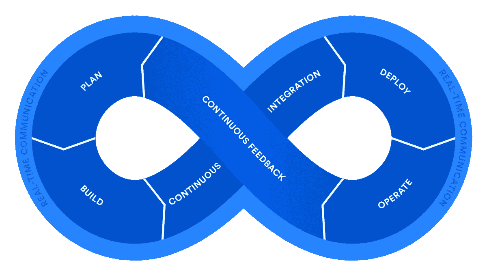
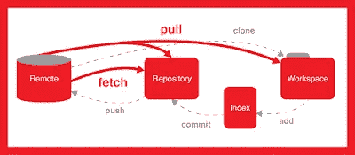
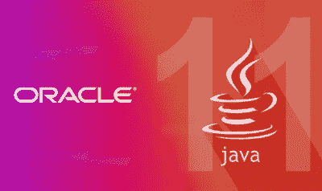
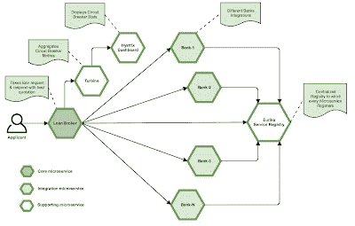
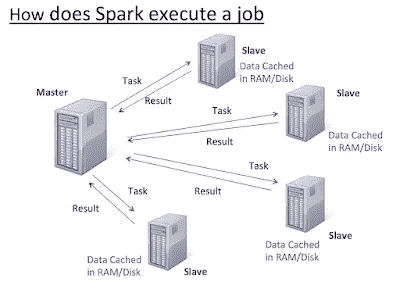
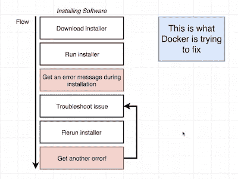

# 2023 年 Java 开发人员应该学会的 16 件事

> 原文：<https://medium.com/swlh/10-things-java-developer-should-learn-in-2019-5e0cf388e07f>

## 想在新的一年有个好的开始吗？从 Java 17 到 Spring 6.0，这里有一系列主题可以帮助你成为更好的 Java 开发人员。

大家好，又一年即将来临，这是一个很好的时间来回顾和反思你去年取得的成就和你可以做得更好的地方。

这将帮助你制定 2023 年的目标。作为一名程序员，你最大的挑战是让自己跟上时代。技术变化非常快，你会看到你喜欢的编程语言和框架的新版本每年都会出现。

对于 Java 开发人员来说，过去几年带来了大量的变化，并对每 6 个月更新一个新的 Java 版本提出了挑战，如 [Spring 6](https://javarevisited.blogspot.com/2018/06/top-6-spring-framework-online-courses-Java-programmers.html) 、 [Spring Security 6](https://javarevisited.blogspot.com/2017/06/3-best-spring-security-online-training-courses-java-programmers.html#axzz5ajt7Ig3L) 和 [Spring Boot 3](https://javarevisited.blogspot.com/2018/05/top-5-courses-to-learn-spring-boot-in.html) 等。当我今年开始的时候，我认为 Java 11 是新的，在我完全学习完 Java 11 之前，Java 16 和 Java 17 已经过时了。

所以，它们来的真的很快，但是有很多有趣的特性，比如记录、 [var with local variables](http://javarevisited.blogspot.sg/2018/03/finally-java-10-has-var-to-declare-local-variables.html) 、API 增强、GC 改进、线程本地握手等等。我在这里[记录了它们](https://javarevisited.blogspot.sg/2018/03/java-10-released-10-new-features-java.html#axzz5ALJyiIAt)，我真的很兴奋能在 2023 年使用它们。

Spring 框架和 Spring Security 也是如此，我并不知道在 [Spring 5.0](http://www.java67.com/2017/11/top-5-free-core-spring-mvc-courses-learn-online.html) 和 [Spring Security 4.0](http://www.java67.com/2017/12/top-5-spring-security-online-training-courses.html) 上的所有变化，我的项目仍然使用 Spring Security 3.1，boom 我们现在已经有了 Spring 和 Spring Security 的 6.0 版本。

在过去的几年里，我的学习速度有所放缓，我无法让自己跟上最新最棒的东西，比如我还没有适应 [Git](https://javarevisited.blogspot.com/2018/01/5-free-git-courses-for-programmers-to-learn-online.html) ，JavaScript 框架，如 [Angular](https://javarevisited.blogspot.com/2018/06/5-best-courses-to-learn-angular.html) 和 [React](https://javarevisited.blogspot.com/2018/08/top-5-react-js-and-redux-courses-to-learn-online.html) ，单元和集成测试领域的最新变化，以及流行框架的新版本，如 Spring、Spring Security 和 Spring Boot。

我设法赶上了过去几年中的许多年，因此，2023 年将是巩固和让自己跟上技术方面最重要的事情，改进我的工具链，并探索 [DevOps](https://javarevisited.blogspot.com/2018/09/10-devops-courses-for-experienced-java-developers.html) 景观

# 2023 年 Java 程序员该学什么

## 以下是我列出的 Java 开发人员在 2023 年应该学习的事情:

## **1。DevOps**

随着越来越多的公司进入 DevOps 并采用持续集成和部署，这是我去年看到的一个很有吸引力的领域。DevOps 非常庞大，你需要学习很多工具和原理，这让很多开发者不知所措，但你不需要担心。我分享过一个 [**DevOps 路线图**](https://javarevisited.blogspot.com/2018/09/the-2018-devops-roadmap-your-guide-to-become-DevOps-Engineer.html) ，你可以按照自己的速度去学习和掌握 DevOps。这意味着如果你是一名经验丰富的 Java 程序员，对管理环境、自动化和改进整体结构充满热情，你可以成为一名 DevOps 工程师。

如果你正在寻找一些很棒的资源，那么 [**Jenkins，从零到英雄:成为 DevOps Jenkins 大师**](https://click.linksynergy.com/deeplink?id=JVFxdTr9V80&mid=39197&murl=https%3A%2F%2Fwww.udemy.com%2Fcourse%2Fjenkins-from-zero-to-hero%2F) 是一个很好的入门课程，尤其是对 Java 开发人员来说。

## **2。Git**

Git 和 Github 已经存在一段时间了，虽然我过去在 Eclipse 中使用过 Git，但是我还没有成为命令行 Git 的大师。

为什么我至今没有掌握 Git？仅仅因为我还不需要它。我偶尔会从 Github 下载项目并从 Eclipse 运行，但我仍然不太擅长 Git 命令，尤其是恢复更改和处理错误。

现在大部分公司都在把项目从 SVN、CVS 迁移到 Git，是时候学习和掌握 Git 了。我最近在 Udemy 上以 10 美元的价格购买了《Git Complete:Git 的权威分步指南》,这将是 2023 年完成的第一件物品。

如果你也有同样的情况，想在 2023 年学习或提高你的 Git 技能，一定要去看看 Udemy 的那个课程，非常方便。

## **3。Java 9–18**

正如我所说的，我仍然在学习 Java 8，许多 Java 开发者也是如此。我还将花一些时间学习 Java 9、Java 10 和 2023 年 Java 19 的新特性，但对我来说，Java 8 仍然是优先考虑的，直到我转向 Java 17，这是另一个 LTS 版本。

JDK 9 在模块、Jigsaw、反应式[流](http://www.java67.com/2016/03/how-to-use-flatmap-in-java-8-stream.html)、过程 API、HTTP2 客户端、JShell 和 API 改进(如集合工厂方法)方面带来了很多好东西，我真的很期待尽早学习它们。

同样，JDK 10 带来了 var，给你一种动态打字的味道和一些 GC 的改进。

在最近的 Udemy 10$销售中，我购买了大量课程，其中一门是针对 Java 11 更新的****，**完整的 Java MasterClass，我期待以此开始我的 Java 11 之旅。

顺便说一句，如果你还没有开始使用 JDK 8，那么这里是我最喜欢的 Java 8 教程和课程的列表，你可以免费获得:[学习 Java 8 的 10 个最佳教程](http://www.java67.com/2014/09/top-10-java-8-tutorials-best-of-lot.html)。**

****

**如果你需要一个课程列表来学习从 Java 9 到 Java 18 的新特性，那么你可以看看这个课程列表来学习从 JDK 9 到 JDK 13 的新特性。**

## ****4。弹簧框架 6****

**我已经听说了一些新的特性，比如 Spring 6 上的反应式编程模型，最近 Java 特性的采用，一些单元测试的改进等等，但是我还没有尝试过。

反正我已经开始跟着[**大师 Spring Boot 3 和 Spring 框架 5 用 Java**](https://click.linksynergy.com/deeplink?id=JVFxdTr9V80&mid=39197&murl=https%3A%2F%2Fwww.udemy.com%2Fcourse%2Fspring-boot-and-spring-framework-tutorial-for-beginners%2F&u1=JAVAREVISITED) 学习 Spring 6.0 了，2023 年还会保持势头。如果你用 Spring，大概是学习 Spring 6.0 的最好时机。**

****

**如果你喜欢书，你也可以看看 Manning 和**

****

**如果你需要更多的选择，你也可以查看我从 Udemy 和 Pluralsight 为 Java 开发人员学习 Apache Spark 的入围课程列表。**

## **12.Docker 和 Kubernetes**

**你可能听说过围绕 Docker 和 Kubernetes 的讨论以及它对 DevOps 团队的影响。一开始你可能会想，“啊，我需要学习的又一项新技术”，但是我会说 Docker 不仅仅是另一项技术，而是真正的游戏规则改变者。与 Kubernetes 一样，它是你可以学习的最重要的工具之一，并将伴随你的整个职业生涯。

现在几乎每个开发团队都在使用 Docker 和 Kubernetes，无论是大型企业还是小型创业公司。可以肯定地说，如果你现在进入职场，你很可能会在某个时候碰到 Docker。

总之，无论你是初级 Java 开发人员，还是有几年经验的资深老手，拥有 Docker 和 Kubernetes 的知识对于你的职业发展和跳槽都是必不可少的。**

**如果你已经意识到了 Kubernetes 的重要性，并希望在 2023 年学习 Kubernetes，那么 Stephen Grider 在 Udemy 上的 [**Docker 和 Kubernetes:The Complete Guide**](https://click.linksynergy.com/deeplink?id=JVFxdTr9V80&mid=39197&murl=https%3A%2F%2Fwww.udemy.com%2Fcourse%2Fdocker-and-kubernetes-the-complete-guide%2F)是一个很好的开始课程。**

****

**如果你喜欢免费的资源，比如免费的在线课程，那么你也可以看看这个为 Java 开发者准备的免费 Docker 和 Kubernetes 课程列表。**

## **13.微服务**

**[微服务](/javarevisited/10-best-java-microservices-courses-with-spring-boot-and-spring-cloud-6d04556bdfed)只不过是 RESTful web 服务的扩展，其主要目标是**将您的代码分解成小型、分布式和独立的服务**以便更好地开发、部署和管理。**

****微服务架构**是公共云的理想选择，其重点是利用按需资源进行弹性扩展。然而，它确实需要深思熟虑的设计和大量的准备工作。**

**幸运的是，[2023 Java 开发者路线图](/javarevisited/10-advanced-spring-boot-courses-for-experienced-java-developers-5e57606816bd#123)
[每个程序员必读的 10 本书](http://www.java67.com/2015/03/10-books-every-programmer-and-software-engineer-read.html)
[提高编程技巧的 10 个小技巧](http://javarevisited.blogspot.sg/2014/01/10-tips-to-improve-programming-skill-become-better-programmer.html#axzz553pz1hYh)
[10 个面向对象的设计原则](http://javarevisited.blogspot.sg/2012/03/10-object-oriented-design-principles.html)
[10 篇文章每个程序员都应该读的](http://javarevisited.blogspot.sg/2014/05/10-articles-every-programmer-must-read.html)
[10 个工具每个软件开发人员都应该知道的](http://javarevisited.blogspot.sg/2018/01/10-tools-every-software-developer-know.html)
[10 个程序员数据结构与算法课程](https://hackernoon.com/10-data-structure-algorithms-and-programming-courses-to-crack-any-coding-interview-e1c50b30b927)
[5 Java 与](https://javarevisited.blogspot.com/2018/04/top-5-java-frameworks-to-learn-in-2018_27.html)**

**感谢您阅读本文。如果你喜欢这些工具，请与你在脸书的朋友和同事分享。如果您有任何问题或反馈，请留言。**

**祝大家 2023 新年快乐。**

> **如果你想翻译这篇文章，或者在你的博客、网站或出版物上重新发表，请给我的电子邮件 savingfunda@gmail.com 留言，我通常会答应的。**

**我的其他一些故事你觉得值得一读**

** [## 我最喜欢的 2023 年学习软件架构的课程——最好的

### 这些是 2023 年学习软件架构并成为解决方案架构师的最佳课程

medium.com](/javarevisited/top-5-courses-to-learn-software-architecture-in-2020-best-of-lot-5d34ebc52e9)  [## 我最喜欢的免费课程&深入学习数据结构和算法的认证

### 为程序员学习数据结构和算法的一些最好的免费在线课程的精选列表。

medium.com](/free-code-camp/these-are-the-best-free-courses-to-learn-data-structures-and-algorithms-in-depth-4d52f0d6b35a)  [## 完整的 DevOps 路线图

### 成为前端或后端开发人员的图解指南，提供课程链接

medium.com](/hackernoon/the-2018-devops-roadmap-31588d8670cb) 

## 这篇文章发表在 [The Startup](https://medium.com/swlh) 上，这是 Medium 最大的创业刊物，拥有+405，714 名读者。

## 订阅接收[我们的头条新闻](http://growthsupply.com/the-startup-newsletter/)。

**