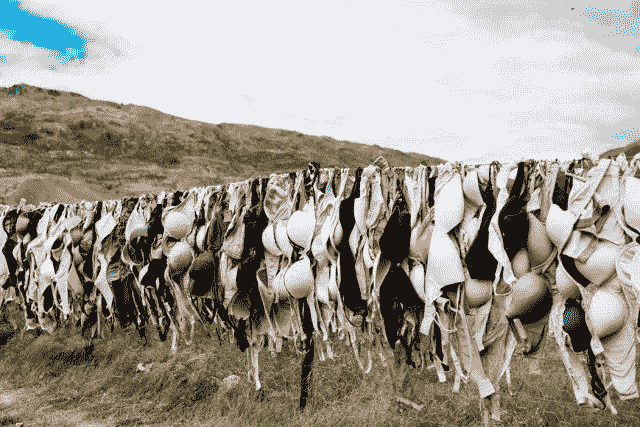

# 这位移民企业家推出了价值 10 亿美元的产品，她不会说英语，她可以教你 10 件事

> 原文：<https://medium.com/swlh/10-things-this-immigrant-entrepreneur-who-launched-her-billion-dollar-empire-speaking-no-english-fe925fd327b2>

这篇文章的一个版本曾出现在《福布斯》杂志上。

*StockSnap via Pixabay*

1904 年，18 岁的艾达·罗森塔尔移民到美国，只会说她的母语俄语。到达纽约后不久，她的丈夫生病了，迫使艾达成为这个家庭唯一的经济支柱。

她用自己微薄的积蓄买了一台缝纫机，并开始用杂志照片制作服装，每件售价 25 美元。

1.  **一夜成名需要几十年的努力**

在她开始做服装的 13 年后，艾达已经把她普通的生意发展到了 15 名员工。

当她的一位顾客在一家高级精品店被发现穿着艾达的一套服装时，机会来了。商店老板伊妮德·比塞特问顾客她在哪里买的这件衣服。

**2。成为合作伙伴，而不是供应商**

伊妮德走近艾达，建议她给她提供服装。艾达拒绝了。相反，她建议他们作为平等的合作伙伴一起做生意。

这两个女人开了一家名为“伊妮德连衣裙”的定制服装店。艾达设计的服装不再卖 25 美元，而是卖 300 多美元。他们的伙伴关系持续了十年。

**3。不要自私，让用户塑造你的价值**

几年后，艾达的第二次大突破来了，她的一位顾客问她是否可以通过购买一些支撑衬里来增加她的衣柜，艾达把这些衬里放在她的衣服上，以突出穿着者的胸部。

如果艾达是一个首席女设计师，她可能会立即拒绝这个要求。然而，作为一个务实的商人，她愉快地遵从了顾客的要求，以每件 1 美元的价格出售衣服衬里。

意识到支撑衬里代表一个独立的产品，Ida 和 Enid 开始为每件购买的衣服赠送一个胸罩。这鼓励顾客将胸罩融入他们的整体衣柜。

**4。逆水行舟**

在 20 世纪 20 年代初的美国，女性时尚的主要风格是活板、“男孩式”的外观，不强调女性的曲线。像赛明顿花边这样的产品是为扁平女性乳房而设计的。相比之下，艾达的设计突出了女性的柔美。为了突出他们产品的与众不同，Ida 和 Enid 将他们的胸罩命名为“Maidenform”

20 世纪 20 年代末，当活板风格开始褪色时，许多女性开始接受更女性化的风格，突出她们的身体，而不是掩盖它。Ida 的定位很好，可以将她的市场从购买定制服装的高端客户扩大到大众市场消费者。

**5。快速跟随者通常会击败先行者**

艾达并不是第一个生产胸罩的人。数千年来，女性一直使用各种类型的织物来束缚、支撑和突出她们的乳房，这在古希腊和古罗马艺术中有所体现。

艾达甚至不是第一个为女性提供胸罩的现代企业家。1917 年，Mary Phelps Jacobs 被授予专利[1115674](https://patents.google.com/patent/US1115674)，该专利声明:“本发明涉及胸罩的改进。”(原文如此)

与艾达和伊妮德不同，玛丽·雅各布斯是一位富有的社会名流，她不做任何营销或销售她的胸罩设计。因此，它对时尚市场没有影响。

**6。名人卖**

通过伊妮德在纽约百老汇演艺圈的关系，她鼓励女演员在她们的衣柜里放入 Maidenform 胸罩。这种公开曝光驱使富有的顾客去买伊尼德连衣裙。经常光顾 Enid 和 Ida 服装店的目标市场。

随着时髦的时尚潮流失宠，该公司吸引了包括伊丽莎白·泰勒在内的好莱坞女演员在电影中穿着她们的胸罩，从而将胸罩引入了全国市场。

**7。性比名人卖得更好**

1949 年，该公司推出了标志性的“我梦想 ________(用一项平凡的任务填空)……在 Maidenform 文胸”活动。这些广告是可耻的，因为它们是第一个以贴身服装为特色的广告——而且是在非常公共的地方，如公共汽车、广告牌和电视上。

美国人以前从未接触过衣着暴露的模特。广告展示了普通情况下的女性(乘坐公交车、购物、在办公室工作等)。)，从腰部以下正常穿着，但除此之外只穿着 Maidenform 胸罩。这场运动是如此成功，以至于它贯穿了整个 1960 年代，使得迈登福公司以高于竞争对手的高价销售他们的产品。

**8。超越产品特性的创新**

该公司的“我梦想……”活动导致需求超过生产。作为对国家采纳他们的时尚创新的回应，Ida 的丈夫 William(在他姐姐 Masha Hammer 的帮助下)通过在女装行业建立第一条大规模生产线来提高产量。通过将胸罩的生产分成简单、独特的步骤，该公司每年生产数百万个胸罩。

**9。掌控你的命运，尽管有不利的外部因素**

事实证明，美国加入第二次世界大战对包括 Maidenform 在内的许多企业来说都是一个挑战，因为该公司所依赖的面料供应短缺。Ida 和 William 没有让材料短缺影响他们的生意，而是利用他们的工厂制造降落伞。他们还设计了一款鸽子胸罩，供美国伞兵穿着。

他们的军用“胸罩”实际上是一件背心，套在男人的胸前，上面带着一只信鸽。当士兵着陆时，他们在鸽子上贴了一张纸条，说明他们的着陆地点和其他相关后勤信息。

10。让它留在家里

威廉 1958 年去世后，艾达一直独自控制着迈登福姆，直到 1963 年健康问题迫使她退休。她的女婿约瑟夫·科尔曼博士随后一直经营这家企业，直到他于 1968 年去世，当时艾达的女儿比阿特丽斯成为首席执行官，经营这家企业，直到她于 1990 年去世。

Beatrice 于 1938 年加入该公司，采取实践的方式学习运营的各个方面，包括在装配线上缝制胸罩。在 1987 年的一次采访中，比阿特丽斯提到，“当时我正在学习成为一名教师，但内心深处我知道我真的不想教书。所以当我母亲让我入行时，我欣喜若狂。我一直很钦佩我的母亲。她是一名企业家，而当时创业女性少之又少。”

Maidenform 在 1997 年申请破产保护之前一直由家族所有和经营。经过两年的重组，这家企业以新的所有者身份重新崛起。

尽管时尚品味不断变化，但 Maidenform 品牌在 2019 年仍然很受欢迎，是价值 65 亿美元的 Hanes 服装品牌家族的一部分。

*在这里关注约翰面向初创企业的推特供稿:*[***@ JohnGreathouse***](https://twitter.com/#!/johngreathouse)*。*

## 这篇文章发表在 [The Startup](https://medium.com/swlh) 上，这是 Medium 最大的创业刊物，拥有+436，678 名读者。

## 在此订阅接收[我们的头条新闻](https://growthsupply.com/the-startup-newsletter/)。

