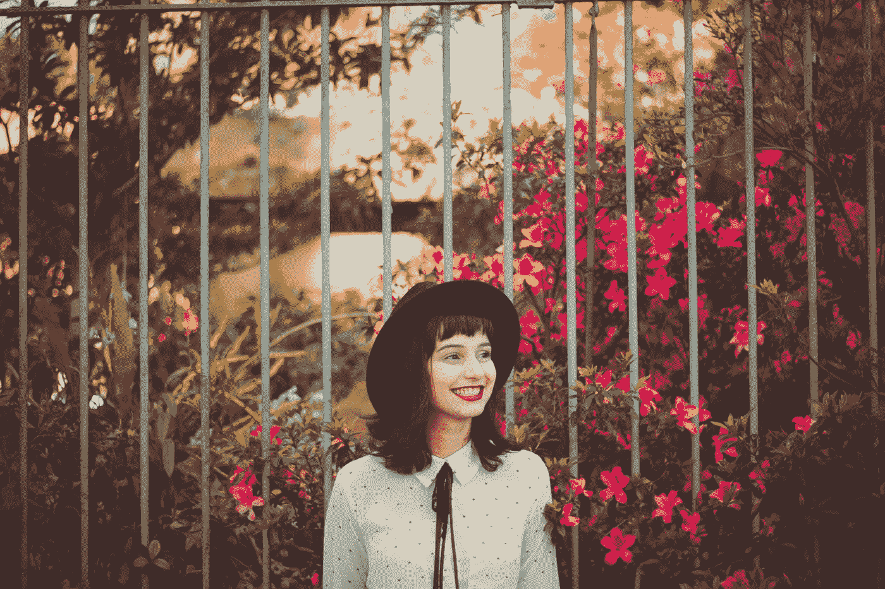

# 避免成为有毒人的 10 种方法

> 原文：<https://medium.com/swlh/10-ways-to-avoid-being-a-toxic-person-a23186472677>

## 拥抱更快乐的关系——甚至是和我们自己。

Photo by [Allef Vinicius](https://unsplash.com/@seteales?utm_source=unsplash&utm_medium=referral&utm_content=creditCopyText) on [Unsplash](https://unsplash.com/search/photos/happy-people?utm_source=unsplash&utm_medium=referral&utm_content=creditCopyText)

不久前，我写了一篇关于认识我们生活中有毒的人的文章。

这篇文章的另一面是，我们吸引我们在世界上放出的东西。如果我们以一种有毒的方式行动，我们会招来更多的毒性。