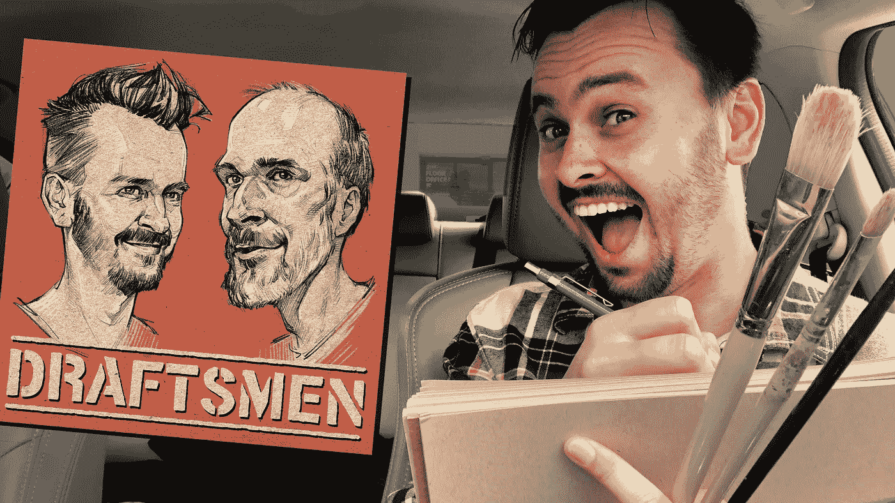

# 给艺术家的 10 个 YouTube 技巧

> 原文：<https://medium.com/swlh/10-youtube-tips-for-artists-f01d15e4b10b>

1.  **利用其他社交媒体网站，制作时事通讯**

如果你是一名艺术家，很可能你已经在不同的社交媒体平台上发布了你的作品。当你开始的时候，使用这些不同的渠道来增加你的视频的浏览量是一个好主意。最重要的是，你也可以尝试建立一个简讯，这样你就有一个内置的订阅者列表，当新视频发布时，你可以通过电子邮件发送。我一直…