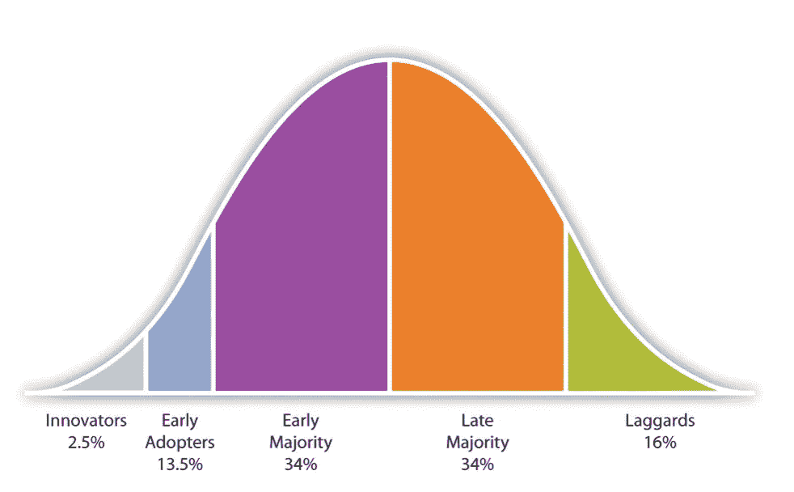
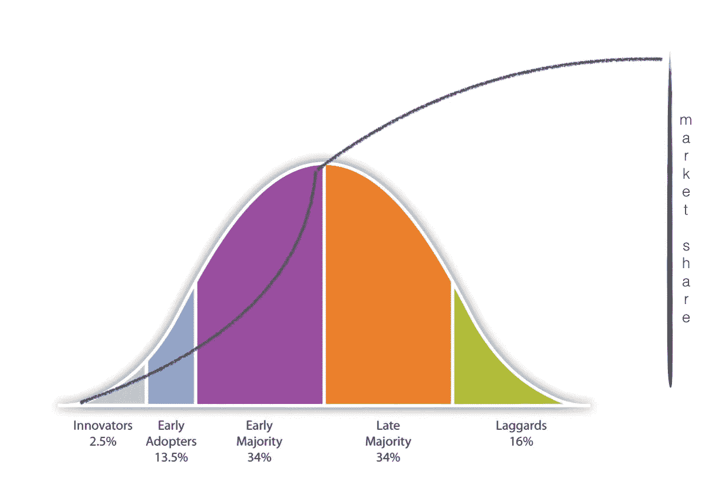
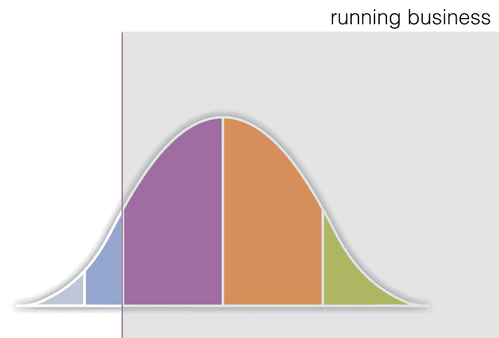
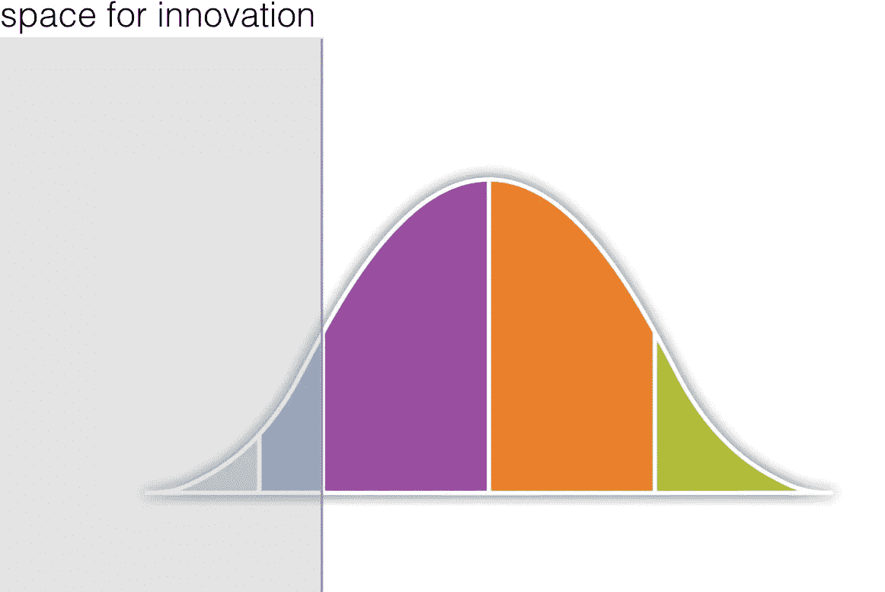

# 扼杀公司创新的 100%有效方法

> 原文：<https://medium.com/swlh/100-effective-method-to-kill-innovation-at-your-company-6a35986a52f4>

## 创新对你的企业重要吗？大概是的。你有创新团队或部门吗？很有可能。你确定你没有做让它失败的事情吗？大概不会。

随着商业世界每天都变得越来越快，越来越多的公司意识到他们需要以某种方式创新。有很多策略可以做到这一点，比如与设计机构合作，或者收购新成立的公司。一些公司决定组建自己的创新部门。他们雇佣渴望创新的人，目的是给公司带来新鲜感。通常情况下，他们会因为事情没有改变而感到失望。为什么这样

## 顾客的正态分布

让我们考虑一下人们如何采用新的解决方案。我们有愿意尝试新事物的创新者和早期采纳者。然后我们有早期的大多数:人们热衷于购买新的东西，但只有在他们觉得这样做是安全的之后。他们可能不会选择电动汽车，但肯定会选择网飞。然后是后来的大多数人:只有当东西变得便宜或者他们不能再用旧东西的时候才买。在 DVD 时代，这些人会去超市买 DVD。今天，就在我们说话的时候，他们已经习惯了网上购物。最后，还有落后者:无论有多少人使用某个解决方案，他们都不会接受。我已故的祖母选择永远不要从带旋转器的模拟手机换成带按钮的手机。但是不要沾沾自喜。我们每个人在某些方面都是落后者——不管是刷牙的方式，度假的方式还是睡觉的时间。在某些领域有落后的行为是很正常的。否则我们会因为过度刺激而发疯。

## 钱在哪里？

如果你从经济角度考虑产品采用过程，它是这样的:

向创新者和早期采用者销售时，收入相当少。这并不意味着他们不愿意在新产品上花相当多的钱。恰恰相反。关键是它们的数量相对较少，所以即使标价很高，你也只能赚这么多。

真正的大规模销售始于早期的多数——如果你能够向这些人销售，你的市场份额和利润就会增加。当你设法达到后期多数时，你就达到了顶峰。因此，到那时你的价格很可能至少下降了三倍。但可以肯定的是，你在做稳定的生意。

## 经营企业

不需要火箭科学家就能看出，任何企业能做的最明智的事情就是专注于迎合早期和晚期大多数人的需求。这毕竟是钱的所在。但问题来了。这两组人的预期都相当保守。他们不想要你想出来的最新最闪亮的创新。他们想要普通的牙刷。也许是不同的颜色或稍微不同的形状。但是它需要和他们所知道的相似。他们习惯了什么。他们愿意接受现状的改善，但不愿意接受现状的改变。他们可以考虑购买无线真空吸尘器，但不要购买清洁机器人。

所以，跑业务的密切关注他们。它调查他们的需求，考虑能说服他们再次购买几乎一样东西的增量改进。还是要升级。或者在他们已经拥有的基础上再增加一个元素。如果你想维持你的客户群，这似乎是唯一明智的做法。但是是吗？

## 不断变化的业务

人们越来越认识到，仅仅照常经营业务是不够的。因此，所有公司采取的创新策略，包括创建自己的创新部门。但是通常是怎么做的呢？

许多创新部门位于正在运行的业务中。他们由向那些负责保持当前客户群满意的人汇报的人领导。他们关注增长和利润。他们期待快速的结果。这是扼杀任何创新的 100%有效的策略。因为创新从来不存在于正在运行的业务中。它潜伏在创新者和早期采用者的边缘。并且没有足够的资金来满足业务运营的期望。因为如果是，那就不是创新了。这将是经营业务。

## 有办法做到吗？

写了一本关于成为变革推动者的书的 April Mills 继续在 T2 的博客上讲述如何为创新和任何组织寻求的任何其他变革创造可持续空间的技巧和诀窍。她也雄辩地谈论它[在这里](http://www.catchingthenextwavepodcast.com/207-april-mills)。如果让我总结这五个要点，听起来应该是这样的:

1.  从小处着手——在你自己的组织中寻找创新者和早期采用者，并以他们为基础创建一个团队。如果你建立了一个由早期和晚期多数成员组成的创新团队，你只能想象他们的焦点永远不会触及边缘。
2.  给他们保护——一个创新团队不能由那些专注于运营业务的人来管理。如果你允许他们有发言权，他们会不自觉地扼杀任何“无利可图”的想法。在你的高层领导中找到一个创新者，让她负责你组织的创新。
3.  给他们正确的成功标准——创新不会在一夜之间诞生。如果你的目标是看到结果，创造一个不拘泥于金钱和利润的成功衡量标准。可以是[口碑](/swlh/the-magical-word-of-mouth-e5f71f359634)。它可以是对你经营的企业的挑衅程度。或者，与市场上的其他产品相比，这仅仅是创意的新鲜感。
4.  给他们自由——如果有一个地方可以采用“专家国家”:一个专家说了算的地方，那就是这里。创新团队需要是自我运行的团队，否则他们只会成为领导思想的开发者。
5.  允许他们寻找灵感——期望创新团队永远运行项目是不可行的。个人的创造力只能让团队走到这一步。创新者需要不断受到激励。他们需要从不同的群体和不同的领域中汲取灵感。他们需要不断激发自己的创造力。这种刺激有的来自接触新知识，有的来自闲散和思考。两者都需要空间。

这能保证会出现一些创新吗？当然不是。但是，在这样的支持下建立一个创新部门，会大大增加开发众所周知的王牌的机会。也许不是为了今天或明天，而是为了未来。有些想法可以在短期内成为热门，有些甚至需要十年时间(比如，1999 年生产的 MS KINECT，2008 年才上市)。因此，如果你计划在未来几年保持你的业务，投资创新可能没有意义。但是，如果你打算在市场上呆更长时间，你最好有一些人认为长期的想法。把他们和那些经营你生意的人以同样的方式看待是没有意义的。否则，你只会有一个部门做着几乎相同的事情，只是有一个花哨的名称。

__________________________________________________________________

[*Aga Szóstek*](https://www.linkedin.com/in/agnieszka-sz%C3%B3stek-5aa2321/?originalSubdomain=pl) *，博士是一位经验丰富的设计师，在学术界和商界都有超过 19 年的实践经验。她是《* [*《鲜味策略:通过混合商业与体验设计*](https://www.amazon.com/Umami-Strategy-Mixing-Business-Experience/dp/9063695799/ref=sr_1_1?crid=1UNSXMBNPEFSF&keywords=umami+strategy&qid=1650869781&sprefix=%2Caps%2C140&sr=8-1) *脱颖而出》一书的作者，在构思过程中支持设计师的工具的创造者:* [*种子卡*](https://agaszostek.com/en/seed-cards) *和《抓住下一波* *播客中的共同主持人。*

## 这篇文章发表在 [The Startup](https://medium.com/swlh) 上，这是 Medium 最大的创业刊物，拥有+427，678 名读者。

## 在这里订阅接收[我们的头条新闻](https://growthsupply.com/the-startup-newsletter/)。

