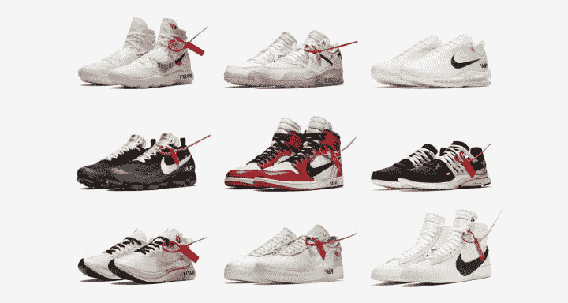

# 1000 美元的运动鞋和转售市场的增长

> 原文：<https://medium.com/swlh/1000-sneakers-and-the-growth-of-resale-marketplaces-69db586fe3f8>

显然，任何东西都有市场。

没有什么比与狗相关的市场数量更能概括这一点了——遛狗的 *Wag* ，看狗的 *Rover* ，狗远程医疗的 *Fuzzy* ，我敢肯定这份清单还会继续下去(补充说明:甚至没有狗主人)。

我们已经不再把 Craigslist 和易贝作为买卖的目的地…