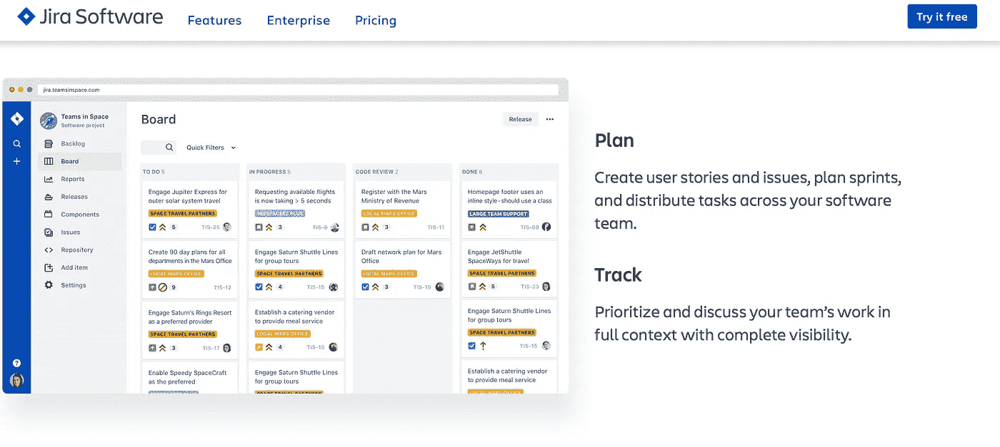
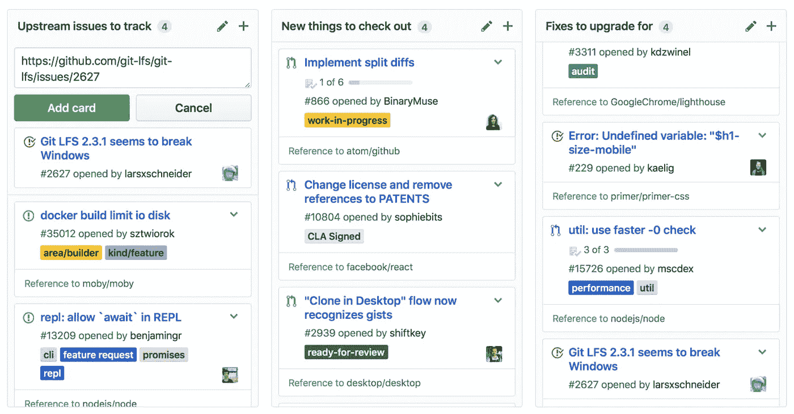
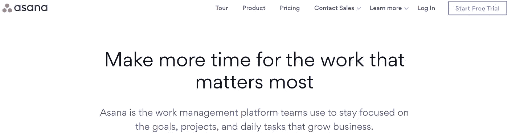
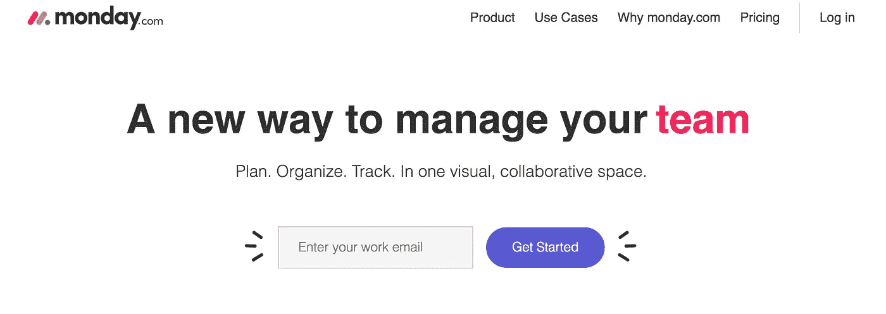
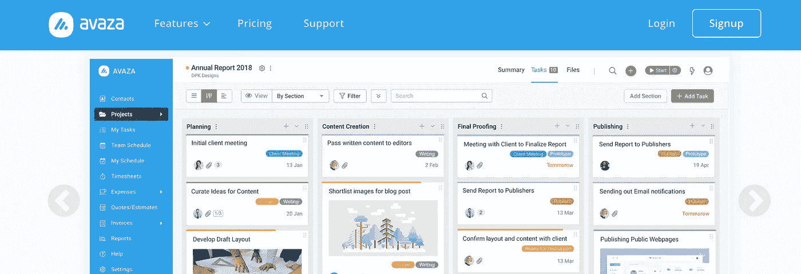
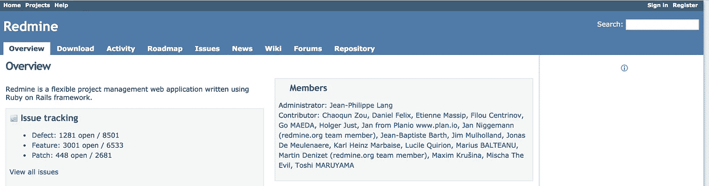
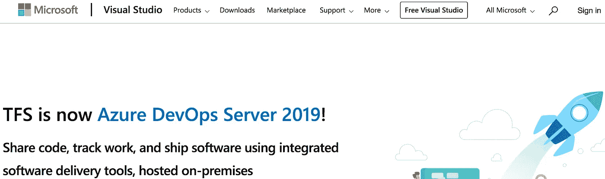
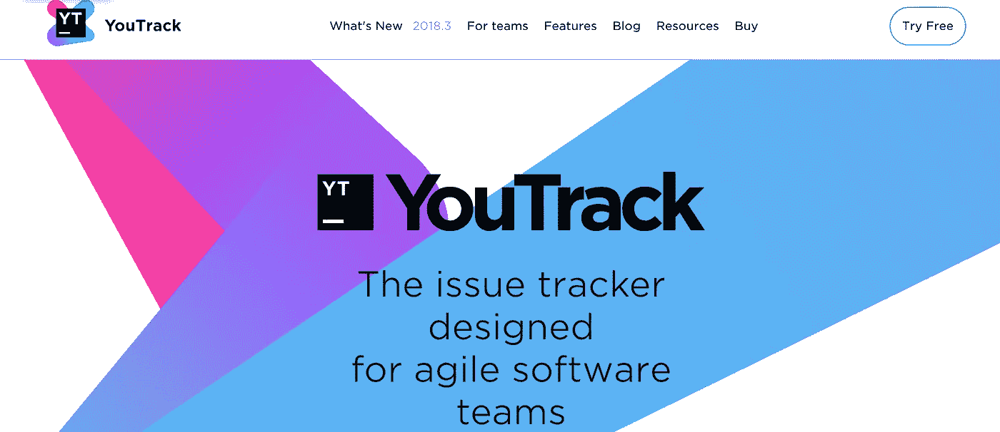
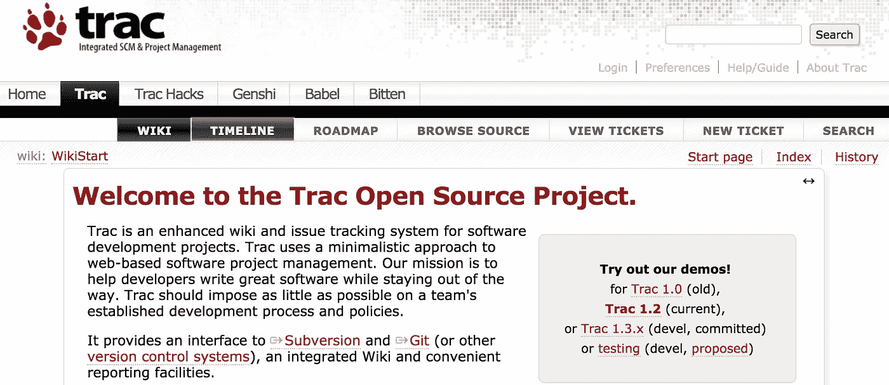

# 11 个问题跟踪系统将于 2019 年结账

> 原文：<https://medium.com/swlh/11-issue-tracking-systems-to-checkout-in-2019-fd80482c85ab>

回顾问题跟踪产品，开发人员应该了解这些产品，并在下一年中使用它们来提高个人工作流的效率，尤其是在团队中。

> **TL；DR:** 在这篇文章中，我们将会看到一些问题跟踪工具，开发者和他们的团队成员应该在来年了解这些工具。

# 简介

在软件开发生命周期中，问题跟踪工具的发明背后的概念是允许一个团队或者有时一个人记录和跟踪软件已经、可能或者正在发生的问题的进展。问题实际上可以是任何可以监控的东西，比如一个 bug、一个错误或者甚至是一个特性。可以通过重要性级别、分配的团队成员或任何其他进度度量指标来跟踪它们。

# 问题跟踪工具

在使用这些工具的客户方面，他们基本上是帮助人们报告问题，然后跟踪问题是如何解决的，有些人甚至让你知道负责解决问题的人/团队。从软件所有者的角度来看，它允许定制跟踪工具以满足他们的确切需求，并且还拥有一个协调软件事务的中央系统。如果问题跟踪工具不断更新，一个好的软件(开源软件)被认为是维护良好的。大多数工具使用称为票的小卡片；它是跟踪问题的最小单位，包含问题的定义、优先级状态以及与问题相关的所有其他重要数据。

# 1.吉拉

**Jira**

吉拉是最流行的问题跟踪和项目管理工具之一。这是一个直观的工具，用于跟踪网络和移动软件的问题。它是由 Atlassian 的团队开发的，有一个非常酷且易于使用的仪表板，其功能使项目管理真正无压力。这里可以开始[下载吉拉。在这里你可以创建用户故事和问题，计划冲刺，并在你的软件团队中分配任务。此外，在完全可见的情况下，对您团队的工作进行优先排序和讨论。](https://www.atlassian.com/software/jira)

# 2.特雷罗

**Trello**

Trello 是一个非常受欢迎的问题跟踪工具，它可以将您的项目组织成多个板块。Trello 告诉你正在做什么，谁在做什么，以及某件事在哪里进行。它基本上是一个白板，上面写满了标签和有组织的便笺，甚至可以在移动设备上访问。

> 如果你想听一些开发者在[安德拉](http://Andela.com)录制并表演的关于 slack 和 trello 的非常棒的说唱歌曲，你可以[点击这里](https://www.youtube.com/watch?v=R8jSait-W5s)。

# 3.Github 板

**Github Boards**

Github Boards 是 Github 的官方项目管理和问题跟踪工具，由于与您的 Github 资源库的快速集成，它已经成为远程团队最喜爱的工具。它位于 github 上项目部分创建的每个存储库中。这些项目由拉动请求、笔记和问题组成，您可以将它们组织成卡片，放在您选择的栏中，github 让您可以绝对控制项目板，并可以选择自动跟踪每个问题。

# 4.阿萨纳

**Asana**

凭借如此漂亮的用户界面，Asana 是由 facebook 的联合创始人达斯汀·莫斯科维茨和前谷歌员工贾斯汀·罗森斯坦创建的项目管理和问题跟踪工具，旨在帮助团队组织、跟踪和管理问题和错误。它还拥有非常直观的用户体验。您甚至可以创建可视化的项目计划，以查看每一步是如何随着时间的推移而规划的，即使计划发生变化，您也可以查明风险，消除障碍。还有一个组合特性，您可以实时监控所有的存储库。

# 5.星期一

**Monday**

周一是一个有益的灵活的在线工具，它通过管理工作量、跟踪项目、问题和错误、推进工作、与人交流来简化团队合作的方式，从而以直观和简单的方式管理问题跟踪工作流。通过一个非常直观的仪表盘来控制您的项目管理，该仪表盘还可以进行定制。

# 6.阿瓦扎

**Avaza**

Avaza 是一个问题跟踪解决方案，包括项目管理、资源调度、在线时间表、费用管理、在线发票、经常性发票、报价和发票等功能。Avaza 有一个非常直观的仪表板，还与第三方平台集成来管理工作流。它有强大的时间跟踪和可视化的调度资源功能。

# 7.点击

**ClickUp**

ClickUp 凭借定制视图计划从几乎所有其他项目管理和问题跟踪工具中脱颖而出。使用 ClickUp，您可以为不同的团队/任务获得不同的视图和仪表板。例如，设计师和开发人员有完全不同的仪表板，甚至项目经理也是如此。这是我最喜欢的问题跟踪工具之一。它也有一套视图:列表、框和板，所以你可以选择以一种非常规的方式拥有你的仪表板。

# 8.红矿

**Redmine**

Redmine 是一个基于网络的免费开源项目管理和问题跟踪工具。它允许用户管理多个项目和相关的子项目。它以每个项目的维基和论坛、时间跟踪以及灵活的、基于角色的访问控制为特色。它还可以让你在图表中可视化你的项目进度数据。它由 Redmine 的团队不断维护。

# 9.微软 TFS 公司

**Microsoft Team Foundation Server**

Microsoft Team Foundation Server 是一个 Microsoft 产品，它提供源代码管理、问题跟踪、报告、需求管理、项目管理、自动构建、实验室管理、测试和发布管理功能。它涵盖了整个应用生命周期，并支持 DevOps 功能。它是一个像 jira 一样的完整的工具套件，并且与 Visual Studio 作为 Team Server 进行了更加无缝的集成。

# 10.Youtrack

**Youtrack**

由 Jetbrains 的团队构建，Youtrack 是一个基于浏览器的商业 bug 跟踪器、问题跟踪系统和项目管理软件。一个项目管理工具，可以适应您的过程，帮助您交付优秀的产品。跟踪任务和错误，计划冲刺和发布，创建工作流程，并为您的业务流程定制 YouTrack。永远不要强迫你的过程再次适应工具的限制。与其他问题跟踪器不同，YouTrack 可以根据您的需求进行定制。对于敏捷团队来说，这是一个非常受欢迎的选择，对于开源项目来说是免费的。

# 11.开源软件应用

**Trac**

Trac 是一个开源、基于 Web 的项目管理和 bug 跟踪系统。它已经被许多组织采用，用作自由和开源软件以及专有项目和产品的 bug 跟踪系统。它为 git 这样的版本控制系统提供了一个无缝的接口，并且是不断维护的。

# 结论

这些是有助于问题跟踪的众多项目管理工具中的几个。这些工具中的大多数都是有益的，并且可以与行业标准产品和版本控制系统顺利集成。因此，根据您的预算、需求和偏好，您可以选择和使用问题跟踪工具，以使您的工作流程在团队中更加高效。

## 这篇文章发表在 [The Startup](https://medium.com/swlh) 上，这是 Medium 最大的创业刊物，拥有+406，714 名读者。

## 订阅接收[我们的头条](http://growthsupply.com/the-startup-newsletter/)。

