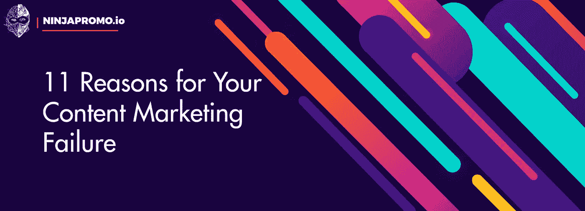

# 你内容营销失败的 11 个原因

> 原文：<https://medium.com/swlh/11-reasons-for-your-content-marketing-failure-2111b99c596b>

每个营销人员都必须问问自己，他/她在公司或个人博客上发布的内容有多好，有多有效。如果你写了又写，但都是徒劳的——你得不到任何有意义的结果:流量——就像什么也谈不上；你的帖子几乎没有任何线索和链接；评论区一片冰冷的沉默——[NinjaPromo](http://ninjapromo.io/?utm_source=medium&utm_medium=organic&utm_campaign=promo)已经为你找到了一些可能的理由。尽情享受吧！

1.  **你花不到一个小时准备每一个帖子。**

的确，一篇内容丰富的帖子可以在 15 分钟内写完。但这种情况确实很少发生。众所周知，大多数受欢迎的博主花 2 到 10 个小时来准备每篇文章。如果你的情况不是这样，重新考虑你的方法。

**2。你认为你的内容“足够好”**

如果让你给你的内容质量打个 10 分的分，你会给多少分？6 分？7?大多数博客可能会回答这个问题。但是有一个棘手的时刻:你的材料的质量不能根据任何尺度来评估。它要么吸引人们的眼球，要么让他们想睡觉，没有中间地带。

换句话说，如果你给你的内容评分为 6 或 7，这和你给 1 评分是一样的。发布这样的内容是浪费时间。

Photo by [Kevin Ku](https://unsplash.com/photos/aiyBwbrWWlo?utm_source=unsplash&utm_medium=referral&utm_content=creditCopyText) on [Unsplash](https://unsplash.com/search/photos/waste-of-time?utm_source=unsplash&utm_medium=referral&utm_content=creditCopyText)

**3。你的访问者平均在博客上停留不到 2 分钟。**

对于大多数传入流量源，任何不超过 2 分钟的指标都被视为不良。如果平均时间连一分钟都不到，那么你的内容会让人失去兴趣。你应该改进它。

**4。你更关心 SEO，而不是别人怎么想。**

每当一个新的博主在写他的第一篇文章之前开始考虑搜索引擎优化(SEO)的时候，就有一个令人担忧的信号——注意力不是放在文本上。因为没有更好的方法来写一篇可怕的，无用的文章，而不是故意用关键词填充它，希望搜索引擎把你的页面排在更高的位置。而事实上，对你来说更重要的是真人给你的博客链接。

**5。你认为 SEO 是创建一个受欢迎的博客的主要秘密。**

为了不误导任何人，我们应该承认绝大多数成功的博主都是真正的 SEO 粉丝。然而，它们都没有将搜索引擎优化放在首要位置。

单靠 SEO 不会让你的博客受欢迎。因此，你的行动顺序应该始终如下:首先准备一篇有趣的文章，然后才是为搜索引擎优化。

**6。主题——关于一切..和任何东西**

阻止人们访问你的博客的最快方法之一是写下你想到的一切。

为什么？因为人们阅读材料不是为了了解你的想法，而是为了找到解决他们问题的方法。如果你不再写他们，他们就会停止阅读你。

Photo by [William Iven](https://unsplash.com/photos/OP2EQ5g-Zkw?utm_source=unsplash&utm_medium=referral&utm_content=creditCopyText) on [Unsplash](https://unsplash.com/search/photos/reading?utm_source=unsplash&utm_medium=referral&utm_content=creditCopyText)

7 .**。你不知道你的内容是否有益于读者。**

让我们做一个小测试:如果在一年之内，你的博客的读者应用了你发表的内容，你能说出他们的生活会有什么变化吗？你能帮助他们获得哪些具体的、可衡量的结果？

它不是关于读者从你的内容中获得一种“深刻的道德满足感”的事实。这是关于别的事情:例如，你能说你的读者已经为他们的生意找到了 5 个新客户，应用了你给的建议吗？

**8。你认为你应该得到更多的流量。**

没有人因为你免费与他们分享有价值的知识而对你表示感谢，这让你感到烦恼吗？

有了这个，你需要学会如何生活。大多数受欢迎的博客都花了一年多的时间才赢得了他人关注的权利。在博客中，认可是随着时间而来的。而这个规律几乎没有例外。

**9。你有科学、工程或其他技术背景。**

虽然这听起来很有偏见，但实践表明，这种“不光彩”的过去可能会阻碍成为一名优秀的博客作者。这种状况的一个可能原因是，科学和技术世界的生活培养了人们在技术任务的框架内思考的习惯，以及灌输了一定程度的被动性和无法进行全球思考——所有这三种品质对公关人员来说都是破坏性的。

很明显，参与这些学科不会自动让你不适合写博客。

10。你不会读到如何写出好的内容。

经营你的博客而不阅读任何关于创造高质量内容的文献，就像没有地图而寻找隐藏的宝藏一样。当然，从理论上讲，你可以不用卡片就能找到它们，但是你不能真的依赖这种神奇的运气。

对了，看这篇文章，你从事的正是这一段所说的。但是不要止步于此。

**11。你每周花在阅读上的时间少于 10 小时。**

预计除了大量写作，你还会有时间和大量阅读。得益于此，你将提高文学风格(通过使用新的隐喻、故事和你从阅读其他作者那里学到的文体技巧)——你将始终跟上你所报道领域发生的一切。

Photo by [Roman Kraft](https://unsplash.com/photos/_Zua2hyvTBk?utm_source=unsplash&utm_medium=referral&utm_content=creditCopyText) on [Unsplash](https://unsplash.com/search/photos/reading-text?utm_source=unsplash&utm_medium=referral&utm_content=creditCopyText)

值得注意的是，每周 10 小时是至关重要的最低时间。理想情况下，为了获得阅读的全部好处，你需要每周花大约 20-40 个小时来阅读。

# **总结**

高质量信息的准备和发布是一项需要时间、精力和耐心的工作。

为了创建一个成功的博客(就像在其他行业一样)，学习如何坚持到底是很重要的。如果现在，读着这篇文章，你正在努力思考，试图评估你的资源， [NinjaPromo](http://ninjapromo.io/?utm_source=medium&utm_medium=organic&utm_campaign=promo) 的工作没有白费。

不要忘记，博客是产生潜在客户的主要资产，其中的每篇文章都必须包含一定的优惠，并带来微转化(订阅细分时事通讯、产品或服务咨询线索、网上研讨会、下载白皮书等)。)

*感谢您阅读这篇文章！如果你喜欢它，请分享它，并告诉我们你对内容营销的看法。另外，你可能会喜欢我们的其他故事:*

> — [如何衡量移动应用的有效性？](/swlh/how-to-measure-the-effectiveness-of-a-mobile-application-23c29c6722cd)
> 
> —[2019 年影响者营销— Instagram 风格](/datadriveninvestor/influencer-marketing-2019-instagram-style-29bc6ad9f00b)
> 
> — [内容营销推动销售吗？](/swlh/do-content-marketing-drive-sales-dfa1a9beb2b3)
> 
> — T [年度趋势:Stablecoins 代替 ICO](/@NinjaPromoAgency/trend-of-the-year-stablecoins-instead-of-ico-688d28844a7a)

## 这篇文章发表在 [The Startup](https://medium.com/swlh) 上，这是 Medium 最大的创业刊物，拥有+437，678 名读者。

## 在此订阅接收[我们的头条新闻](https://growthsupply.com/the-startup-newsletter/)。

