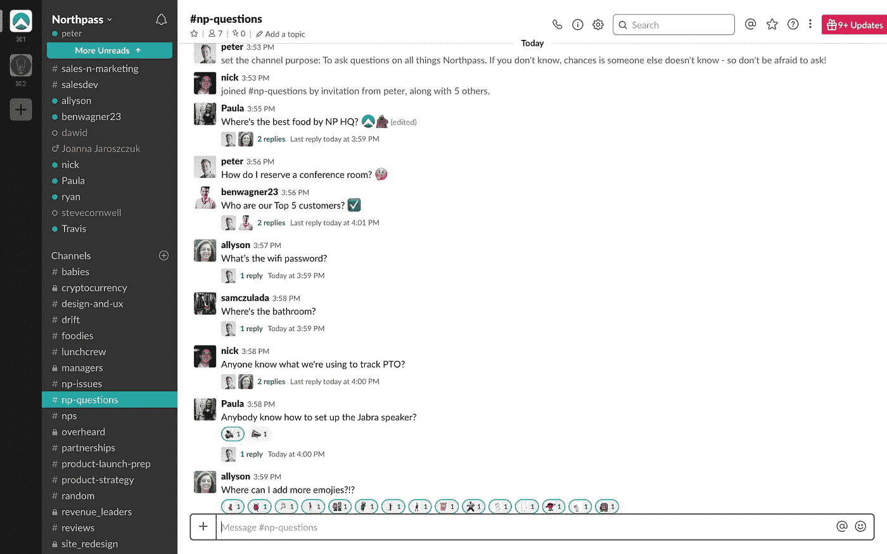
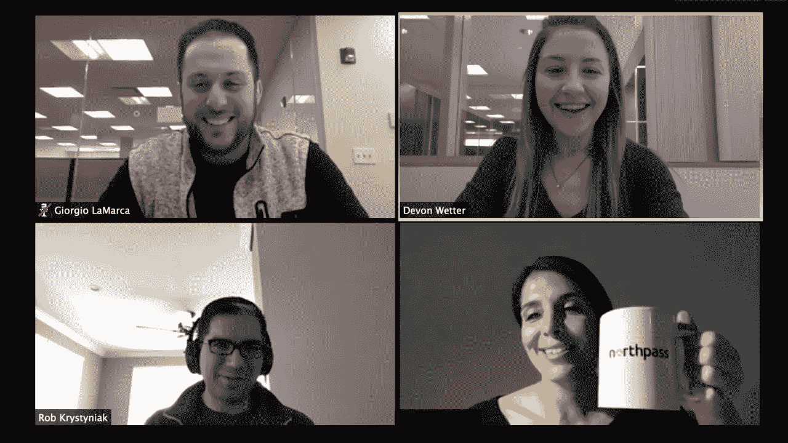
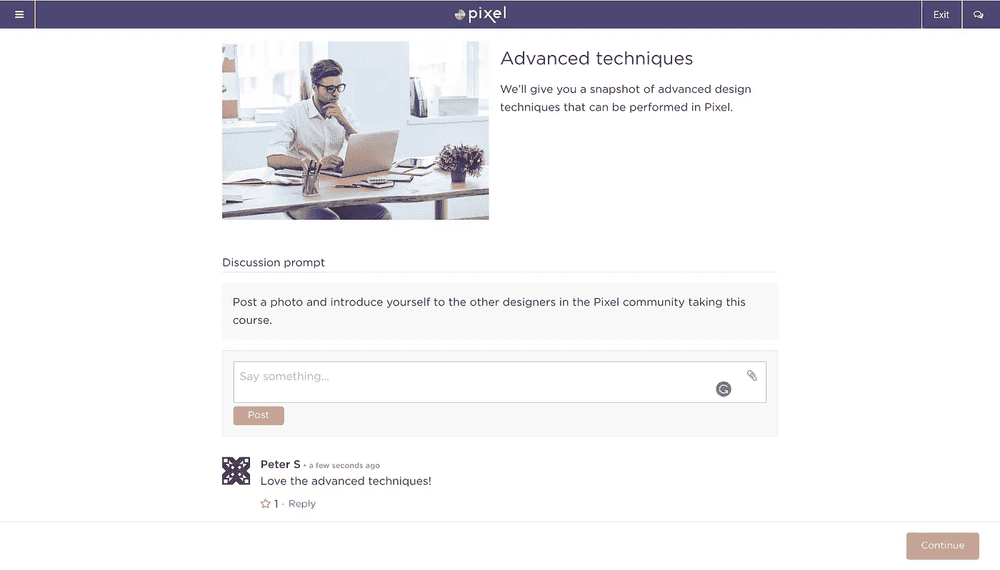
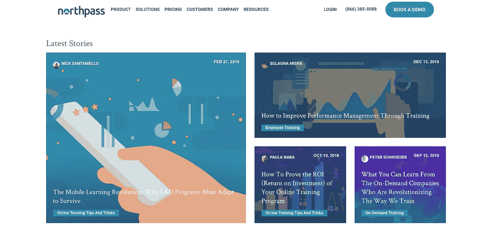

# 现代管理者的 11 个独特团队培训理念

> 原文：<https://medium.com/swlh/11-unique-team-training-ideas-for-modern-managers-879981319a1c>

使用这些技巧、工具和技术，快速提升你的内部团队培训。

 [## 每当彼得·施罗德发表文章时，就收到一封电子邮件。

### 每当彼得·施罗德发表文章时，就收到一封电子邮件。通过注册，您将创建一个中型帐户，如果您还没有…

medium.com](/subscribe/@peterschroederr) 

W 当想到团队培训时，你可能会想象你的员工离开公司，在会议室里坐一两天。来自贵公司的辅导员或培训师以及其他专家带领团队完成一系列练习和[培训课程](https://elearningindustry.com/employee-training-software-what-manager-needs-know)。

培训对你的组织的成功至关重要，但是离开工作场所两天会降低生产力。而且不得不等待那些预定的非现场日也是有问题的。

例如，也许你刚刚雇用了 10 名新员工，你需要让他们马上熟悉工作。在培训新员工时，您希望优化您的入职效率。

幸运的是，有了电子学习，有无数种方式为新员工提供[及时培训](https://www.northpass.com/blog/the-complete-guide-employee-onboarding)，这些培训可以整合到工作日和你的学习管理系统中。

这里有 13 个想法，你可以用来提高你的团队训练，无论是在场外还是现场，在办公室还是在网上。

# 1.为新员工制作更多更短的介绍视频

视频是与新员工分享公司使命、期望、程序和资源的可靠且可扩展的方式。但是不要犯试图制作一个涵盖所有内容的综合视频的错误。

简短易记通常更好，它允许您轻松地更新单个内容或定制单个员工需要的内容。

例如，简单的截屏可以用来演示如何使用你的电子邮件系统，如何设置语音邮件，以及你的计时系统如何工作。

# 2.使用演示视频进行强调

Northpass’ Demo Video

包含视频的团队训练项目如今风靡一时。然而，如果你的组织决定首次在其培训计划中播放视频，这种前景可能会引起员工的恐慌。没必要。

专门从事视频制作的机构和公司如雨后春笋般涌现，以指导组织战略性地使用视频。更好的是，大量的在线课程和社区可以在你制作视频的同时为你提供支持。

即使你的团队[培训活动](https://elearningindustry.com/employee-lifecycle-tips-help-rule-market-talent-king)是亲自演示如何使用设备，处理客户服务，或实践安全——后续演示视频可以加强学习。

许多员工将从材料的回顾中受益，并且可能更喜欢暂停和回顾的能力。

# 3.利用社交网络建立关系

[Northpass](https://www.northpass.com/) has a Slack channel for anyone to ask questions on our product, organization, facility, etc.

创建一个内部 [Slack](https://onna.com/blog/the-beginners-guide-to-slack-ediscovery/) 渠道，供员工就特定主题提问并从同事那里获得答案。这些也有助于教练和导师与你的团队保持联系。

我们频道的宗旨是:“对诺斯帕斯的所有事情提出问题。如果你不知道，很可能其他人也不知道，所以不要害怕去问！”

让新员工知道可以提问，从而营造一个坦诚开放的环境。

# 4.建立在线入职计划

An example of [Northpass](https://www.northpass.com/)

[入职培训](https://www.northpass.com/employee-training)有助于提高员工绩效，通常没有大多数团队培训那么正式，并且关注个人需求。

在你的入职培训中利用资深员工。对于想要提问或获得支持、鼓励和反馈的员工来说，它们是理想的资源。导师也可以帮助设定目标，并提出有效的策略。

在入职方面取得成功的公司意识到，这是一个多方面的过程，取决于技术基础设施、市场营销能力、用户参与度、出色的设计和有效的培训。(注意: [Northpass](http://www.northpass.com) 有助于简化过程，减少摩擦)

通过深思熟虑的规划，一步一个脚印，你可以将这一挑战转化为增长引擎，使你在竞争中脱颖而出。

# 5.推动网络会议或网络研讨会，促进团队培训和协作

Web 会议使远程工作或在其他地点工作的员工能够实时加入同事。类似于课堂教学，网络研讨会允许培训者在线观看，使体验更加个性化，并允许员工实时提问。

Zoom、GoToWebinar、Microsoft Office Live Meeting、Adobe Acrobat Connect Pro 和 CiscoWebEx 等网络会议或网络研讨会工具是将小型团队聚集在一起的最常用工具。

# 6.创建讨论板、奇迹墙或涂鸦墙

讨论板是学员在培训课程中互相讨论主题的好地方，也是讲师提供更多信息的好地方。

神奇墙有时被用于“翻转学习”，它结合了在线学习和课堂教学。神奇墙是参与者写下他们的想法或添加讨论主题的地方。

涂鸦墙使用虚拟或教室内的活动挂图或白板，让参与者写下关于某个主题的“涂鸦”，包括他们的观点和感受。

# 7.讲故事

团队训练不再使用传统的说教形式，而是演变成讲述一个故事的叙述。这使得培训更容易接受，并确保没有信息从一个耳朵进，从另一个耳朵出。

我们的社会是建立在故事之上的。故事让我们关心并帮助我们联系。这就是为什么最好的内容利用讲故事来推动参与和保留。这是一种屡试不爽的授课方式，可以亲自授课，也可以通过在线视频授课。

在你的组织中，谁是最好的故事讲述者？考虑招募他们参加一些小组培训课程，尤其是如果他们有员工需要学习的专业知识。让你的教学设计师参与进来，创作一个写得很好的故事。

# 8.让回顾步骤充满乐趣，而不是老调重弹

在他的文章 [*中，培训专家 Robert W. Lucas 建议使用有趣的活动进行复习。他说，“不要简单地回顾你课程中的关键概念，让学习者为你做这件事。”*](http://www.thecreativetrainer.com/wordpress/)

他使用一种“烫手山芋”游戏，通过音乐和投掷东西来吸引所有参与者。评审期间您可以使用的其他有趣的培训活动包括:

*   制作一个上面有复习题的轮盘，然后随机召集学生旋转轮盘，看看他们能否正确回答问题。
*   在交互式白板上使用危险游戏。将全班分成两队对这个问题进行投票。正确答案最多的队伍获胜。在[JeopardyLabs.com](https://jeopardylabs.com/)寻找模板。

# 9.建立一个内部博客，邀请员工投稿

The [Northpass Blog](https://www.northpass.com/blog)

你团队中的一些人会通过书面文字更好地向同事表达自己，他们都会有让你惊讶的观察和故事分享。给他们一个在内部博客上发表文章的机会将有助于你的团队团结，并在一系列主题上发挥领导作用。

同样，职业发展和领导力的战略可以来自你的老员工或资深员工，通过你内部网的博客。

# 10.使用问题桶

在您完成[团队培训](https://elearningindustry.com/create-a-training-program-works-5-steps-building-stronger-employees)的每个模块后，请员工写下他们的问题，并将其添加到一个桶中。然后让参与者轮流抽出一个问题并回答。

你甚至可以提出自己的与培训材料无关的问题，比如“你最喜欢的度假地点在哪里？”如果班级提前知道他们可能会被随机要求参与，他们肯定会在课堂上更加关注。

确保人们感到被授权提出澄清性问题。如果人们感到足够安全和放心来问这些问题，你知道你已经创造了一个安全和授权的工作环境。

# 11.用增能剂打破你的员工培训

所有优秀的教练都知道用一两个破冰的话题来开始他们的课程，但是全天喷洒能量剂将有助于参与者保持警觉。小组讨论、解决问题的分组会议、小测验、伸展运动甚至一个快速游戏都是让你的班级充满活力的好方法。

在线运行您的课程？没问题。用频繁的互动测验来打破你的教学，以评估你的学生对材料的吸收程度。

# 今天就尝试几个，开始组建你的团队

受过培训的员工是快乐的员工，这给你的组织带来了竞争优势。这意味着团队培训应该是对你的员工的持续承诺。

所以，从上面的列表中挑选三个想法，将它们融入到工作中，看着你的培训计划更上一层楼。

## 这篇文章发表在 [The Startup](https://medium.com/swlh) 上，这是 Medium 最大的创业刊物，拥有+443，678 读者。

## 在这里订阅接收[我们的头条新闻](https://growthsupply.com/the-startup-newsletter/)。

