# 12 个高转化率登录页面(这会让你希望是你建的)

> 原文：<https://medium.com/swlh/12-high-converting-landing-pages-thatll-make-you-wish-you-built-em-96afe0815472>

*由* [*加勒特·休斯*](https://twitter.com/garrettbhughes) *，营销文案主持人*

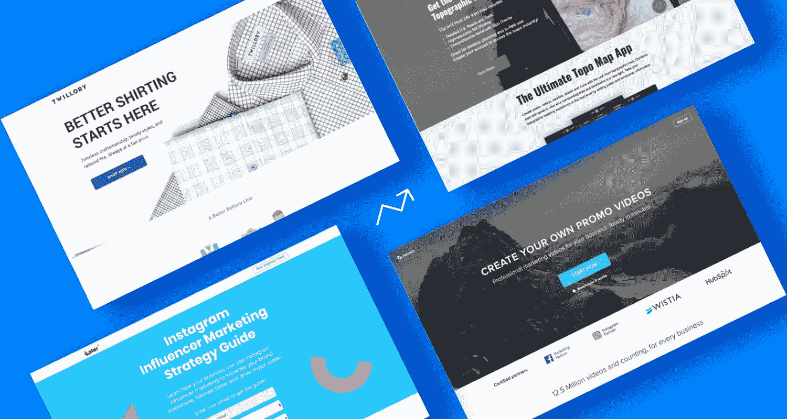

不要误解我们:[我们喜欢好看的登陆页面](https://unbounce.com/landing-page-examples/best-landing-page-design-examples/?utm_medium=referral&utm_source=medium&utm_campaign=blog-post-high-converting-lp-examples&utm_content=blog-post-best-lp-design-examples)。颜色对比以引起注意的方式；引人注目的定制摄影和动画；负空间和布局三法则的巧妙运用。说真的，这些东西让我们夜不能寐。

但是在 Unbounce，我们知道登陆页面不仅仅是外观。我们想要那种当你把它带回家给你的 CMO 时不会让你尴尬的页面。你真的可以，你知道… ***用*** 建立一个活动。

我们真正想要的是一个登录页面转换。

# 是什么造就了高转化率的登陆页？

人们已经用 Unbounce Builder 创建了很多登录页面(就像你们一样，很多)，所以我们认为我们已经很好地理解了是什么让页面转换。多年来，很明显几乎所有成功的登陆页面都有一些共同的关键元素。

高转化率登录页面:

*   **有一个强有力的、上下文相关的英雄照片和辅助图像**
    你的英雄照片(你的登陆页面上折叠上方的主要图像或视频)是访客首先要关注的，所以你最好让它吸引人。在使用环境中展示你的产品或服务:展示它是如何工作的，让人们很容易想象自己正在享受好处。
*   **展示一个单一的重点行动号召**
    你的行动号召(CTA)是你希望访问者在你的页面上做的一件事，也是你的主要转化指标。确保你的 CTA 是显而易见的(从设计的角度)和引人注目的(从文案的角度)。最佳做法通常是在通过 CTA 进行转换之前，删除任何可能导致他人离开您页面的二级链接，包括网站导航。
*   用一个引人注目的标题和副标题清楚地陈述你的价值主张。使用你的标题和副标题来阐述你的价值主张，清楚地说明你的产品的好处以及你与竞争对手的不同之处。
*   **概述产品的特点和优势(重点是后者)**
    当然，人们需要知道你的产品或服务是做什么的，但如果他们明白坚持使用你的 CTA 能给他们带来什么好处，他们更有可能改变主意。以利益为导向的信息传递(我们将在一些例子中看到)是推动转化的最佳方式之一。
*   **包括推荐书和其他形式的社会证明**
    如果人们相信其他人在他们之前已经这样做了(并且对结果感到满意)，他们更有可能在你的登录页面上转化。社交证明——证明、评论、合作伙伴徽标——可以快速有效地与潜在客户建立信任。

> 你的页面有你需要的所有元素来推动转化吗？[Unbounce 登陆页面分析器](https://unbounce.com/landing-page-analyzer/?utm_medium=referral&utm_source=medium&utm_campaign=blog-post-high-converting-lp-examples&utm_content=lp-analyzer)根据九项性能指标对您的页面进行评级，并找出提高转化率的机会。

# 高转化率登录页面示例

在我们深入我们的高转化率登录页面示例之前，让我们设定一些基本规则。下面介绍的所有页面都有至少 500 名访客，尽管许多页面的访客超过了 10 万。它们的转换率都在 30%以上。(作为参考，[平均落地转换率](https://unbounce.com/average-conversion-rates-landing-pages/?utm_medium=referral&utm_source=medium&utm_campaign=blog-post-high-converting-lp-examples&utm_content=lp-average-conversion-rates-landing-pages)约为 4%。)

值得注意的是，转化率受你登陆页面实际内容之外的很多因素影响。例如，我们知道**平均转换率因行业而异**。请务必查看我们的[转换基准报告](https://www.conversionbenchmarkreport.com/?utm_medium=referral&utm_source=medium&utm_campaign=blog-post-high-converting-lp-examples&utm_content=conversion-benchmark-report)，了解您与竞争对手相比的优势。

还有一个流量质量的问题:如果你的页面从针对性差的广告中获得了大量的流量，你的转换率将会低于有更多合格访问者的情况。当然，点击页面的转化率会高于 lead gen 页面，因为转化目标要简单得多。在过于苛刻地评判你自己的页面之前，请记住这些事情。

排除免责声明后，**这里有 12 个来自未发布客户的高转化率登录页面示例**(有来自实际构建它们的人的转化提示)。

# 1.商品广告

## 行业:社交媒体/转化率:46.94%

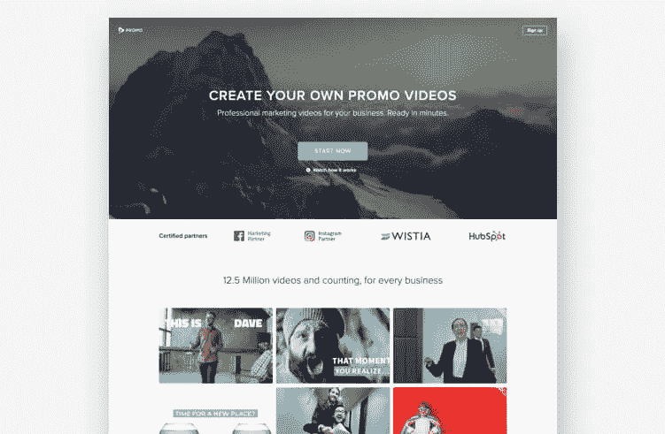

[Image courtesy of Promo](https://promo.com/). (Click [here](https://unbounce-wpengine.netdna-ssl.com/photos/promo-lp.jpg) to see the full page.)

> 宣传片的高转化提示:利用视频增加访客参与度，推动转化。

如果我们已经说过一次，我们至少还会说几次:**在你的登陆页面上使用视频是提高参与度和转换率的好方法**。事实上，在你的页面上包含一些动态图片可以[提高 80%的转化率](https://unbounce.com/landing-page-articles/the-benefits-of-using-video-on-landing-pages/?utm_medium=referral&utm_source=medium&utm_campaign=blog-post-high-converting-lp-examples&utm_content=landing-page-articles)。值得投资，不是吗？

Promo 也是这么认为的，这就是为什么他们在这个视频制作服务的登录页面上包含了大量的视频内容——从标题到解说视频，再到访问者可以在自己的营销中实际使用的示例视频。

已注明 [Yael Miriam Klass](https://www.linkedin.com/in/yael-miriam-klass/) ，宣传片内容导语:

> 我们专注于创造转换视频，吸引观众和引发行动。
> 
> 为此，我们的登录页面有一个漂亮的动态标题视频，占据了第一个文件夹，并覆盖了显示明确价值主张的文本。

然而，视频只是等式的一部分。你想让访问者转变，这意味着让他们跟随你的行动号召。不要担心——Yael 说:“没有直接的文本和第一页引人注目的 CTA 按钮，任何登陆页面都不会产生影响。”宣传片抓住了这些元素，然后用一堆客户推荐和强有力的客户标志来结束这一切。干得好。

# 2.edX

## 行业:教育/转化率:52.68%

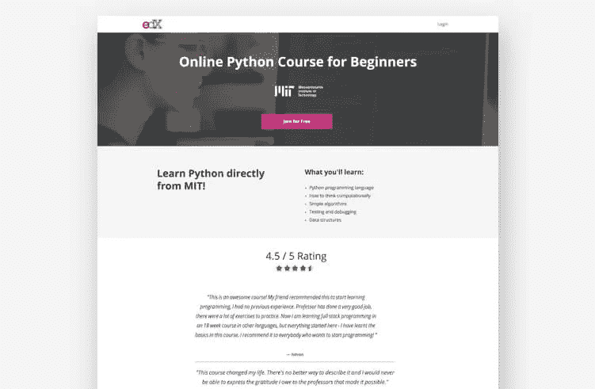

[Image courtesy of edX](https://www.edx.org/). (Click [here](https://unbounce-wpengine.netdna-ssl.com/photos/edx-lp.jpg) to see the full page.)

> edX 的高转化提示:简化你的推销，让好处一目了然。

美国营销人员往往与我们的产品和服务如此接近，以至于我们有时会向潜在客户提供过多的信息。“是的，我们的核心产品是 X，但是这些铃铛怎么样？那些哨子呢？“不，他们可能不知道这些额外的好处，但在这个阶段，他们可能不需要知道。

在他们的在线课程的登陆页面上，edX 的高级成长型营销人员[乔希·格罗斯曼](https://www.linkedin.com/in/joshgrossman28/)选择将信息精简为他希望访问者带走的要点。“我们没有拘泥于课程的细节，而是用几个要点让人们很容易理解他们将学到什么。”这一点，以及明确的标题和副标题后，坚实的社会证明。

“在我们的测试中，较短的拷贝比较长的拷贝效果更好，”乔希补充道。“要么想学 Python，要么不想学。”

这是一个我们都应该牢记在心的见解。有些人不会想要你所拥有的，无论你向他们抛出多少额外的信息。最好省点口舌(或字数)，把注意力放在有这种想法的人身上。

# 3.后来

## 行业:社交媒体/转化率:57.92%

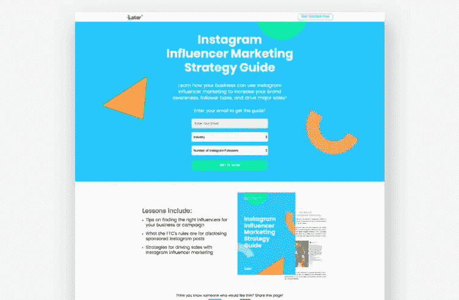

[Image courtesy of Later](https://later.com/). (Click [here](https://unbounce-wpengine.netdna-ssl.com/photos/later-lp.jpg) to see the full page.)

> 后来的高转换提示:保持转换气味和平衡你的激励。

人类是善变的生物。他们很容易分心。他们会感到困惑。大多数情况下，他们是坏的。作为一名营销人员，这意味着在购买过程的每一步，你都需要牵着他们的手——或者，对我们来说，*牵着他们的鼻子*。

**转换气味是在整个消费过程中保持文字和视觉提示一致的原则**。这就是[后来](https://later.com/)为这一商机挖掘活动所做的工作，正如 [Chin Tan](https://www.linkedin.com/in/chinhweetan/) 所言，该公司的传播设计负责人解释道:

> 我们在整个活动中保持转换气味。报价与广告、电子邮件、登陆页面前的创意以及页面后的内容相匹配。

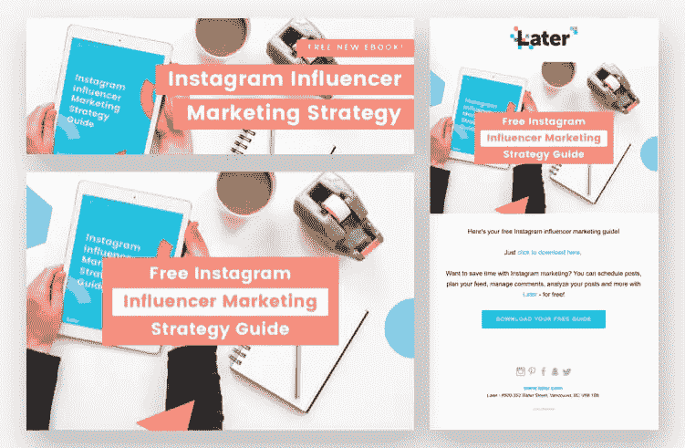

Check out Later’s clever use of conversion scent to deliver a unified customer journey.

Chin 也承认，提供的简单性对该网页的成功做出了贡献。“很明显你会得到什么:你用你的电子邮件来交换访问指南。表格不太长，只要求相关信息。在这个漏斗的顶端询问太多的个人信息会吓到访问者。确保你的要求与你提供的激励价值相匹配。

# 4.列表实验室

## 行业:房地产

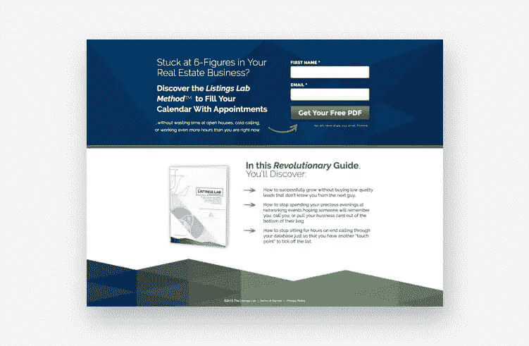

[Image courtesy of The Listings Lab](https://go.thelistingslab.com/). (Click [here](https://unbounce-wpengine.netdna-ssl.com/photos/thelistingslab-lp.jpg) to see the full page.)

> 清单实验室的高转换提示:使用简单明了的设计，把重点放在报价上。

另一个潜在客户生成页面，我们来自[列表实验室](https://go.thelistingslab.com/)的示例并不是列表中最耀眼的，但是不要让它欺骗了你:**这个简单的页面很有冲击力。**

首先说设计。清单实验室在将所有页面内容压缩到一个小空间而不让人觉得拥挤方面做得很好。游客不需要滚动页面就能明白提供了什么以及为什么它有价值。

“下载的模型有助于人们觉得这是一个制作精良的真实的东西，他们可以阅读，”列表实验室的营销总监伊夫·勒努维尔说。"表单的彩色大按钮上的粗体文本将人们的注意力吸引到 CTA 上."更不用说方向提示，这是另一个很好的触摸。

尽管如此，还是以利益为导向的文案把这一页放在了最上面。房源实验室真正瞄准了房地产经纪人的关键痛点——陌生电话、糟糕的线索、长时间的工作——并提供了替代方案。“人们看到的第一份文案是讲述来访者的痛苦，然后向他们提出解决方案。“读读指南，赚更多的钱，找回自己的生活。不喜欢什么？

在保持随意的同时注入自信的隐私声明加分。

# 5.Twillory

## 行业:服装/转化率:46.85%

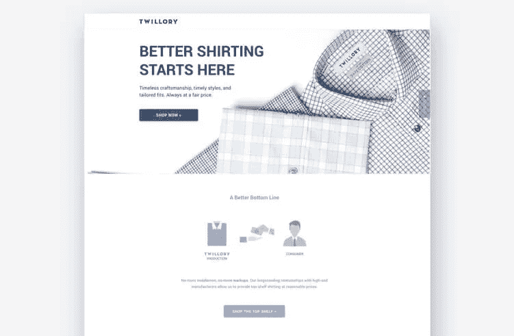

[Image courtesy of Twillory](https://www.twillory.com/). (Click [here](https://unbounce-wpengine.netdna-ssl.com/photos/twillory-lp.jpg) to see the full page.)

> Twillory 的高转换提示:为您的移动访问者建立定制体验。

我们不需要告诉你，移动消费者应该是优先考虑的对象。(尽管我们*已经告诉你*很久了。)到 2017 年，移动已经成为全球网络流量的主要来源，占 50.3%——[这一部分去年有所增长](https://www.statista.com/statistics/241462/global-mobile-phone-website-traffic-share/)，达到 52.2%。将移动消费者视为在线受众的一部分已经不够了。**在 2019 年，他们通常是大多数。**(查那些 GA 报告，人。)

内[机构的数字自动化经理 Aditya Bagri 描述了他的团队如何适应消费者对品牌的第一次体验往往是在手机上的世界:](https://www.agencywithin.com/creative-and-landing-page-services/)

> 我们的登录页面创建策略是移动优先，针对移动进行优化有助于我们获得首次浏览者。

许多品牌不仅仅是建立移动响应页面，而是为他们的移动访问者创造不同的体验。

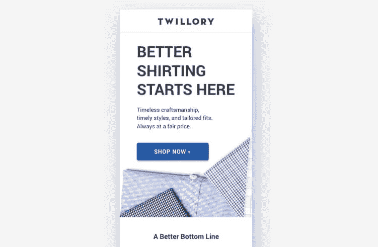

[Image courtesy of Twillory](https://www.twillory.com/). (Click [here](https://unbounce-wpengine.netdna-ssl.com/photos/twillory-lp-mobile.jpg) to see the full page.)

输入机构和 [Twillory](https://www.twillory.com/) 。在桌面上，这个登录页面包括视频和 gif——这些元素已经被证明可以增加访问者的参与度，并有助于推动转化。不过，在手机上，我们得到了一个精简版，它保持了老大哥的视觉吸引力，同时也确保了手机连接的闪电般加载速度。

Twillory 因使用[解锁弹出窗口](https://unbounce.com/product-overview/popups/?utm_medium=referral&utm_source=medium&utm_campaign=blog-post-high-converting-lp-examples&utm_content=lp-popups)给予访问者额外的转化激励而获得额外的加分。

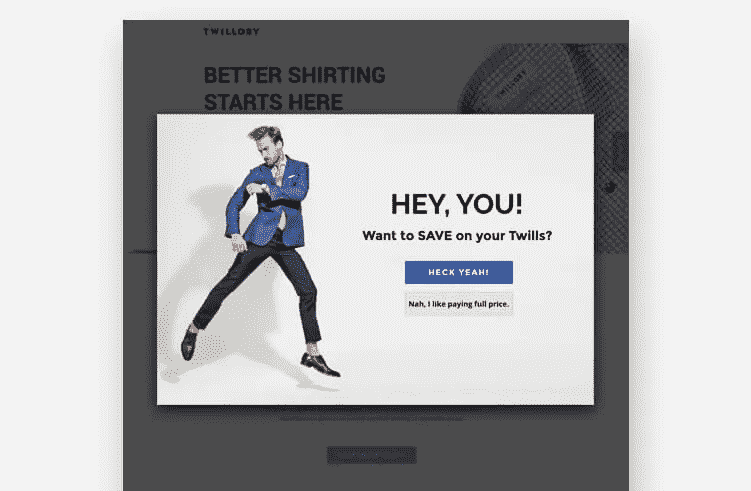

# 6.轮胎在车道上

## 行业:汽车

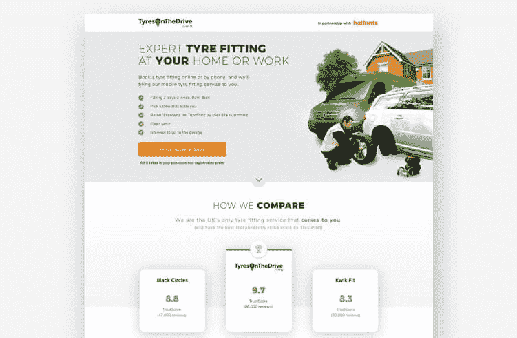

[Image courtesy of TyresOnTheDrive](https://www.tyresonthedrive.com/). (Click [here](https://unbounce-wpengine.netdna-ssl.com/photos/tyresonthedrive-lp.jpg) to see the full page.)

> TyresOnTheDrive 的高转化提示:标题要清晰，然后用社会证据来支持。

当谈到着陆页的文案，清晰导致转换。你的访客应该在几秒钟内就知道*你到底在提供什么以及为什么他们需要关心。如果他们不这样做，他们很可能会反弹。*

*来自 [TyresOnTheDrive](https://www.tyresonthedrive.com/) 的这一页用一个标题说明了清晰的重要性，该标题立即传达了价值主张:“在您的家中或工作场所安装专业轮胎”我们马上就知道，与众不同的是，我们不必去找机械师，他们会自己来找我们。再加上一个快速的操作方法、大量的推荐和一个大品牌的商标拼贴画，我们有足够的关于 TyresOnTheDrive 的信息，可以在很短的时间内做出购买决定。*

*结果呢？**通过屋顶转换。***

*但是巨大的转化率不是停止测试的借口。TyresOnTheDrive 的高级 UX 设计师克里斯·伍德描述了该公司如何利用其他俯仰角度进行游戏，但仍不断回归基本面。“我们发现，更多以利益为导向的信息似乎比推优惠和促销更容易转化。”*

# *7.ooba*

## *行业:金融/转化率:35.57%*

*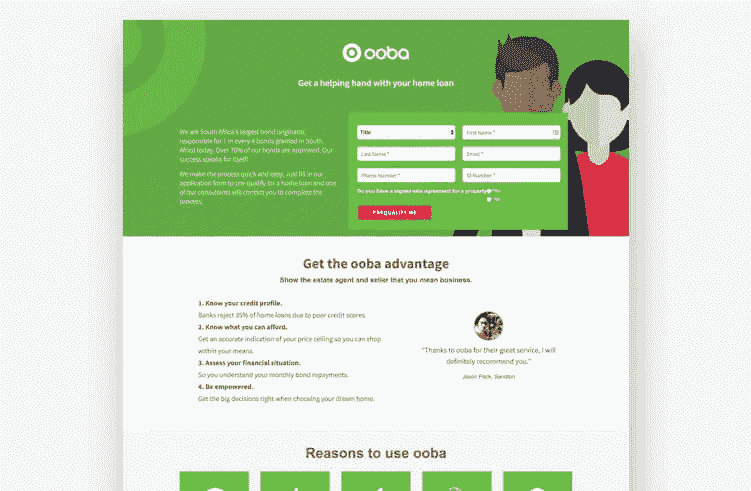*

*[Image courtesy of ooba](https://www.ooba.co.za/). (Click [here](https://unbounce-wpengine.netdna-ssl.com/photos/ooba-lp.jpg) to see the full page.)*

> *ooba 的高度转化提示:使用描述性的行动号召，告诉访问者接下来会发生什么。*

*是的，让你的访问者在访问你的页面时就知道你在提供什么是很重要的。但是同样重要的是，访问者知道你想让他们做什么，以及当他们这样做时会发生什么。*

*ooba[的这个页面](https://www.ooba.co.za/)(由数字机构[路标](http://signpost.co.za/)设计)提供了一个有效号召行动的很好的例子。一眼看去，副本——连同上下文提示和支持信息——告诉我们在填写表单时可以预期什么。*

*“表单位于页面的顶部，折叠的上方，这使得我们希望用户从一开始就采取明确的行动，”signature 首席执行官亚当·兰格说。“对比色将用户的注意力吸引到最终目标上，而描述性按钮确认了他们将要采取的行动。”*

*该表格要求提供大量信息，但这实际上可能有助于在这种情况下建立信誉——我们试图获得房屋贷款，而不是注册时事通讯。如果我们希望通过资格预审，我们需要提供一些细节是有道理的。*

# *8.索赔罗盘*

## *行业:法定/转换率:30.02%*

*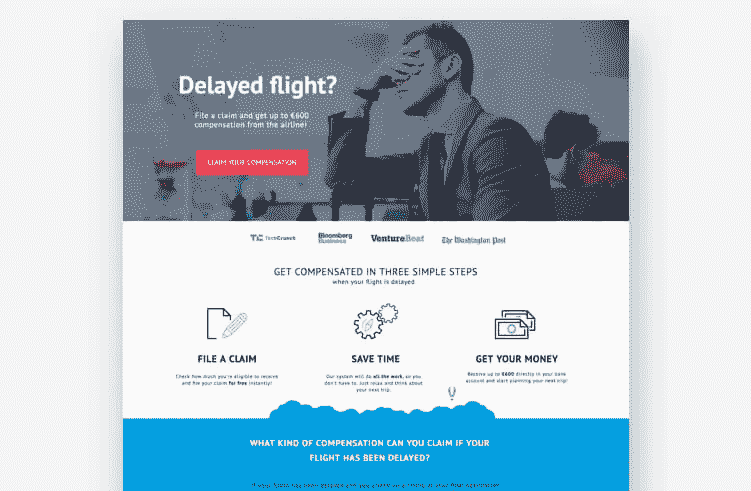*

*[Image courtesy of ClaimCompass](https://www.claimcompass.eu/en/). (Click [here](https://unbounce-wpengine.netdna-ssl.com/photos/claimcompass-lp.jpg) to see the full page.)*

> *ClaimCompass 的高转换提示:确保访问者有足够的信息进行转换(然后再次询问他们)。*

*那句老话怎么说来着？“如果一开始他们不改变信仰，那就再试试看”？(其实不是。请不要对人说那件事。)*

*然而，这正是 [ClaimCompass](https://www.claimcompass.eu/en/) 为这个登录页面所做的事情，该页面针对的是那些在往返欧盟以及在欧盟内部乘坐延误航班的旅客，欧盟的立法要求航空公司对重大旅行中断进行赔偿。*

*[该公司的联合创始人兼 CMO 亚历山大·苏明](https://www.linkedin.com/in/alexandersumin/)描述了让人们收集他们的无条件现金这一令人惊讶的困难任务。*

> *我们试图提供一些有价值的信息，并用权威来支持它——不仅仅是社会证明和媒体标志，而是简要地解释它是如何工作的。*
> 
> *这增加了报价的可信度，当你承诺免费时，这很重要。*

*ClaimCompass 认识到，他们将与具有不同程度的欧盟监管专业知识的客户交谈。([那里有 GDPR 人吗？因此，他们知道有些人会有足够的信息可以立即转换，而有些人则需要一些教育。](https://unbounce.com/gdpr/?utm_medium=referral&utm_source=medium&utm_campaign=blog-post-high-converting-lp-examples&utm_content=lp-gdpr)*

*“整个登录页面旨在让人们点击三个 CTA 按钮中的一个，”Alex 解释道。“如果这个提议很吸引人，他们就不需要再滚动了。如果不是，下面的部分将通过图片、好处和社会证明来更清楚地说明这一过程。每一次滚动都应该让用户更接近点击 CTA，”*

# *9.onX*

## *行业:导航/转化率:61.15%*

*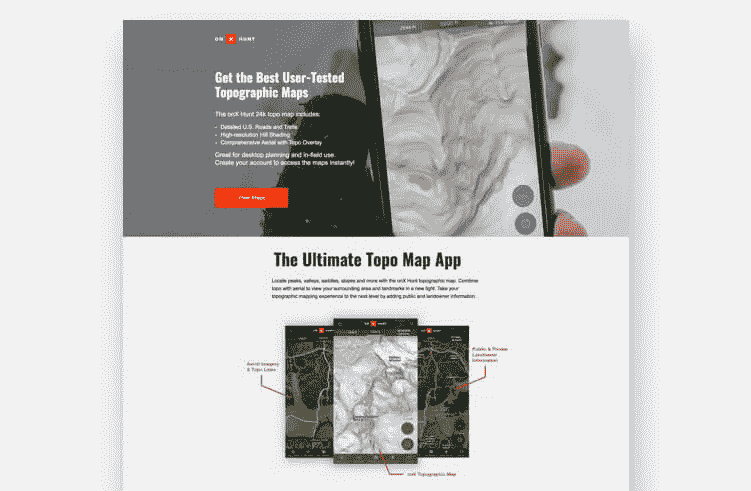*

*[Image courtesy of onX](https://www.onxmaps.com/hunt-app). (Click [here](https://unbounce-wpengine.netdna-ssl.com/photos/onxmaps-lp.jpg) to see the full page.)*

> *onX 的高转换提示:在文字和视觉内容中匹配访问者的搜索意图。*

*多年来，我们在 Unbounce 一直强调信息匹配的重要性。当有人点击谷歌广告，比如说，地形狩猎地图，他们希望登陆的页面与他们最初的搜索意图一致。甚至更好？一个页面通过附带的图像立即显示搜索者处于正确的位置。*

*举个很好的例子，只要看看从 [onX](https://www.onxmaps.com/hunt-app) 的这一页就知道了，它(在撰写本文时)宣称**的转化率比平均水平**高 50%以上。我们问 onX 的用户获取经理[瑞恩·沃森](https://www.linkedin.com/in/themktgguy/)，为什么他认为登陆页面如此成功:*

> *登陆页面创意向用户展示了他们想从点击付费谷歌广告搜索中找到什么。*
> 
> *将搜索与精确的视觉提示相关联是产品功能登录页面和搜索策略的必备条件。*

*Ryan 还将 onX 的高转化率登录页面归功于 A/B 测试。“我们测试了许多不同的 CTA，我们发现了一种有效的 CTA，并获得了巨大的点击率。”嘿，登陆页面最佳实践也不会有坏处。*

# *10.投资捷径*

## *行业:金融/转化率:51.32%*

*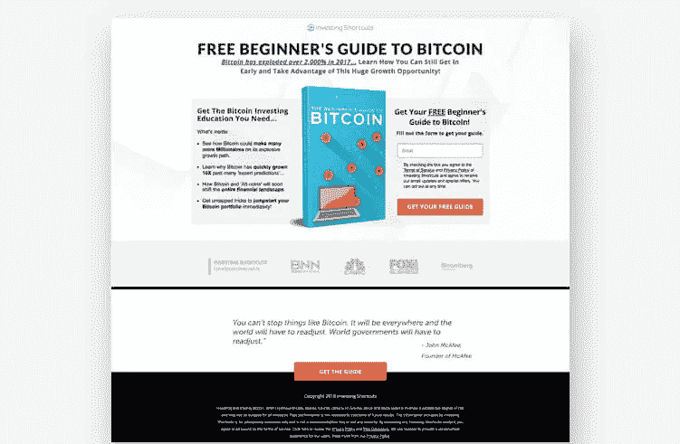*

*[Image courtesy of Investing Shortcuts](https://investingshortcuts.com/). (Click [here](https://unbounce-wpengine.netdna-ssl.com/photos/investingshortcuts-lp.jpg) to see the full page.)*

> *投资捷径的高转换提示:尽可能在你的报价中制造紧迫感。*

*害怕错过(FOMO)是每个营销人员的武器库中最强大的工具之一。人们讨厌同龄人在没有他们的情况下玩得开心、酷或者赚钱。当然，这是小气和报复性的，但这也是人类与生俱来的。(伙计，我们今天是在挑我们种族的毛病。)*

*这个[投资捷径](https://investingshortcuts.com/)的登陆页面(由 [Strikepoint Media](https://strikepointmedia.com/) 创建)利用 FOMO 来加速转化。这份拷贝凸显了比特币价值的飞速上涨，并敦促游客在赚钱的时候进入。Strikepoint 的联合创始人兼首席执行官 Jeremy Blossom 解释说:“这个页面在比特币火热的时候取得了最大的成功，所以这是一个正确的提议和正确的时间。”。有人还活着吗？*

*撇开比特币的受欢迎程度不谈，这个高转换率页面的很多原因都归结于良好的基本面。“虽然它不是最漂亮的页面，但它与读者联系在一起，建立在他们对主题的兴趣上，同时清楚地传达了指南的价值，”杰里米指出。“该页面还使用了‘特色’标志和高调引用的社交证明。”*

# *11.我的导师*

## *行业:教育/转化率:55.29%*

*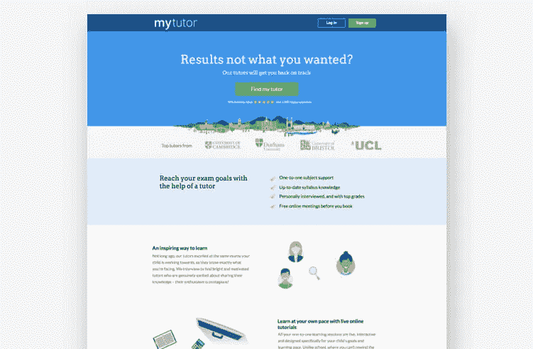*

*[Image courtesy of MyTutor](https://www.mytutor.co.uk/). (Click [here](https://unbounce-wpengine.netdna-ssl.com/photos/mytutor-lp.jpg) to see the full page.)*

> *我导师的高度转化提示:在正确的时间向正确的人展示正确的提议。*

*一场运动的成功很大程度上取决于有效的目标定位。这不仅仅是为了接触你的目标人群，也是为了向他们提供针对性强的优惠，这些优惠在他们特定时刻的体验中是有意义的。*

*我们之前从投资捷径中获得的例子展示了如何为重大文化活动(如 2017 年底的加密狂潮)提供及时的报价。然而，我的导师的登陆页面更进了一步。它展示了营销人员如何在个人生活中的一个重要(甚至是非常私人的)时刻与他们的受众联系起来，在此期间，提供的服务特别有意义。*

*[my tutor 的数字营销经理 Gemma Pearson](https://www.linkedin.com/in/gemma-pearson-2992128b) 解释说:“这个登录页面是我们考试结果日活动的基本组成部分。它旨在鼓励没有达到所需成绩的学生在导师的帮助下回到正轨，以满足他们的需求。”*

*我们大多数人在一次考试中表现不佳，而且(我很乐意代表这里的所有人发言)*它糟透了*。Gemma 最不想做的事情就是责骂或教训那些需要帮助的学生。*

> *相关、积极的信息以及时机和清晰的 CTA 是该登录页面成功的关键因素。*
> 
> *它提供的信息既能同情他们的处境，又能提供清晰的解决方案来获得他们需要的结果。*

*现在，这就是你如何做出能引起共鸣的推销。*

# *12.过滤容易*

## *行业:上门维修/转换率:34.52%*

*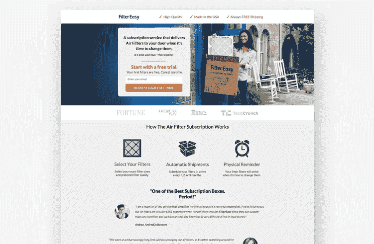*

*[Image courtesy of FilterEasy](https://www.filtereasy.com/). (Click [here](https://unbounce-wpengine.netdna-ssl.com/photos/filtereasy-lp.jpg) to see the full page.)*

> *FilterEasy 的高度转化提示:为什么一个登陆页面是成功的并不总是很清楚——这也没关系。*

*偶尔，你会建立一个登陆页面，击中转换黄金。它的填表率比你见过的都高。它疯狂地增加了收入。它减少了像拉塞尔·克罗在那部关于角斗士的电影中的挑战者。(叫什么来着？)*

*这就是发生在[FilterEasy](https://www.linkedin.com/in/ririddle/)成长型营销总监莉安娜·里德尔身上的事情。她创建了一个杀手级页面，然后发现自己在努力解决一个我们经常问自己的问题:到底是什么*让这个页面成功了？**

*“老实说，我们仍在不断测试，以找出这个登录页面的伟大之处，”Ri 解释道。“我们已经挑战了几次，没有一个挑战者击败了这一冠军页面——即使是那些我们绝对相信会击败它的人。”*

*事实是，构建高转化率的登录页面并不是一门精确的科学。当然，有一些最佳实践可以提高你的网页的成功几率，国际扶轮在这里采用了它们:简单的设计，强有力的利益陈述，良好的社会证明，引人注目的提议。不过，最终，我们可以确信已经实现了最佳页面的唯一方法是继续测试。*

*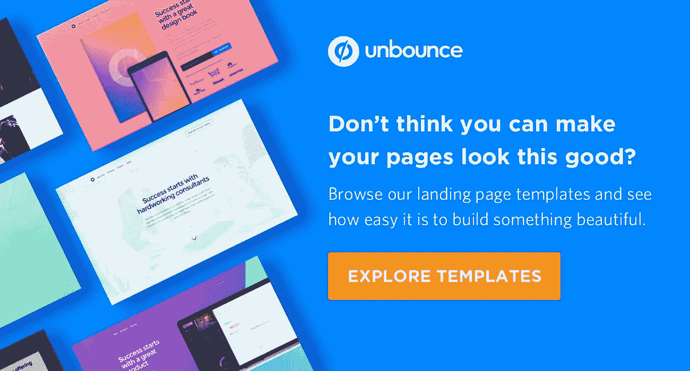*

**原载于 2019 年 2 月 19 日*[*【unbounce.com】*](https://unbounce.com/landing-page-examples/high-converting-landing-pages/?utm_medium=referral&utm_source=medium&utm_campaign=blog-post-high-converting-lp-examples&utm_content=direct-ongoing)*。**

*[*脸书*](https://www.facebook.com/Unbounce/)*|*[*LinkedIn*](https://ca.linkedin.com/company/unbounce)*|*[*推特*](https://twitter.com/unbounce)*|*[*insta gram*](https://www.instagram.com/unbounce/)*

**

## *这篇文章发表在 [The Startup](https://medium.com/swlh) 上，这是 Medium 最大的创业刊物，拥有+426，678 名读者。*

## *在这里订阅接收[我们的头条新闻](https://growthsupply.com/the-startup-newsletter/)。*

**