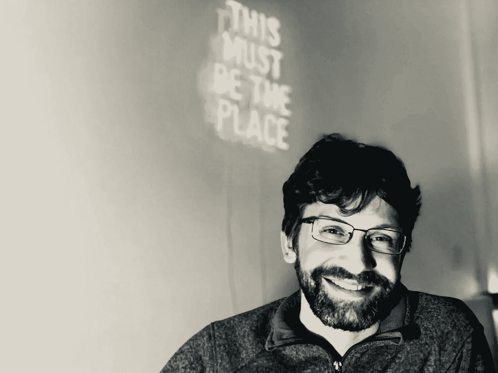

# 打造价值 1 亿美元的教育技术产品的 12 个收获

> 原文：<https://medium.com/swlh/12-takeaways-from-building-100m-educational-platform-9835c5924283>

## Gleb Kudryavtsev 是东欧最大的在线学习公司之一 Skyeng 的产品总监。Gleb 分享了他对构建成功产品、创造持久的行为改变、管理远程团队以及让教育变得愉快的见解。

Photo by [JESHOOTS.COM](https://unsplash.com/@jeshoots?utm_source=medium&utm_medium=referral) on [Unsplash](https://unsplash.com?utm_source=medium&utm_medium=referral)

# **谈成功的教育技术业务**

**1。我们建立了一家估值 1 亿美元的教育科技公司。**我们最初是一所向俄语学生教授英语的在线学校，在 6 年多的时间里，我们成长为一个拥有 5 万付费学生和 5 万名教师的平台，他们提供了超过 390 万堂在线课程。我们使用优步模式，从每笔交易中抽取佣金。我们的市场是俄语国家。我们在中国和土耳其这样的国家进行实验。

**2。要打造一款成功的科技产品，重要的是要广泛考虑竞争。**例如，我们确实与传统教育机构、市场(如 [itlaki](http://italki.com) )和自学平台(如 [DuoLingo](http://duolingo.com) )竞争。但最重要的是，我们与任何占用学生时间的东西竞争:体育、电视、游戏和 YouTube。这有助于我们制造出吸引人的产品。

**3。到目前为止，我们的成功有三个要素:**

*   **伟大的商业模式。我们没有进入自学模式，尽管在我们开始的时候它很受欢迎。**
*   我们生产并拥有**高质量的混凝土**。
*   **我们是学校即服务。我们试图像一所顶尖学校一样运作，在那里教师是经过审查的，可以互换的，学生是负责任的，受到尊重。**

**4。任何科技企业成功的两个重要因素:**能够成功的创始人，以及在正确的时间选择正确的商业模式。

> “4-5%的人热衷于从学习中获得乐趣。在某种程度上，它们是一种偏差。对于 95%以上的人来说，这是一项必要但昂贵的投资。”

# **论学与教**

**5。打造一个成功的教育产品很难，但是有可能。超过 95%的人认为教育是必要但昂贵的投资。这就是为什么大多数自学工具在 2-3 次课程后无法留住人的原因。可能有 4-5%的人有多巴胺情结，渴望从学习中获得快乐。在某种程度上，它们是一种偏差。我们试图让教育对大众来说没有痛苦。**

**6。学习语言的学生有两种类型:**那些带着**一个直接目标而来的**(20%)——通过考试，上大学，移居国外，等等。；那些带着**生活方式目标** (80%)而来的人——被视为受过教育，偶尔阅读文章，等等。后者不需要说这种语言。但是他们是大多数，所以语言产品的设计需要考虑到这一点。

**7。顶级教师都有相似的特质。**

*   他们往往是迷人和有趣的人，所以学生永远不会对他们感到厌烦。
*   他们对学生的个性很好奇，而不仅仅是他们的表现。
*   他们很了解他们的材料。

Gleb Kudryavtsev. Photo by Dmitry Dumik

# **关于行为改变**

**8。我们以三种方式影响行为。**

*   **问责**。我们和真正的语言老师一起工作，当学生和人类一起学习时，他们会感到有责任感。例如，如果学生不能上课，老师会提出重新安排时间，并询问更好的日期。学生更难逃课。
*   **参与内容**。我们设计和测试我们的教材，所以它们是一流的。我们的内容制作团队拥有剧本写作、教育和心理学方面的综合技能。我们使用机器学习来识别和显示最相关的内容。
*   **游戏机制。我们使用游戏化的一些原则来影响人们的行为，尽管这个领域很棘手。过度玩游戏太容易了，所以我们要小心使用。**

# **进行远程工作**

9。如果你应用一些最佳实践，远程工作是很棒的。

*   不断测量各种性能指标，并要求人们经常演示。
*   每周，与你管理的每个人安排一个小时的一对一会议，并严格参加。
*   每天与团队一起站立 15 分钟，既能让人们保持活力，又能掌控全局。
*   在招聘过程中，将远程工作作为一项优势。比起办公室，许多候选人更喜欢有效的远程工作。

Skyeng platform. Image courtesy Skyeng.ru

# **关于开发产品的技巧**

10。一个伟大的产品经理需要有*开阔的视野*，擅长*软技能*，以及强大的*分析方法*。

*   **视野开阔**。他们应该了解高层次的概念，识别模式并将它们与广泛的系统联系起来。
*   **软技能。与他人交谈、谈判、达成目标。**
*   **分析能力。他们需要对任何事情都有合理的怀疑，并希望验证事情，无论是产品方面还是自我方面。**

**11。我希望我的孩子在快速变化的世界中拥有的最重要的软技能是*销售*、*移情*和*系统思维*。**

*   **销售**来源于同理心，给予人们需要的东西。
*   **同理心**是虚拟地进入另一个人的大脑，了解他们如何生活、思考、感受以及他们想要什么。
*   系统思考的关键在于怀疑并不断验证它们。对于这项技能来说，数学和逻辑极其重要。人们不应该假设事情是显而易见的:从逻辑上证明它们，然后把它们卖给一个符合他们世界观的人。

**12。如果你想成为一名产品经理，**我建议你**学会 ***销售*** ，成为擅长 ***营销*** 。我认为产品管理是一项多面手的工作。你可以从评估你的优势和劣势开始，努力改善或减少你的缺点。然而，当你面试的时候，把重点放在你的优势上。如果你是专业的，并且有明确的价值主张，就更容易达成销售。**

**Alex Ivanov 是旧金山的一名产品设计师兼积分教练。推荐这篇文章看更多相似的作品。**

****

## **这篇文章发表在 [The Startup](https://medium.com/swlh) 上，这是 Medium 最大的创业刊物，拥有+417，678 名读者。**

## **在这里订阅接收[我们的头条新闻](http://growthsupply.com/the-startup-newsletter/)。**

****