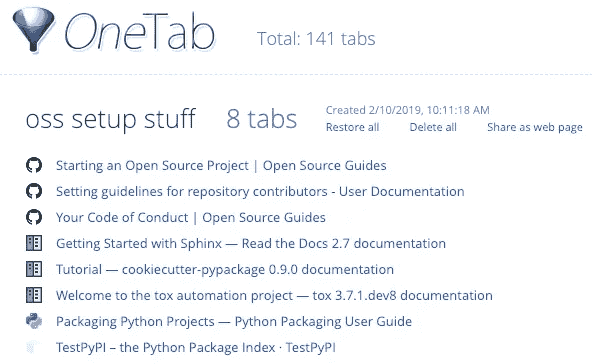
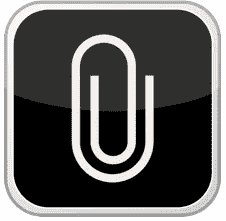
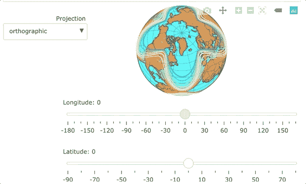
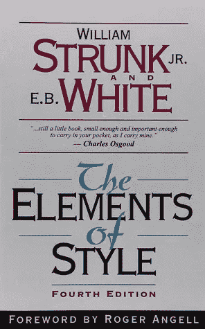
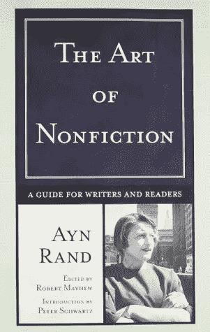
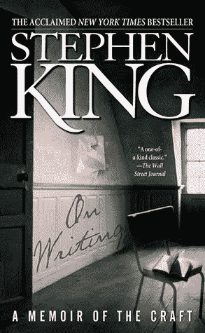
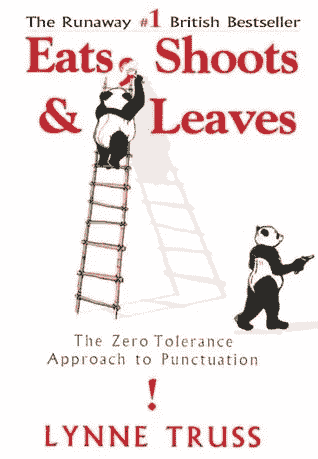
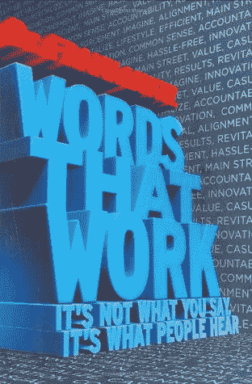
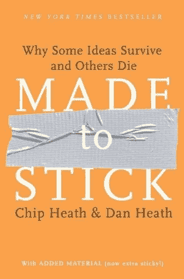

# 更快写出更好的中型文章的 12 个工具

> 原文：<https://medium.com/swlh/12-tools-to-write-better-medium-articles-faster-b009d294526>

在过去的九个月里，我成了一名作家。我以前写过东西，但从未拥有过这个头衔，直到我在 Medium 上发表了我的第一批文章。现在我是科技领域的顶尖媒体作家。

在媒介上写作对我和我的观众来说是双赢的。写作帮助我成为思想领袖。有大量证据表明，思想领导力可以帮助你发展公司、筹集资金或找到工作。

写作也让我能够帮助人们学习技术技能。我热衷于帮助其他开发人员、企业家和数据科学家提高工作效率。我的文章帮助人们选择在哪里花他们的学习预算，节省时间，并做出很酷的东西。😄

虽然在媒介上写作对你和你的读者来说是非常有益的，但这也是一项需要技巧的耗时努力。没有什么可以代替练习，但是有很多工具可以帮助你写得更好更快。

在这篇文章中，我将分享这些工具——在我的旅程中帮助我的关键文章、应用程序和书籍。我希望他们能帮助你。

我们开始吧！🚀

Channel your waterfall of thoughts into a beautiful stream of articles.

# 中等

如果没有媒介，我不知道我今天会写什么。该平台使入门变得极其容易。它提供了一个很好的写作体验，并帮助我的内容到达广泛的受众。

*   [这篇文章](https://blog.medium.com/tips-and-tricks-for-medium-writers-1d79498101c3)提供了帮助你入门和有效使用媒体的技巧。
*   如果你想在媒体上获得图片帮助，请查看[这篇文章](https://blog.medium.com/tips-and-tricks-for-posting-photos-and-images-on-medium-3f82659986c4)。关键见解—如果分辨率不够高，就无法制作全幅图像。
*   这篇文章有很多关于媒介技术写作的好建议。如果你在任何地方写技术内容，都值得一读。

Medium 是一个神奇的平台，没有广告！我建议你付钱🏇每月 5 美元成为[会员](https://medium.com/membership)并支持它，如果你有能力的话。

让我们来看看数字工具，以改善你的写作，让你更有成效。

# 数字工具

复杂的句子可能是我在技术写作中看到的最常见的问题。把你的内容粘贴到 [**海明威 App**](http://www.hemingwayapp.com/) 里，看看哪些句子比较难跟上。这个免费的网站帮助你把你的文章从被动变成主动。海明威应用程序无疑帮助我成为了一名更好的作家。

大多数时候，我发现自己打开了几十个浏览器标签。 [**OneTab**](https://www.one-tab.com/) 帮我把混乱的标签整理好。它通过将我给它的任何标签压缩成一个标签来帮助我专注于手头的任务。它还节省了系统内存。OneTab 是免费的谷歌 Chrome 扩展。

用 [**BetterSnapTool**](https://itunes.apple.com/us/app/bettersnaptool/id417375580?mt=12) (用于 Mac)将你的屏幕分割成多个窗口。您可以创建键盘快捷键来将活跃窗口吸附到整个、一半、三分之一、四分之一或您喜欢的屏幕的任何自定区域。我通常把屏幕分成两部分，一边是代码、文档或图片搜索，另一边是我正在写的文章。BetterSnapTool 为 2.99 美元。

[**CopyClip**](https://itunes.apple.com/us/app/copyclip-clipboard-history/id595191960?mt=12) 是一款免费的 Mac 应用程序，可以将你过去复制的素材存储在一个易于访问的列表中。它节省了我大量的时间。

CopyClip

gif 可以帮助你把你的中型文章更上一层楼。Medium 不允许嵌入 JavaScript，所以交互式可视化的 gif 是退而求其次的选择。 [**GIPHY 捕捉**](https://giphy.com/apps/giphycapture) 让添加 gif 变得轻而易举。GIPHY Capture 在 Mac 上是免费的——我听说类似的 Windows 应用程序也有。

GIF from [my article on Plotly](https://towardsdatascience.com/its-2019-make-your-data-visualizations-interactive-with-plotly-b361e7d45dc6?source=friends_link&sk=ad9ff3eda197071e6b056abe23c1509e).

## 形象

在争夺潜在读者注意力的战斗中，图片和标题是你的主要武器。

Pixabay 是一个免费的高质量图片平台。有许多漂亮的图片不需要署名，这个平台很容易搜索到。它节省了我无数的时间。真诚的感谢 Pixabay！

A photo from Pixabay, of course

这是一个额外的图片搜索网站。Pexels 刚刚重新设计，有很多很棒的免费照片。

现在让我们来看看我的六本可以帮助你成为更好的作家的顶级书籍。

## 六本书

**斯特伦克和怀特的《文体要素》是经典的写作文体指南。它永远不会过时。如果你以前没有接触过，或者已经有一段时间没有接触过了，一定要读一读。**

****

***安·兰德的非虚构艺术可以帮你创造一个省时的写作过程。这也有助于你学会如何让你的文章生动起来。用兰德的书让你的写作更快更生动。***

******

***斯蒂芬·金的《T4》*《论写作》* 鼓舞人心，文笔优美。部分是回忆录，部分是说明书。我的建议——去掉副词，多用比喻。金提醒我们，好作家之所以优秀，是因为他们既是如饥似渴的读者，又是始终如一的作家。***

****

**Lynn Truss 的 [*吃，芽&叶*](https://www.goodreads.com/book/show/8600.Eats_Shoots_Leaves) 为标点符号提供了有趣而有益的建议。这是一个很好的例子，说明如何让枯燥的话题变得有趣——这是任何撰写技术话题的人的关键技能。😄**

****

**弗兰克·伦茨的《管用的话》包含了许多关于写作的建议。伦茨提醒我们使用令人难忘的、令人向往的、能引起听众共鸣的语言。**

****

****由芯片和丹希斯制成是我最喜欢的通信书。如果你只打算读这份清单上的一本书，我建议你读这本书。这本书对写作有极好的建议，这样你的读者就更有可能记住你的要点。****

******

# ***总结和概括***

***看看这些工具和书籍，帮助你在媒体上更高效地写作。***

## ***概述***

*****应用和网站*****

1.  ***[海明威 App](http://www.hemingwayapp.com/)***
2.  ***[OneTab](https://www.one-tab.com/)***
3.  ***[更好的快照工具](https://itunes.apple.com/us/app/bettersnaptool/id417375580?mt=12)***
4.  ***[回形针](https://itunes.apple.com/us/app/copyclip-clipboard-history/id595191960?mt=12)***
5.  ***[pix abay](https://pixabay.com)&[Pexels](https://www.pexels.com/)***
6.  ***[GIPHY 捕获](https://giphy.com/apps/giphycapture)***

*****书籍*****

1.  ***[*风格的要素*](https://www.goodreads.com/book/show/33514.The_Elements_of_Style?ac=1&from_search=true)***
2.  **[T5【非虚构的艺术】T6](https://www.goodreads.com/book/show/2112.The_Art_of_Nonfiction)**
3.  **[*上书*](https://www.goodreads.com/book/show/10569.On_Writing?from_search=true)**
4.  **[*吃，芽&叶*](https://www.goodreads.com/book/show/8600.Eats_Shoots_Leaves)**
5.  **[*工作的话*](https://www.goodreads.com/book/show/95884.Words_That_Work)**
6.  **[*造棍*](https://www.goodreads.com/book/show/69242.Made_to_Stick)**

****

**These tools can help you tame your inner waterfall of thoughts**

**我希望这些资源对您有所帮助。如果你有，请在你最喜欢的社交媒体平台上分享这篇文章，这样其他人也可以找到它。😄**

**提高写作水平和速度的最好方法就是多写。所以，分享你所知道的——或者一路上学到的。写，重写，坚持！**

**我撰写关于数据科学、Python 和其他技术主题的文章。如果你对这些感兴趣，请关注我，在这里查看我的其他文章。**

**快乐写作！✍️**

**杰夫·黑尔是一位企业家，他共同创立了三家公司，包括反叛者服务台。Rebel Desk 出售一种跑步机，可以放在立式办公桌下面，这样你就可以一边工作一边走路了。**