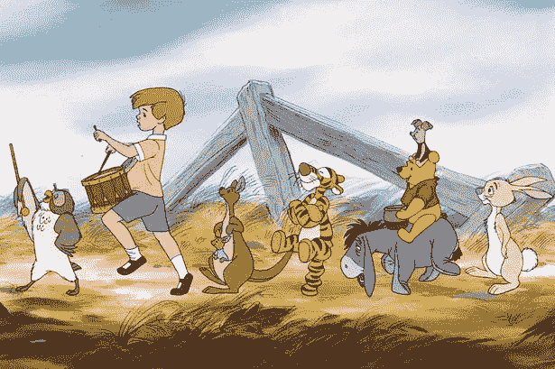

# 帮助理解生活的 12 种小熊维尼哲学

> 原文：<https://medium.com/swlh/12-winnie-the-pooh-philosophies-to-help-make-sense-of-life-a352c13d4b37>

Image Source: Unknown

我有一个美好的回忆，一只光着屁股的黄熊和他的一群动物朋友在森林里冒险。他对蜂蜜的痴迷是可爱的，每次他惊呼“哦，麻烦！”这感觉太熟悉了；一个亲爱的朋友又在做他自己的蠢事了。

但作为一个孩子，我从表面的层面体验了小熊维尼。我看了电视节目…