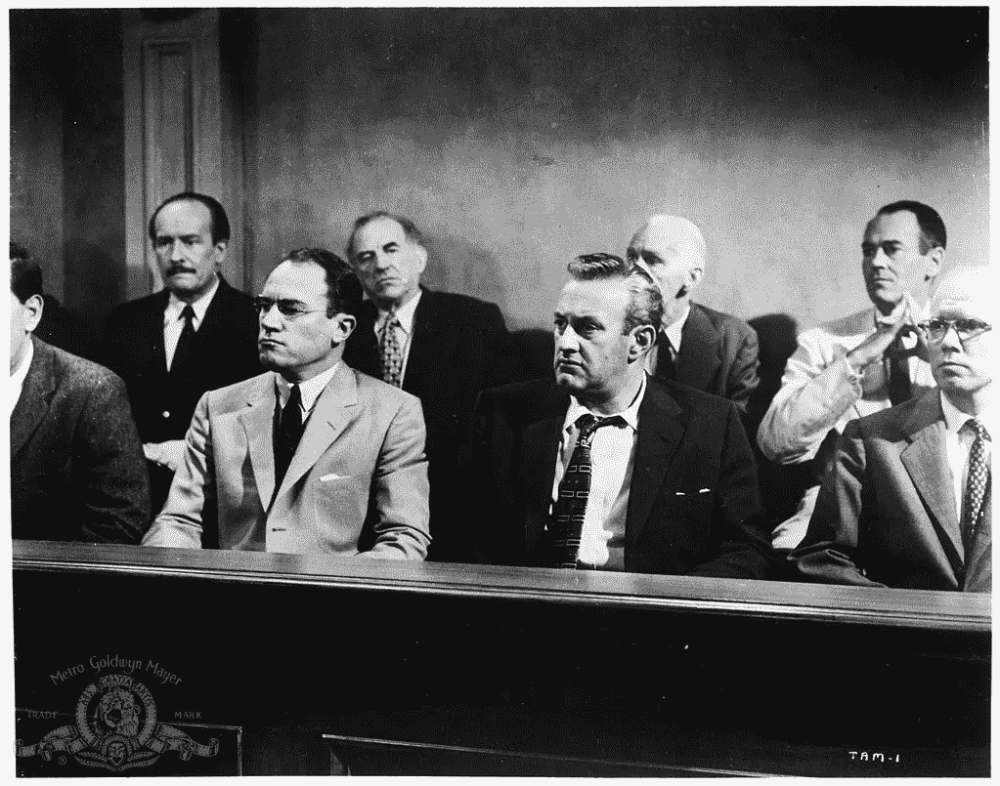

# 当风险很高时踩刹车

> 原文：<https://medium.com/swlh/12angrymen-f56dd479910a>

## 领导力课程— [加布里埃尔·梅迪纳](https://medium.com/u/821e6edad9e9?source=post_page-----f56dd479910a--------------------------------)

## 一个真正的领导者如何从 12 个愤怒的人组成的团队中脱颖而出

The Cast of 12 Angry Men (IMDb)

我第一次体验 *12 怒汉*的剧情是在 2000 年代初的剧集*中间的马尔科姆*中。在名为“陪审团职责”的一集中，露易丝(马尔科姆的妈妈，由简·卡兹玛拉克饰演)被叫去…