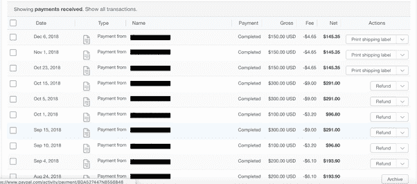

# 13 个地下策略，让你在舒适的家中赚钱

> 原文：<https://medium.com/swlh/13-underground-strategies-to-make-money-from-the-comfort-of-your-home-5b7cbe67482f>

*(Photo by* [*Matthew Brodeur*](https://unsplash.com/photos/ZnwP4M-m1e0?utm_content=creditCopyText&utm_medium=referral&utm_source=unsplash)*)*

虽然金钱买不到幸福，但任何一个理智的人都知道，金钱是这个世界上人们渴望得到的资源。金钱允许价值和工作的交换。

> 工作与人类有着根深蒂固的联系。

环顾四周——无论你在哪里。在你 360 度世界观的某个地方，有些东西是由人类创造的。那种创造是辛勤劳动的产物。

在今天的市场上，我们人类被赋予了从舒适和安全的家中赚钱的能力。只需一台电脑和接入互联网，*你*就有能力扩展你的能力，创造和赚钱唾手可得。

我怎么知道这个？**举个例子，我已经做到了。**

*(My PayPal Business account income statement)*

通过做一个简单的决定，坐下来每天写作，我已经开辟了一条崭新的道路，打开了许多大门，包括自我发现、积极的人际关系网和财务收益。

很多时候，每当我浏览社交媒体时，我都会看到视频中这个人告诉我的承诺，如果我做 X，Y 和 Z，我就可以每月赚 15，000 美元。此外，我可以在几天或几周内完成。

不幸的是，它不是这样工作的。你不会一夜之间赚到几千甚至几百美元。

> 但这并不意味着这是不可能的

在花了几年时间学习并在你舒适的家中获得财务收入后，我发现了 X 种可以实现这一点的方法(可能还有更多尚未被发现)。

## **1。写为** [**中**](https://medium.com/creators) **的合伙计划:**

这可能是网上赚钱最简单的方法。Medium 的合作伙伴计划鼓励像您这样的作家撰写有助于世界的内容。在这里，内容是王道(大写的“K”)。只有通过用户参与来衡量算法的最佳内容才会产生更高的回报。

## **2。**[**Quora**](https://quorapartners.quora.com/)**合作伙伴计划:**

同样，与前面提到的努力类似，Quora 合作伙伴计划鼓励人们通过向参与者付费来为世界提出最好的变革性问题。

## **3。附属伙伴关系:**

Photo by [rawpixel](https://unsplash.com/photos/E_-aYIrQ1-U?utm_source=unsplash&utm_medium=referral&utm_content=creditCopyText)

舒适在家赚钱的最简单方法之一。附属合作伙伴关系是指那些付钱让你推销他们的服务/产品的公司。

这里最大的可能是亚马逊。你经营着一个成功的摄影博客，并且知道你想向你的观众推荐一些摄影器材吗？

注册亚马逊的合作伙伴计划是免费的，并会通过你的独特链接授予你每笔销售的佣金。

## **4。为公司代笔:**

在决定坐下来写作之后，关于这个决定的议论开始在我的网络中蔓延。通过口口相传(尽管像 [Fiverr](https://lp.fiverr.com/lp-go-brand-connections/?ad_id=323657221191&agid=43879774452&caid=731898203&gclid=CjwKCAiAqt7jBRAcEiwAof2uKwSxC2dJc2s54JVO2P9s5JptMxXqjinbXBLU1RiuLUd6QuI40ngNphoCojsQAvD_BwE&gclsrc=aw.ds&kw=fiverr&lpcat=br_general&utm_campaign=G_US_Brand_BrandingDeskTop_Exact&utm_content=AdID%5E323657221191%5EKeyword%5Efiverr%5EPlacement%5E%5EDevice%5Ec&utm_medium=cpc-brand&utm_source=google&utm_term=one-fiverr_(exact)) 和 [Upwork](https://www.upwork.com/) 这样的网站也能工作)，我得以获得两份代笔工作，这让我多赚了数千美元。

有些工作的报酬是每小时 100 美元。这是不可思议的无价之宝，只需要相当少的时间和精力。代笔甚至让我的作品在《福布斯》上发表！

## **5。杂项自由职业:**

我喜欢认为自己是一个视觉艺术家。然而，我相信我的才能适合文字。

然而，我知道很多朋友通过自由职业来赚取兼职和全职收入。无论是平面设计、文案、电影特效等等，都有无限的可能性。

## **6。在线辅导:**

Photo by [Kristopher Roller](https://unsplash.com/photos/PC_lbSSxCZE?utm_source=unsplash&utm_medium=referral&utm_content=creditCopyText)

你被说服参加免费的网上研讨会了吗？我知道我有。免费网上研讨会的创建者并不总是想让你注意到的是最后的推介。

为什么？因为网上研讨会只是即将到来的真正服务的一小部分，而这种服务总能带来收入。运行这些网络研讨会的营销人员知道，他们只会让一小部分人注册，但是，这些小部分人会打开他们的钱包。

假设免费的网络研讨会吸引了 100 个人，10%的人支付 200 美元的服务费。大约一小时的工作价值是 2000 美元。

## **7。在您的 Youtube 频道上销售广告:**

虽然我没有这方面的第一手经验，但我知道通过 Youtube 广告带来额外收入是可能的。

根据 [BusinessInsider](https://www.businessinsider.com/how-much-money-youtube-stars-actually-make-2014-2) 的说法，用户可以通过广告为其内容的每一百万次点击带来 2000 美元，这不是最好的收入模式，但它为我们提供了下一个选择。

## **8。通过 Youtube 销售分支机构:**

与前面提到的选择类似，通过 Youtube 加盟有助于赚钱。如果你有一个大约 1000 人的适度渠道，你仍然可以通过你的内容，通过与你有联盟伙伴关系的广告产品赚钱。

## **9。通过 Patreon 或其他捐赠服务支付:**

如果你有一个忠实的追随者，通常观众会打开他们的钱包，提供支持捐款。

Patreon 可以与 Youtube 频道和博客结合使用。根据 Patreon 的说法，拥有 3 万名用户的普通创作者每月收入低端为 315 美元，高端为 1575 美元([来源](https://blog.patreon.com/figuring-out-how-much-you-might-make-on-patreon))。

## **10。撰写并出版一本 kindle 图书:**

Photo by [Kinga Cichewicz](https://unsplash.com/photos/n6judbg4SOY?utm_source=unsplash&utm_medium=referral&utm_content=creditCopyText)

你知道吗，过去 10 年最畅销的书籍之一是从数字下载开始的。《五十度灰》最初是作为对《暮光之城》的同人小说回应而写的，在作为平装本出版之前，通过 Kindle 下载了数百万次，这使它几乎一夜成名。

虽然你的结果可能不会实现，但如果你已经有一个可行的读者，他们会购买和下载你的电子书，你就有一座金矿在等着你。

## **11。开一家 Shopify 电子商务商店:**

互联网企业家、喜剧演员和我的私人朋友[乔丹·凯](https://www.tribeloyal.com/)一天晚上，当他想到去看一场体育比赛时，有了一个主意。她不喜欢任何一个团队，觉得自己被其他穿着团队成员服装的人冷落了。

她有一个想做帽子的想法。帽子上写着*“来喝啤酒”*，这在她的 Shopify 页面上成了畅销商品。零库存和小暴发户融资，你可以把你的想法变成现实与直运和电子商务商店。

## **12。在 Etsy 上创建商店:**

在 Etsy 上创建一个商店类似于在 Shopify 上创建一个电子商务商店，但是你要对库存负责。这更适合那些对他们销售的产品充满热情和知识的个人/企业主。我认识的另一位企业家 Gabby 在 Etsy 上出售她的手工珠宝，这为她带来了不错的副业。

## **13。从一家** [**易贝**](https://www.ebay.com/help/account/signing-ebay-account/signing-ebay-account?id=4191) **商店:**卖你的旧东西

除非你有足够的带宽通过“翻动”你出去找到的物品来把这个冒险变成一个全职工作，否则这只是一个暂时的冒险。与其穿过你最亲近的衣服，扔掉或捐赠你的旧衣服，不如在易贝上卖掉它们。见鬼，在洛杉矶，90 年代的复古服装风靡一时(我知道这不是唯一的城市)。这对于千禧一代来说再好不过了，他们可以利用那些我们不再穿的旧衣服，因为我们的父母没有时间或财力扔掉它们。

这仅仅是冰山一角，你有很多机会来赚外快或者改变你的生活。

这么多人在寻求自由。那可能是:

*   **言论自由。**
*   **想住哪就住哪的自由。**
*   摆脱财务压力。
*   **追求让自己快乐的自由**

互联网是一份礼物，也是帮助你实现这一目标的工具。

你应该尽最大努力去实现它。

因为这个世界现在需要它。

这个世界现在比以往任何时候都更需要你。我们需要你的礼物。我们需要你独特的声音。我们需要你的创造力。

所以，把你自己从困顿和不满足的生活中解放出来，步入你的力量。

## 这篇文章发表在 [The Startup](https://medium.com/swlh) 上，这是 Medium 最大的创业刊物，拥有+431，678 名读者。

## 在这里订阅接收[我们的头条新闻](https://growthsupply.com/the-startup-newsletter/)。

