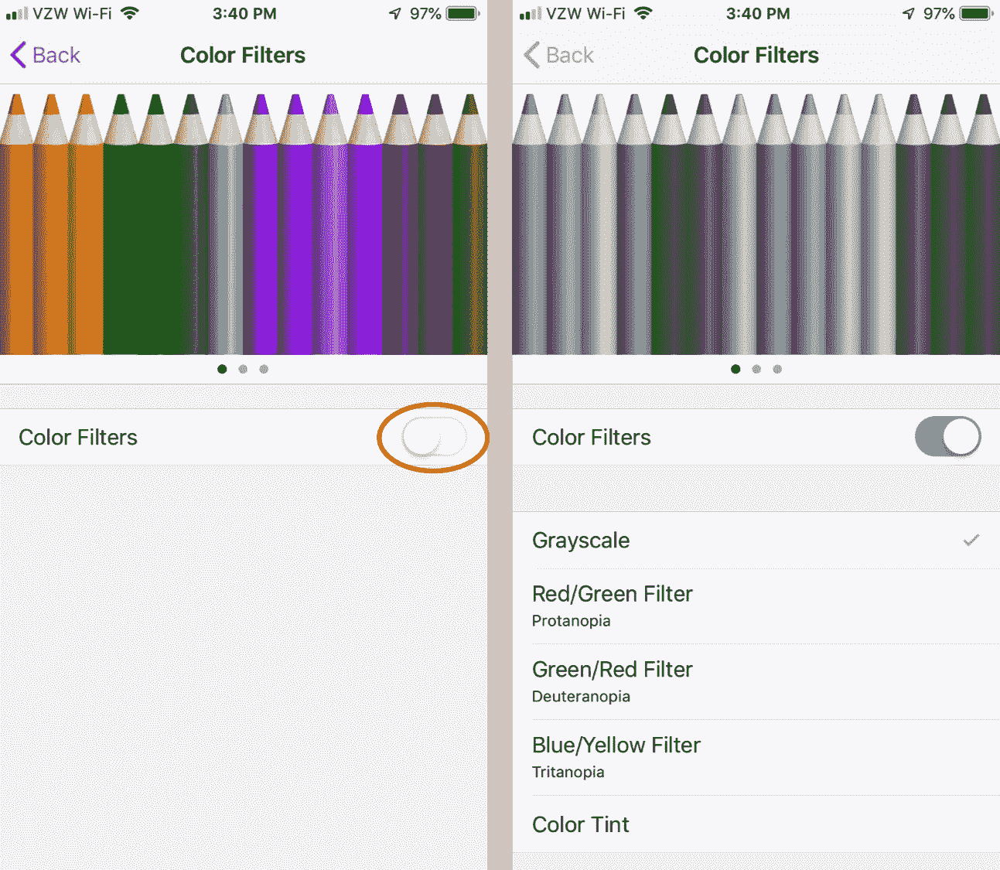
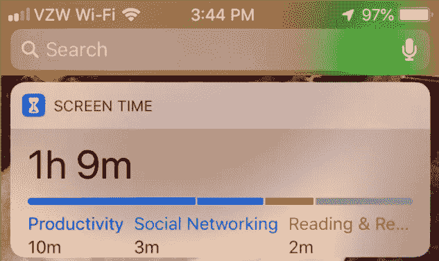

# 13 种方法让你的 iPhone 为你服务，而不是与你作对

> 原文：<https://medium.com/swlh/13-ways-to-make-your-iphone-work-for-you-not-against-you-e3a4df23c139>

A lock and home screen designed to promote productivity and joy. (How can you not be happy being greeted by that face?)

毫无疑问，iPhone 是一个不可思议的工具，但它为我们提供了两条道路:一条可以改善我们的生活，成为生产力、连通性和教育的伟大工具，另一条可能成为我们生活中最大的干扰。

然而，如果你愿意花一点时间来定制 iPhone，让它为你工作，而不是反对你，你的生活会因此而变得更好。

有了优化配置的手机，你会更加专注，分心的事情更少，工作效率也更高。有了正确的配置，享受生活中的真正乐趣就像与朋友和家人共度时光一样容易。

如果你准备好重新掌控你的时间、注意力和生活，那就从手机开始吧。这里有 13 种方法可以让你的手机为你服务:

# **1。关闭几乎所有通知**

你的 iPhone 被设置成了一只讨厌的、烦人的、喋喋不休的小狗。如果没人碰它，它会整天对你吠叫，拼命想引起你的注意。

重新获得控制权的最简单和最容易的方法是关闭手机上几乎所有的通知。事实上，现在就这样做，否则你会在阅读这篇文章时收到通知，无法完成本文的其余部分。

关闭通知有两个主要原因:

1.  你想用手机尽可能地控制你的体验。它是一个工具，应该由你选择何时、何地、如何使用。通知削弱了你控制这个工具的能力，是不受控制的干扰，会不断地让你偏离方向，让你偏离你想要做的事情。
2.  分心会产生长久的影响。一旦你从一个特定的任务中分心，研究表明，它可能需要长达 [23 分钟](https://www.fastcompany.com/944128/worker-interrupted-cost-task-switching)才能回到手头最初的任务。浪费了很多时间。

以下是关闭通知的方法:

*   前往设置应用程序>通知。

逐个应用关闭不重要的应用通知。

此外，最好让你的手机一直处于振动模式。振动模式的音量足够大，不用铃声也能听到，更不用说没人想听到你的手机在每次接到电话时播放汤姆·琼斯的“[”这并不罕见。](https://www.youtube.com/watch?v=tGRZBa4cKWA)

当你完成后，你的大部分应用程序应该是这样的，关闭通知。

Only the essential notifications remain on.

当然，有一些通知你仍然想要和需要。以下是您应该留下的通知:

*   日历应用程序—让您不会错过约会
*   电话或短信
*   地图，这样当您要去某个地方时，您会收到通知
*   送货和旅行应用程序——你不会想错过 Grubhub 的食物配送或错过你的 Lyft 或优步之旅。在你的航空应用程序上留言也很好，比如达美航空，这样你就能知道你的航班什么时候起飞，什么时候延误，什么时候登机等等。

# **2。周末关闭电子邮件**

技术是一种不可思议的工具，它将世界连接起来，并使世界变得比以往任何时候都小，但这种连接有一个巨大的缺点。

我们中的许多人都有一个错误的印象，认为既然我们有电子邮件和工作在我们的指尖，那么我们就有责任随时随地做出响应。然而，这种哲学有巨大的代价。

为了达到最佳状态，你需要用高强度的恢复来对抗高强度的工作。

看高水平的[运动员](/@parkernash/9-tips-from-3-olympic-athletes-that-will-change-your-life-5eba1d778cf1)；他们最艰苦、最紧张的训练释放了他们的最佳表现，之后总是有一段时间的休息。他们的身体必须恢复，以便愈合和加强自己，甚至更大的表现。

你在办公室环境中的身心没有什么不同。如果你想在一周内高效工作，你必须在周末完全恢复。分离和放松。

这对你来说可能不足为奇，但是[研究发现](http://www.tbline.nl/index_htm_files/Mimecast-WP-Shape-of-Email-Report-Consumer.pdf)只有 14%的电子邮件被认为对工作至关重要。这是大量不重要、浪费和无用的电子邮件。它还需要大量的时间来管理这些电子邮件，并决定阅读或删除哪些电子邮件。

为了帮助你在周末完全恢复，让工作的诱惑远离你的视线，在周末关掉手机上的电子邮件。

如果工作中真的有急事，有人不会给你发电子邮件，他们会给你打电话或发短信。否则，如果你开着电子邮件，你会看到越来越多的收件箱，当你应该花时间专注于帮助你恢复的事情，如与家人、朋友相处、锻炼和休息时，你会被迫考虑工作。

当周五要离开办公室的时候，帮你自己一个忙，关掉你的工作邮件。

*   设置>密码和帐户>选择您的工作电子邮件帐户>关闭邮件

Shut it down on the weekends.

# **3。删除旧的和不用的应用程序——为你的手机做春季大扫除**

一年中有几次，我会翻遍我的衣橱，把它清理干净。我的原则是，如果我有 6 个月或更长时间没穿过某件衣服，我就扔掉它。你的手机应该没什么不同。

在一些人的手机上找到一个应用程序就像大海捞针一样困难。他们有数百个无用的应用程序存储在各处。囤积的非理性行为不仅仅适用于我们的房子和壁橱，我们也用手机做同样的事情。我们保留着一年多前用过一次的应用程序，希望不久后我们会再次使用它。

帮自己一个忙，删除那些你不用或者很少用的旧 app。

通过在手机上更容易找到你真正需要的东西，你会让自己的生活变得更轻松。

如果你最终真的需要一个你后来删除的应用程序，它会一直在 App store 中供你再次下载。

# **4。将最适合你的应用移到最前面**

如何确定哪些应用程序是好的还是坏的取决于你，但如果你希望花更多时间使用那些帮助你生活得更好、更健康、帮助你成长和学习的应用程序，请将这些应用程序优先放在手机的首页。

在我的手机上，我将正面屏幕限制在以下类别，常用应用程序如谷歌地图、旅游、计算器和天气，学习应用程序如播客和 Audible，然后是放松和集中应用程序如 Headspace 和 Spotify。

这些是我使用的应用程序，也是我最想使用的应用程序。每一个都理想地帮助我变得更健康、更聪明、更专注，而不是浪费我大量的时间。将这些应用放在我的首页也是一种微妙的提醒，提醒我使用这些应用，而不是其他浪费的应用。

Limited distractions and “healthier” apps placed here.

# **5。把对你来说最差的应用移到后面**

相反，有些应用我希望少用，比如 Instagram、脸书或 Twitter。对于有可能成为巨大干扰的社交媒体应用，我会把它们移到手机的最后一页。这样的话，如果我想去拜访他们，我必须在到达那里之前浏览四页。

通常，滚动到最后一页所需的几分之一秒的时间足以让我意识到我在做什么，并让我专注于手头的任务，而不是漫不经心地滚动应用程序。

Apps that have the potential to waste time are placed in the back.

# **6。每天删除和重新安装上瘾的应用**

比把上瘾的应用程序移到最后一页更好的是，删除它们，然后每天重新安装。

这是一个巨大的时间节省。

想一想你手机上最浪费、最分散注意力的应用程序，当你精神崩溃时，你最常使用的程序。

你总是在这些应用上花费比你希望的更多的时间，因为它们是专门设计来吸引你的。这就是为什么它们都是可滚动的。没有尽头，你可以继续前进，深入到社交媒体的黑洞中。

对我来说是 Instagram。我每天会打开手机几次，出于纯粹的习惯，我会滚动到 Instagram，查看发生了什么。更糟糕的是，当我陷入会议或与朋友和家人共度时光时，我发现自己甚至没有意识到自己在查看 insta gram…这有多粗鲁？！没有什么比看手机更糟糕或者说你不在乎的了。

在应用追踪器的帮助下，我发现我平均每天花 6 分钟在 Instagram 上。这相当于一年中有 2190 分钟或大约一天半的时间花在 Instagram 上！多出来的一天半时间里，我可以也应该做很多其他的事情。

也就是说，偶尔在精神上检查一下，看看你的朋友们在做什么，这仍然很有趣，也很好。

使用最有可能让你分心的应用程序的最好和最有效的方法是在每次使用后删除它们，并且每天只重新安装一次。

当你想查看 Instagram、脸书或你选择的应用程序时，第二天再安装一次。

你不能在你没有的东西上浪费时间。

这一简单的技巧每年将为你节省几个小时的时间。每天删除和安装一个应用程序是最大的强制功能。就好像你在节食一样。如果你想把垃圾食品从你的饮食中剔除，当你的食品柜里没有薯片、咸零食和甜食时，那就简单多了。

如果你营造了合适的环境，你就更有可能坚持下去。

# 7 .**。禁用应用审查请求**

想象一下，你打开手机做一些重要的工作，然后弹出一条信息，提示对一个应用程序进行评级。你拒绝了这条信息，但是当你回去的时候，你已经完全忘记了当初为什么要打开手机。

这是你想要避免的代价高昂的中断。去关闭所有的应用审查请求。

*   设置> Apple ID> iTunes & App Store >应用内评分和评论

# **8。设定夜班时间表**

我们的手机和设备是产生蓝光的小机器，这对我们的睡眠和生理节奏非常糟糕。

[哈佛大学最近的一项研究](https://www.health.harvard.edu/staying-healthy/blue-light-has-a-dark-side)发现设备发出的蓝光的负面影响包括:

*   褪黑激素(一种影响昼夜节律并使你感到疲劳的激素)分泌受到抑制
*   打乱的昼夜节律
*   睡眠不足或难以入睡
*   不安的睡眠

为了帮助对抗手机上的蓝光，设置一个夜班时间表。

当你的手机开着的时候，它会给你的屏幕一点橙色，有效地减少蓝光。睡觉前 1-2 小时最好不要使用手机，但是如果你必须在晚上使用手机，一定要制定一个夜班计划。

*   设置>显示和亮度>夜班

# **9。打开请勿打扰**

对我们大多数人来说，99%的电话和短信都不是紧急或过于重要的。

打开“勿扰模式”和安排“勿扰时段”,可以很好地限制专注工作时的分心，也是晚上获得更好睡眠的必要条件。

晚上睡觉时你能做的最糟糕的事情就是把你的手机放在你的床头柜上，并打开警报。无论何时你收到一条短信、一个电话、一个提醒或一声 ping，不管你是否意识到，你的睡眠周期都会被打乱，导致失眠。

打开“请勿打扰”并没有你想象的那么苛刻。如果您仍然需要接到家人等重要人物的电话，您可以将他们添加到您的收藏夹列表中。

*   设置>请勿打扰
*   允许来自您的收藏夹的呼叫。这样，即使你的手机静音了，你添加到收藏夹列表中的任何人都可以在紧急情况下联系到你。
*   反复打电话。在紧急情况下，如果你的收藏夹列表之外的人在三分钟内给你打了两次电话，电话就会接通。

# **10。关闭广告跟踪**

为了最大限度地减少讨厌的广告把你吸引到对地球上最可爱的猫的无意搜索中，请关闭广告跟踪。你仍然可以在你的应用程序上看到广告，但根据你过去的观看习惯，这些广告不会那么有针对性，也就不太可能吸引你的注意力。

简单却非常有效。

*   设置>隐私>广告>打开限制广告跟踪。

# **11。转到灰度级**

正如谷歌前雇员、[人道技术中心](http://humanetech.com/)创始人特里斯坦·哈里斯解释的那样，我们的手机被专门设计来做一件事:抓住我们的注意力。

我们手机的一切都是经过深思熟虑和特别设计的，尽可能让它成为最吸引人、最容易上瘾、最引人注目的设备。

我们的手机确保不断吸引我们注意力的一种方式是通过颜色。我们手机上的这些应用都是糖果色的，这是有原因的，它们能吸引我们的注意力。为了解决这个问题，让你的手机不那么吸引人，把你的手机调成灰度模式。

虽然听起来有些极端和无聊，但是把你的手机变成灰度是一个巨大的帮助。当你的屏幕颜色变得柔和时，它就变得不那么吸引人了，这为你每周节省了无数小时的电话使用时间。

*   设置>通用>辅助功能>显示调节>颜色过滤器

Before and after home screen.

# **12。追踪您的时间**

直到你真正知道手机对你生活的影响，知道你花了多少时间在手机上，把时间花在哪里，你才很难纠正自己的行为。

更有可能的是，你低估了自己每天打电话的时间。为了准确了解你在手机上花了多少时间，你必须追踪它。

有一些很棒的应用程序，比如 Moment，可以帮助你了解你在哪里花了时间，花了多少时间。它还可以帮助你设定限制日常电话使用的目标。

如果你不想获得像 Moment 这样的应用程序，你也可以在 iPhone 上打开屏幕时间功能，以帮助跟踪你的时间并设置限制。

*   设置>屏幕时间>打开屏幕时间

You can view your screen time from your Today screen

*   设置应用程序限制以限制花费的时间

# 13。关掉手机，放在抽屉里

这可能很难相信，但人类已经在没有智能手机的情况下生存了几十万年，所以你不应该通过关闭手机并将其放在抽屉里来进入完全恐慌的模式。

没关系，深呼吸，记住，手机不在身边，生活还在继续。

我敢说你甚至可以请一天假，把手机留在家里。你永远不知道没有手机会有什么积极的副作用，比如和朋友共度美好时光，或者和陌生人搭讪！

# 想要发展您的业务吗？

下载 [5 步营销改造](https://www.parkertnash.com/5x-sales/)。这种免费资源将帮助您吸引更多的客户，在一片嘈杂中脱颖而出，并发展您的业务。

[点击这里获取清单！](https://www.parkertnash.com/5x-sales/)

## 这篇文章发表在 [The Startup](https://medium.com/swlh) 上，这是 Medium 最大的创业刊物，拥有+417，678 名读者。

## 订阅接收[我们的头条新闻](http://growthsupply.com/the-startup-newsletter/)。

