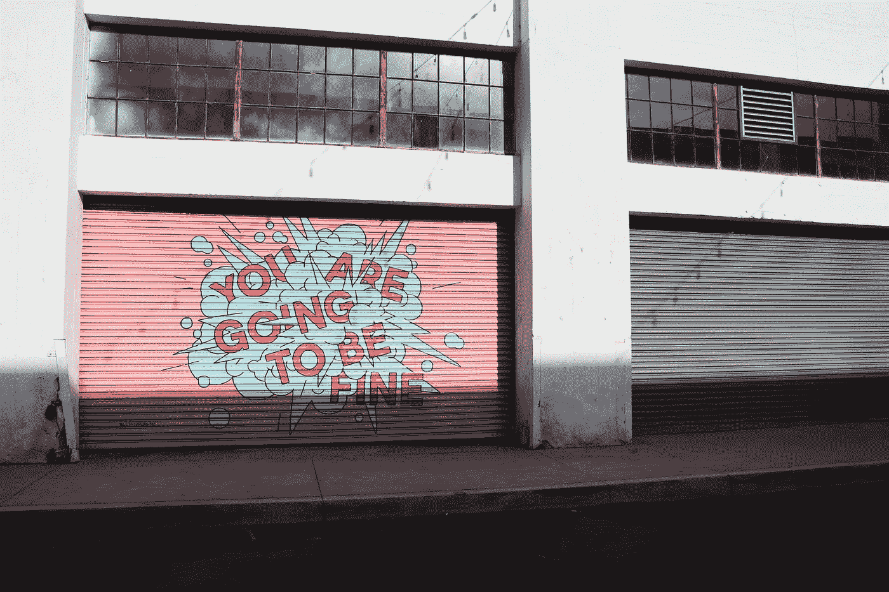

# 13 种方法让你的生活越快越轻松

> 原文：<https://medium.com/swlh/13-ways-to-make-your-life-much-easier-asap-85d755bb8fdb>

> 基于我自己的艰难经历、人生经验和对成长的承诺。

Image by Anna Sullivan

我实话实说。我不知道这些建议会不会让你的生活轻松十倍，但我知道，事实上，它们会让生活变得更轻松。我知道这一点，因为它们让我的生活变得更加轻松。改变习惯改变生活。当然，有 13 种以上的方法可以让你的生活更轻松。不过还是从这些开始吧。

# 1.不要对过去的你生气

我知道回想过去和思考 WTF 是多么令人畏缩。我感受到了[很多耻辱](https://thekateferg.com/home/2019/1/8/im-ashamed-to-feel-ashamed-tbh)，也清除了很多耻辱。我们偶尔都会做傻事。很难想象如果我们是不同的，事情会有什么不同。*但我们没有。我们就是我们。*

这很酷……你能反思和畏缩意味着你已经成长和改变了。这是最难的部分。你已经清醒好几天了。所以，花点时间感谢你自己，感谢你做了这份工作，成为了现在的你。让过去的你休息一下。试着对这一切保持幽默感。如果你不打算回去，也许是时候原谅你自己了。

# 2.清理你的粪便

字面上和比喻上。我知道他们说天才经常有乱七八糟的桌子和类似的有趣的东西，但是很多天才也有躁郁症和孤僻。我不认为你缺乏条理就证明了你正在走向成功。

我知道对着一堆乱七八糟的东西讲话有多烦人。但是你如何对待你的物理空间和你的情感空间有很大的相似之处。回避就是回避。扔掉东西就是扔掉东西。为新东西腾出空间就是为新东西腾出空间。清理你的衣柜或处理所有你一直逃避的杂务，然后试着告诉我你并没有感觉更好。你不能。当你不让事情堆积如山时，生活会变得更简单。

# 3.现在就做

你在为一个特殊的场合保留一个可爱的小数字吗？等着开始写那本书，直到你完全确定这个世界会在出版界给你提供一条受欢迎的道路？在艰难的谈话中拖延？也许你应该现在就做。穿上那套该死的衣服。这是你的生活，就在此时此地。你总是可以再穿一次…并声称你正在做出更可持续的时尚选择。

如果你在等待许可，你最好现在就停下来。你可能永远得不到你认为你需要的那种形式。你肯定不需要它。从这个世界得到真正肯定的唯一方法就是去做事情。你不需要有人抓住你，把你的才能从你身上拉出来。或者告诉你你很漂亮。或者支持您的业务目标。你现在只需要开始活出你自己的真相，然后你真实的存在方式会简单地告诉人们你是谁。

不是说一旦你开始把一切都放在那里，所有人都会支持你，而是你不需要所有人。你需要一群相信你所做的事情的人。或者一个人，视情况而定。外面有很多人。但你必须让他们知道你在做什么。

# 4.转动你的臀部

快讯:不是你尝试的每件事都会成功。这绝对不是不做的理由。就像你不需要在经历分手后停止(永久)约会一样，你也不需要因为没人买你的艺术而放弃画画。

生活不是一个线性的经历，没有人说过它应该是这样的。一切都在不断变化，所以你也需要能够不断变化。当事情不顺利的时候，你可以尽情地哭，但之后会有转机。假装你是某个喜欢冒险的坏蛋，喜欢挑战，用新的方式再试一次。如果你尝试的足够多，你可能会成为一个喜欢冒险的坏蛋。谁知道呢。

# 5.停止责备其他人

其他人可能会很糟糕。但那真的和你的经历没有任何关系。是的，他们的行为和话语进入了你的意识，但是在一天结束的时候，你要对你的经历负责。不管别人做了什么或说了什么，你都可以控制自己的反应，以及如何对待周围的感受。

责怪别人很容易。往里面看更勇敢。下次有人侮辱你的时候，想想它为什么侮辱你。如果他们说的话没有受到指责，你可能早就忘记了。你为什么还在想它？

当然，在适当的时候，人们仍然应该对自己的行为负责。我们不是在谈论他们的影响。我们在谈论你的感受。不管他们发生什么事，你都是你的主人。要承担很多责任，但个人责任应该是你的首要任务。

# 6.设定你的界限

如果你允许的话，有很多人会在闲暇时推来搡去。让人们越过你的界限就像跳上一列快车直到筋疲力尽。但是你可以拒绝他们。如果你要求他们不要在工作时间打电话给你，就不要接电话。如果他们拒绝停止伤害你，就走开。做任何你需要做的事情，让他们明白你的时间很重要。你的价值观很重要，或者你的钱很重要，等等。

虽然很难想象，但有时那些人甚至不知道你感觉自己的界限被跨越了。当你让他们知道的时候，他们可能会明白你的意思，然后退出。但是如果他们没有，那么你就更有理由放弃自己。不要和不尊重你的人浪费时间。

# 7.停止与不可信的人分享一切

你不必和那些刻薄或刁蛮的人分享你生活的每一个细节。我花了很长时间才弄明白如何解开一些更为友敌的友谊。爱一个人却不爱他的行为，总是让人困惑。但是如果有人表现得有毒，他们实际上是有毒的。他们可能会改变，但你不必同时过度扩张自己。或者被拉进他们的戏剧中。

不要等到事情变得更糟，才鼓起勇气说出自己的需求。停止告诉竞争对手你所有的好主意。不要和背后捅刀子的人说闲话。不要从暗地里希望你失败的人那里寻找支持。

# 8.请求帮助

你没有义务独自做每件事。你没有义务知道该知道的一切。你没有义务保护伤害你的人。找志同道合的人。向比你懂得多的人学习。信任值得信赖的人。

仅仅因为你对自己的经历负责并负责任地生活，这并不意味着你必须避开其他人或忽视他们的见解。这意味着你学习如何尽可能做到最好，这样当你向别人伸出援手时，他们会愿意帮助你。寻求帮助也能让你更有责任感。变得有责任感。变得有能力回报。重复一遍。

# 9.合作

同样，协作也是关键。当一个概念是新的，或者如果你第一次探索一个天赋，让它贴近你的内心是很有诱惑力的。有时在潜伏期这是绝对必要的。当你脆弱的时候保护你自己和你的艺术。

但是当你不脆弱的时候，接受这样一个事实:一起工作可以让 T2 做得更好，确实可以节省一些时间。如果你不知道如何去做某件事，或者这个项目太大，你一个人无法完成，那就找一个志同道合的人加入你。与其什么都不做，不如和别人一起做点什么。你随时可以离开，然后做你自己的事。

# 10.收起你有限的信念

许多人脑子里都有一个限制信念的连续对话，但那些信念大多已经过时了。当你 5 岁、15 岁或 23 岁时，你对自己有了错误的认识。但是如果你不再是那个年龄，你也不再是那个人了。即使某件事在某个时间点是真的，*也不意味着它现在也是真的*。你可以随时重写这个故事。改变你的想法。转换你的视角。想出一个新的故事，更支持你想要的，而不是你不想要的。

# 11.写下你想要的

你有很多心事吗？也许你应该把这些想法写下来，以便妥善保管。我从小就开始列愿望清单。(在我妈妈的催促下，大部分都发生在新月的时候。)我现在仍然有很多这样的清单，我可以告诉你，我在获得或完成清单上的东西方面有着非常好的记录。把事情写下来的行为只是增加了它的重量。这个想法立即存在于你头脑之外的某个地方，这就离实现它更近了一步。

如果你有动力，或者你想变得有动力，看到它被写下来会立刻火上浇油。一旦你承认你真正想要什么，就很难打退堂鼓。你不想让自己失望，对吧。此外，当你可以追溯到你第一次概念化的时候，完成事情会感觉特别酷。这是你有能力的纯粹证明，这将总是有助于你进入下一件事。

# 12.放下失败的浪漫

我在爱情方面失败了，在经典的浪漫喜剧和更危险的惊悚电影中受伤了。约会是疯狂的。但最终，因为这些，我成为了一个更好的人。真的。因为一些打击，我更卑微了。我对自己的需求和价值有了更清晰的认识。我更甜美，因为我懂得更多。

你所经历的一切都会改变你。让它以好的方式改变你。让心碎软化你参差不齐的部分。当你重新振作起来的时候，要相信自己变得更加坚强。许多爱情都不会长久。没关系。他们不需要。了解人际关系。了解自己。感激你有成长的机会。

# 13.善良一点

善良才是真正的交易。这确实意味着你必须总是对人好或者对任何事情都说好。这意味着你有清晰的情感，并能表达出来。这意味着你可以倾听并感同身受，而无需耗费他们的精力。意思是你可以说不，但不要太严厉。它意味着表达真诚的赞美和分享你的爱。这也意味着善待自己，这自然是远离这一切的关键。当你尊重自己的时候，别人会更加尊重你，这往往会让事情在各方面都变得更加顺利。

说起来容易做起来难？不完全是。当然，改变习惯需要时间。但事情就是这样。思维习惯。你开始得越早，你就能越快看到结果。你*将*看到结果。

*原载于 2019 年 2 月 16 日*[*【https://www.divvymag.com*](https://www.divvymag.com/new-blog/13-ways-make-your-life-ten-times-easier-asap)*。*

[*凯特·弗格森*](http://www.thekateferg.com) *是一位洛杉矶的作家兼创意人。她是* [*Divvy 杂志*](http://www.divvymag.com) *的创始人，也在娱乐、科技和社交媒体领域工作。在线找到她***或者直接在 thekateferg@gmail.com 取得联系。**