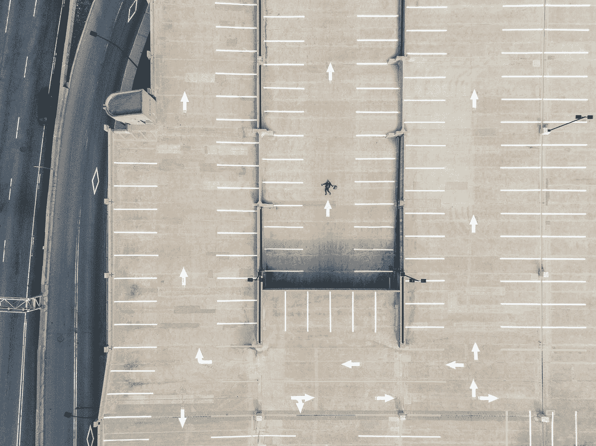

# 14 条来自 28 岁的人生经验

> 原文：<https://medium.com/swlh/14-life-lessons-from-and-for-a-28-year-old-a286b161e3d6>

Photo by [Martin Reisch](https://unsplash.com/@safesolvent?utm_source=medium&utm_medium=referral) on [Unsplash](https://unsplash.com?utm_source=medium&utm_medium=referral)

我收到的最难忘的生日祝福是 2017 年我爸的:

> "通过每天改变来保持你自己。"

从那以后，我一直试图听从这条建议，但它似乎从未像今天这样切题。28*有没有感觉不一样。27 岁时，我仍然认为自己是“20 多岁的孩子”，而不是“快 30 岁的人”但我不认为这是…*