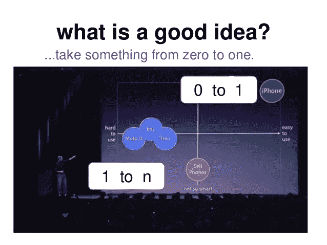
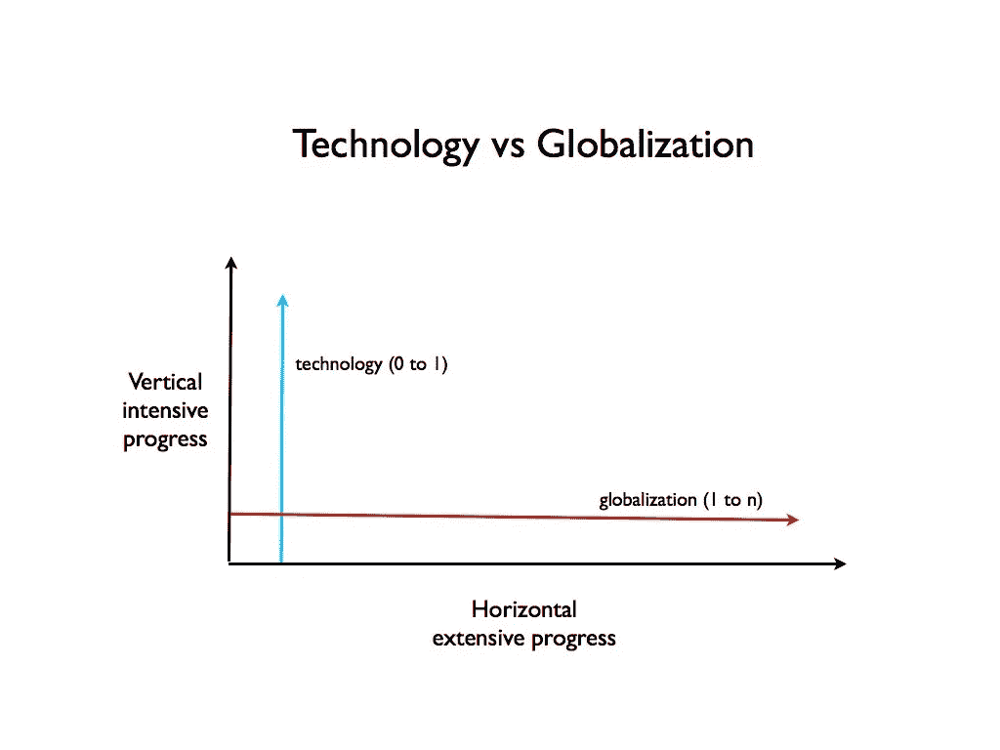
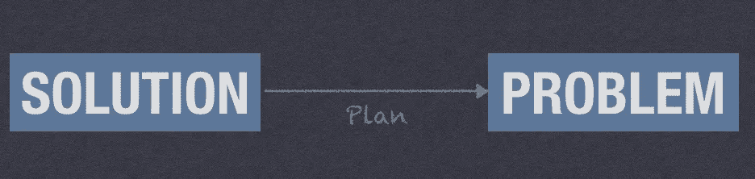
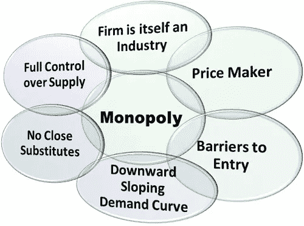

# 我从彼得·泰尔的阿伦·刘冰的《从零到一》中学到的 14 件事

> 原文：<https://medium.com/swlh/14-things-i-learned-from-peter-thiels-zero-to-one-3bd369df1922>

# 1: **从 0 到 N**

永远要知道我们知道的和不知道的区别。做别人做过的事情，可能对你的业务有好处，但对你的业务来说价值不大，但做从未做过的事情，即从 o 到 n，将是一种资产，其结果将是一些新鲜的东西，无论是创业想法或营销计划或新功能。

# 2: **寻找纵向的进步而不是横向的**

横向的进步很容易想象，因为它只是复制或做别人正在做的同样的事情，但纵向的进步意味着做一些新的事情。纵向发展比其他人更难，所以你对此一无所知

3:一个创业公司最重要的实力是**新思维**。如果你没有新的想法，那么你死亡的日子很快就会到来。

# 4:像 1999 年一样狂欢

“M *adness 在个人身上很少见，但在团体、政党、国家和时代里却是普遍现象。”
—尼采(在他发疯之前)*

循序渐进。小步渐进是唯一安全的前进道路

保持精简和谦逊(将创业视为不可知论的实验)

不要只从现有的客户开始，所以你应该通过改进其他竞争对手提供的产品来建立你的公司

专注于产品而不是销售(技术主要是关于产品开发，而不是分销)

糟糕的计划总比没有计划好

5:企业家总是倾向于低估竞争的规模，但这是创业公司可能犯的最大错误。

# 6: **进步来自垄断**

垄断是每一个成功企业的条件(每一个企业的成功恰恰在于它做了别人做不到的事情)

***垄断的特征:***

专有技术(难以或不可能复制的产品)

网络效应(网络非常强大，但你永远不会重复，除非你让你的产品对它的第一批用户有价值，当网络非常小的时候)。脸书开始时规模很小，只有哈佛的学生。这只是为了让他所有的同学都在脸书上注册，而不是为了吸引地球上的所有人

规模经济(一个好的创业公司应该总是有巨大的规模潜力。它应该不需要添加任何功能来获取用户，也没有理由停止增长)。

品牌(创造一个强大的品牌是宣称垄断的有力手段——就像苹果一样)

7:竞争让我们过分强调旧的机会，盲目地复制过去的成功经验。如果打不过对手，合并可能更好。

8:伟大意味着愿意为薄如蛋壳的原因而战:任何人都会为重要的事情而战。

# 9: **要么思考，要么死亡！**

不要只关注短期增长，要经常问这样一个问题*你的企业能存活十年左右吗？*单单数字不会告诉你答案；相反，批判性地思考你的业务的质量特征。

# 10: **放大**

一旦你创造并主导了一个利基市场，那么你应该逐步扩展到相关的和稍微广阔的市场。亚马逊从书籍开始，然后扩展到其他相关市场

> [阿伦赖纳](http://www.instagram.com/arun_raina)

# 11: **最后将是第一**

作为第一个行动者，你可以获得巨大的市场份额，而竞争对手将争先恐后地开始。

但真正重要的是在未来产生现金流，因此，如果其他人也来了，成为第一个行动者没有任何好处，但最好是最后一个行动者，即在特定市场上取得最后的重大发展

12:你可以期待未来有明确的形式，但如果你期待一个由随机性决定的不确定的未来，你将放弃努力去掌握它。

无限乐观——如果你计划并努力让未来变得更好，未来会比现在更好(如美国)

绝对悲观(相信未来是可以预知的，但既然前景黯淡，他必须为此做好准备(如中国)

无限悲观(对未来感到黯淡，但不知道该怎么办(欧洲)

# 13: **相信法律的力量**

这条法律对投资者并不重要，而是对每个人都重要，因为每个人都是投资者。一个企业家通过花时间在初创公司工作来进行重大投资，因此他必须考虑他的公司是否会成功并变得有价值

# 14: **你能问的最好的面试问题**

"在哪些重要的真理上，很少有人同意你的观点？"

一个好的答案采取以下形式:“大多数人相信 x，但事实与 x 相反。”

关注阅读更多与增长黑客、创业、创业、营销、社交媒体相关的故事。等等

**关注我这里** : [推特](https://twitter.com/arunraina121)， [Instagram](http://www.instagram.com/arun_raina) ， [Nojoto](https://nojoto.com/profile/af16dd9575e23e3c7944f56ba8008214/arun-raina)

阿伦·刘冰

## 这篇文章发表在 [The Startup](https://medium.com/swlh) 上，这是 Medium 最大的创业刊物，拥有+418，678 名读者。

## 在这里订阅接收[我们的头条新闻](http://growthsupply.com/the-startup-newsletter/)。

# **点击此处查看更多故事**

