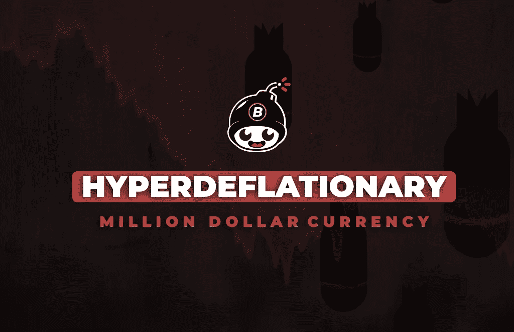

# 创造百万美元超级通货紧缩货币的 14 件事

> 原文：<https://medium.com/swlh/14-things-we-learned-creating-a-million-dollar-hyperdeflationary-currency-f372b270469c>

四个月前，我们在 reddit 上发表了一篇文章，宣布了一项社会实验，创造了一种叫做“T4 炸弹”的“T2 自毁货币”。至少可以说，这些反应是两极分化的: