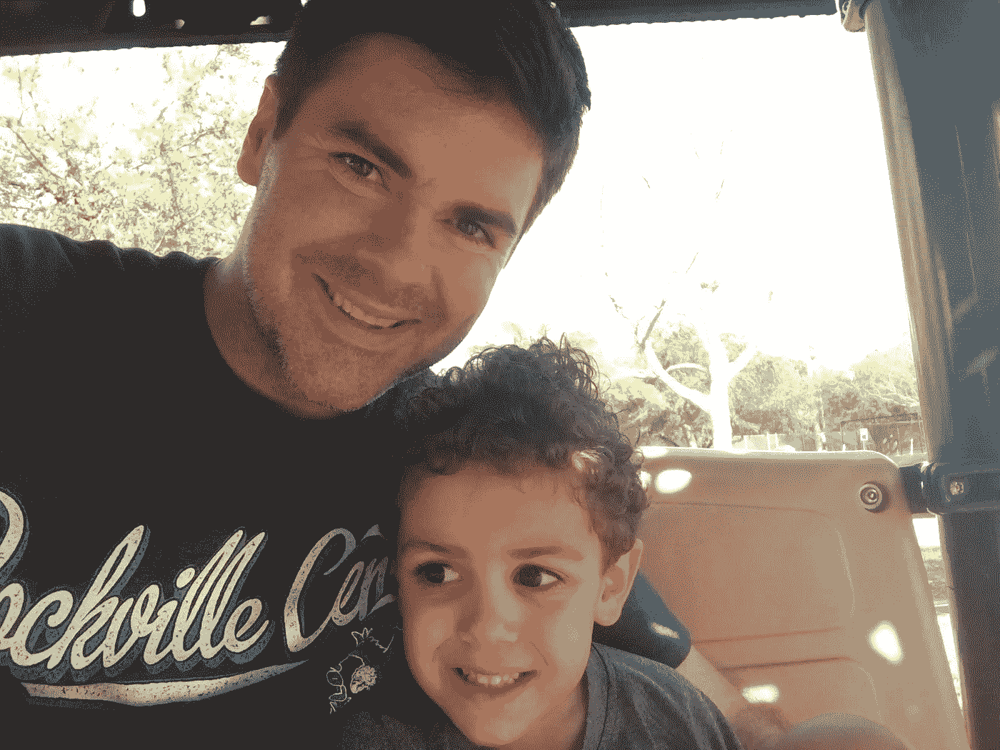

# 2019 年我们个人成长的 15 个大胆新年再承诺

> 原文：<https://medium.com/swlh/15-bold-new-years-resolutions-for-your-and-my-personal-growth-in-2019-7c8f152a3070>

> 向昨天学习，为今天而活，对明天充满希望。 **—阿尔伯特·爱因斯坦**

决心。新计划。真相。你想怎么称呼他们都行。

我把我的 2019 年称为“新年再承诺”

这就是为什么把你的重新承诺放在一起很重要:

我们都会迷失，沉浸，有时甚至被困在我们正在做的事情中。无论是好的、坏的、有成效的还是浪费的时间，我们并不经常在那一刻知道。这就是视角如此重要的原因。对我们的成功至关重要的是，我们后退一步，盘点我们正在做什么，我们要去哪里，以及这对我们是否是正确的事情。

然后，一切都是为了重新承诺最重要的事情。问题是我们根本没有致力于坚持不懈地去做。我们需要重新致力于我们知道对我们有益的事情，而且我们可能已经这样做了。我们没有让他们习惯。这正是这次清算——新的一年的开始——新的一季的延续——所要做的。

重新承诺什么会让你，你。开启生产力的新篇章，做最好的自己。

这需要时间，而且远不如社交或梦想那个伟大的想法有趣。大多数人远离梦想，不是因为缺乏欲望，而是因为他们只是不愿意“做工作”每当你听到这个非常重要的短语时，要知道“工作”首先涉及价值观的基础，然后是计划。

这必须放在第一位！如果你只是漫无目的地跳下去，一开始你可能会成功，但迟早你会失败。这不可持续。祝你好运！以下是我对 2018 年的“重新承诺”。这些是个人的，但它们有广泛的应用。

我想你会在这里发现很多你自己。我希望它们能给你勇气和信心，让你下定决心，努力过上你真正想要的生活！

# 1.更有当下感

在场的不仅仅是*教练讲的*。这是真正的全身心地沉浸在当下。你所做的一切都是心智、情感、精神和身体的觉知。活在当下，只关注那一刻重要的事情是最重要的。它消除了干扰。它以你最真实、最真实的形式呈现当下的你。

活在当下，每时每刻。你会最大化你的快乐和结果。

# 2.没有(那种)恐惧的信仰

在这张单子上所有的重新承诺中，这可能是我要克服的最大障碍。也许对你来说也是。真正相信自己，没有(那种)恐惧，是人生最大的挑战之一。恐惧有很多种。你知道，就像知道什么时候逃离着火的大楼。看到你的生活计划在错误的轨道上，担心你最终会过上别人的生活。

恐惧有很多种。

但是对成功的恐惧，对完成你最大目标的恐惧——那是很可怕的。这就是最大的信心和对自己的信念的来源。有时候，你需要几天时间来重新发现自己，重新安排事情的轻重缓急。希望圣诞假期对你有帮助。如果没有，后退一步，让自己变得年轻，重新树立你的信念。

# 3.时刻相信自己，这会带来自信和一致性

相关，相似，但不等于#2，这是信仰的表现，信仰会导致有形的，被证明的结果。我们越自信，我们越了解自己，越能弥合我们的想法和行动之间的差距，我们就越有可能做我们想做的事情，并把它们做好。

经过验证的结果带来信心，重复应用带来一致性。首先，你必须全心投入。为了完成和实现你的目标，你必须始终如一。

# 4.不后悔。接受已经发生的事情。

重要的是接下来会发生什么。重要的是我们面前的是什么。就是这样。当然，美好的回忆会伴随我们一生。记忆不一样。

在结果、产出和成就的世界里，最重要的是我们如何走向下一个目标、旅程、任务或我们面前的竞争。对最重要的事情进行优先排序和激光聚焦会引导你。不要担心已经发生的事情。你总能为你的故事写下新的篇章，让全世界都看到。继续前进！

# 5.成为一些事情的专家

我已经写了一本成功的书,目标读者是那些寻求将自己的生活建立在价值观和目标规划的坚实基础上的人。我得到了同行的认可，获得了写作社区的认可，并在媒体上有过一些令人敬畏的表现。其他人开始认识到我是这个领域的专家。我很高兴走进门来过这种生活。

我给你的建议是，想想你最大的天赋——你最大的技能——以及你把时间花在了什么上面。首先成为某一方面的专家，然后你可以开始获得多个领域的技能和知识。但是先从一件事开始。成为最好的。成为行业领导者和抢手的专家。奉献那段时间，不断成长。

对于 2019 年，对我来说，这是我能做的最好的教练。成为情商方面的全球思想领袖。你呢？

# 6.留下那些可能很好，但不符合我的游戏计划的东西

我想成为*纽约时报*畅销书作家。我想成为许多不同活动的主题演讲人。我想指导更多的高管和领导者。但是我受时间限制。我被我对家人和客户的义务所限制。我不能全部完成。我不介意。我选择专注于几件事情，并在这些事情上取得成功。

未来总有时间实现我们所有的宏伟梦想。所以，把它们写下来。但是不要试图同时做所有的事情。这导致压力太大，自我施加压力。相反，专注于你的优先事项，然后计划。

请听西奥·特塞德斯博士的话:

> “大脑最重要的功能之一——也是我们进化过程中最新的功能——是执行功能，这是一组认知能力，进化后使我们能够设定和实现目标。这种大脑功能是我们区别于所有其他生物的地方。大多数其他生物基于本能做出反应；我们根据计划采取行动。”

# 7.建立持久的联系。注重质量而不是数量

坚如磐石的关系源于对他人的奉献、同情、关心和爱护。用心去领导，出于对他人的真诚关心去建立关系。这不是关于你有多少追随者或者人脉。而是你拥有的强大的、改变生活的联系。把你的时间花在那些关系上。

# 8.更大的个人决策权

生活中我们都需要别人的依靠。但是没有什么能阻止你对自己的生活拥有更大的自主权。没有什么能阻止你去实现成功。对我来说，这意味着放弃对我最想要的东西“袖手旁观”。

这真的与决策有关。敏锐、专注和坚定的决策。我知道我能做什么，不能做什么。希望你能在 2019 年学到这种智慧。对你能控制和影响的事情拥有更大的自主权，把你不能做的事情委派出去。这需要一个全面的个人所有权方法！

# 9.主动是这个游戏的名字

向别人求助。请，无论如何。但是在你做的所有事情上，首先要愿意采取主动。只有这样，你才能决定你需要分配或给予他人什么。带着对自己最高的信心和信念全力以赴。当你知道你不能做某件事——或者这件事在其他地方可以做得更有效率——那么就去找别人。

我们都需要有人来帮助提升我们，让我们更上一层楼。但是先主动一点。这可能是:

*   开始你一直想写的那本书
*   开创新事业
*   创建应用程序
*   联系你一直想合作/共事的企业，请求他们给你一个见面的机会

去争取吧，不要害怕！

# 10.“玩房款”

当然，这个概念来自博彩业——用赌场的钱来刺激和推动未来的收益。记住，拉斯维加斯不是建立在赢家之上的！但是，正是那些在思想、言论和行动上“随遇而安”的胜利者——那些自信地领导的人——决定了他们希望如何生活。

玩房子的钱是一个礼物，但也是我们在如何处理我们的业务时必须做出的选择。从心理学的角度来看，当我们不害怕失去任何东西时，即使我们会失去我们刚刚赢得的东西，这也很容易做到。这是一种自信的心态，除了我们对风险的厌恶之外，还能缓解焦虑和对损失的恐惧。

# 11.减轻压力

“要快但不要急。”这是著名的加州大学洛杉矶分校篮球主教练约翰·伍登的话。这对我来说意味着:不要担心紧迫感。不要着急。这样做只会给自己更多的压力，引起更多的担忧。当你担心、焦虑、有压力并生活在恐惧中时，你不会想得那么清楚。你真是一团糟。

快速意味着执行你的游戏计划。你得先有个计划。有可依赖的价值观和支持这种价值观的常规肯定会有所帮助。当你有了这些东西，你就能更清晰流畅地操作和实现*流*。游戏开始变得更加自然。因为没有压力阻止你成为最好的自己。

# 12.更多的诚实、开放和脆弱

这是对我们中那些只是想让我们的本色闪耀出来的人的一个召唤。我喜欢《T4》中迈克尔·汤普森的这句话:

> “你经常竭力隐藏的东西，恰恰是把你和他人联系在一起的东西。这个世界已经有足够多的面具——我强烈建议在 2019 年摘下你的面具。”

# 13.不要重温过去的错误

犯错，有挫折，失败，绝对没有错。错的是沉湎于同样的错误中，而不努力继续前进并克服它们。不要重温对你没用的东西。找到一种建立在你的挫折之上的方法，利用逆境带领你走向新的胜利。

一旦你犯了一个错误，尽最大努力不再犯。

# 14.每天找时间反思

可能是在早上。可能是中午。也许是你睡觉前做的事情，或者刷牙，或者祈祷。但是请花几分钟时间思考一下。再加上冥想练习。它将改变你的生活，给你心灵的宁静。

# 15.让人觉得自己很特别

每个人都希望被特别对待。我们都想感受到被重视。所以，从你自己开始吧。善待自己。反过来，你也可以对别人友好和特别。

我最钦佩的人是那些能激发他人潜能的人。他们似乎漫不经心，毫不费力地做这件事。但他们的思想、言语和行为都是有意的。他们让世界变得更美好，一次一个人。他们带着自我意识、同情心、好奇心和帮助他人成功的真诚愿望行动。

让别人觉得自己与众不同，你就会拥有一个朋友和一生中强大的关系。

# 开始新的一年吧！

[***加入我的迅***](http://chrisdconnors.com)****查看我的畅销书，*** [***你的价值***](https://www.amazon.com/Value-You-Living-Joyfully-Through-ebook/dp/B076S4VJXZ/ref=sr_1_1?ie=UTF8&qid=1509045296&sr=8-1&keywords=christopher+d+connors) ***。这会给你灵感，开始为你的旅程的成功做计划。如果你有兴趣跟我合作，*** [***试试我这里的***](https://www.linkedin.com/in/chrisdconnors/) ***。****

**

## *这篇文章发表在 [The Startup](https://medium.com/swlh) 上，这是 Medium 最大的创业刊物，拥有+406，714 名读者。*

## *在这里订阅接收[我们的头条新闻](http://growthsupply.com/the-startup-newsletter/)。*

**