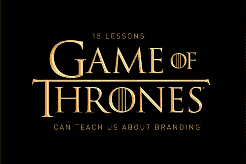

# 《权力的游戏》可以教给我们关于品牌的 15 堂课

> 原文：<https://medium.com/swlh/15-lessons-game-of-thrones-can-teach-us-about-branding-8866fc191388>

Image courtesy of Night Sky Creative

…现在我们的观察结束了。

不管你对《权力的游戏》最后一季的感觉如何，毫无疑问，它在过去十年里制作了一些最好的电视剧。

它在规模和视觉奇观方面重新定义了媒体。