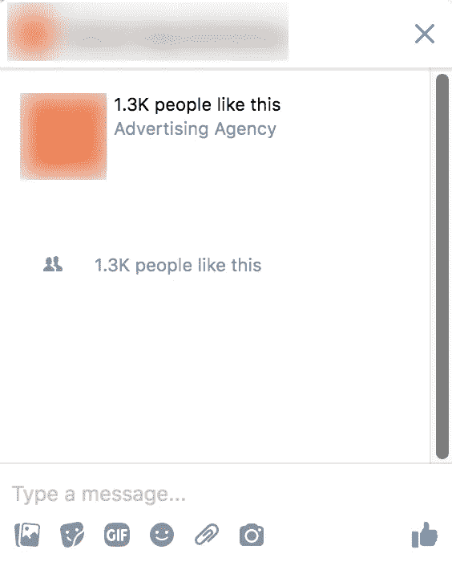
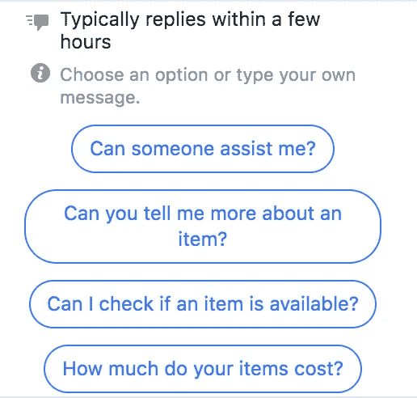
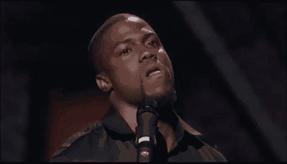

# 你的聊天机器人糟糕的 15 个原因

> 原文：<https://medium.com/swlh/15-reasons-why-your-chatbot-sucks-aafe0e9926bc>

每个人都对聊天机器人是最新最好的营销策略赞不绝口…如果你有一个聊天机器人，那么你已经领先了。不过，这里有一个警告:**并非所有的机器人都生来平等**。

在你的业务中，每个聊天机器人都需要有一定的效率，这就是为什么我列出了你的聊天机器人糟糕的 15 个原因。如果你有这 15 件事情中的任何一件，是时候开始行动了，把你的机器人弄直了！

# **1。你根本没有。**

如果你还没有某种 Facebook Messenger 响应器，那么你还没有完全掌握这个球，但是你需要尽快行动起来。大公司已经开始使用(并主导)Messenger，所以是时候迎头赶上了。前往 ManyChat.com，设置您的欢迎信息—这非常简单且用户友好。

如果您没有设置 Messenger，请查看一下它的外观:

如果你正在寻找一个可靠的信使营销策略，这不是一个好的外观。尤其是当你的页面提示人们给你发送信息的时候。

# **2。你不让你的聊天机器人跟进。**

不久前，我给一个机器人发了一条消息，它看起来像是被设置好的，然后奇怪的事情发生了…

机器人问了我一个问题，当我回答时，机器人过了 **30 分钟才回应**。这是一个糟糕的机器人。对我来说，弄清楚机器人没有跟进，而是一个真实的人做了，真的很容易。

拥有一个机器人的全部意义在于自动化你与你的观众对话的不同部分。如果你设置了一个机器人，确保你的对话中最简单和最容易的部分是自动化的。

# **3。它的设置方式不会节省您的时间和金钱。**

至少，你的机器人应该能够回答你的观众的常见问题，并引导他们进行购买(如果这是他们的目的)。

**这里有一些你的机器人应该能够做的事情:**

✅Answer 常见问题

✅Showcase 畅销产品陈列馆

✅Showcase 你最好的和最有帮助的内容

✅Schedule 是一个战略电话

# **4。不是个性化的。**

这摘自《电子邮件营销 101》一书。人们爱他们自己，当你个性化你的机器人时，你让你的观众知道你在想他们。这总是一个伟大的自我打击。

# **5。没意思&没个性。**

好吧，你的机器人真的是一个机器人，但它不应该听起来像。发挥创意，在你的文案中加入一些个性！你不希望人们对你的机器人感到厌烦，并在你看到好东西之前取消订阅。不要害怕做自己，尤其是这真的是你品牌文化的一部分。

# **6。你让脸书决定你的聊天机器人如何与你的观众互动。**

不，不，我的朋友。看看这张照片:

这是当你使用脸书默认的 Messenger 设置时，你的机器人的外观。当然，你可以选择定制这些问题，但是你愿意猜猜当我点击其中一个问题时会发生什么吗？

是啊…没有回应。当热情的潜在客户对你的业务表现出兴趣时，这是拒绝他们的绝佳方式。帮你自己一个忙，在 ManyChat 中构建你的机器人，这样你就可以更好地控制回复。

# **7。你只是将它用于基础，而不是整合成长工具。**

你必须让你的机器人更上一层楼，使用成长工具！这允许你在你的脸书生活中，在脸书的广告中，在你的网站上，在你的电子邮件中…任何地方捕捉机器人线索！

ManyChat 中的增长工具是快速增长你的 bot 列表的最佳方式。如果您不熟悉它们，请登录您的帐户并进行探索。有无数种可能性。

# **8。同样，您没有使用任何集成来节省时间和金钱。**

ManyChat 与 Zapier、Google Sheets、MailChimp 和 Integromat 集成在一起，因此您可以充分利用它们。这些集成将把许多应用程序连接在一起，这样你就不必做大量的手工工作。

花点时间学习如何进行整合，这样你就不必花时间在业务的细节上。

# **9。你只发宣传片。**

你已经知道电子邮件一直在下降，其中一个很大的原因是因为公司发送了太多的宣传片！宣传片是可以的，但是如果你有一个可靠的机器人战略，持续的宣传片不应该是其中的一部分。

通过你的机器人发送促销信息是可以的(只要你遵守规则)，但是如果有人不要求或者一周内发送太多次，你肯定会被禁止使用 Messenger 向你的受众进行营销。

# **10。你在错误的时间发送信息。**

不久前，我注册了一个机器人，因为我注册了一个网络研讨会。网上研讨会结束后，我开始一天到晚都收到信息。

早上 6 点。

午夜 12 点。

凌晨 3 点。

什么？？！！！确保你设置的信息符合你的用户的时区…没有人想在半夜被炸死。

# **11。当人们与你的机器人互动时，你没有把他们分割开来。**

你的机器人策略应该相当类似于你的电子邮件策略。

当你给你的听众发邮件时，你不会给每个人都发同样的邮件，因为不是每个人都在同一个客户旅程中。细分受众的一个很好的方法是确保你的机器人正在提问，并根据人们与你的机器人的互动方式来标记他们。

例如，如果有人给你的机器人发消息，想要和你的企业安排一个约会，你可能想用标签告诉你他们是否真的安排了约会。这样，你就知道马上跟进一个热门线索！

# **12。你没有在最好的情况下使用标签。**

好吧，简单来说:**标签一定要用！**

**我用标签**

✅to 告诉我谁点击了某个按钮或快速回复

✅to 细分了我的观众

✅and 来决定谁是热门线索。

标签是一个真正强大的工具，它可以帮助你讲述一个故事，告诉你人们是如何通过你的机器人流动的，而不是让他们点击进入而不收集你的订户的数据。

# 13。你没有用关键词。(所以当他们说一些可以预见的自然的话时，你的机器人会用可怕的默认回复来回应……不！)

如果用户给你的机器人输入一条信息，并且他们使用了一个特定的关键词，机器人可以根据你如何设置你的关键词来响应。例如，许多聊天机器人的默认关键字之一是停止。

当有人输入这个时，ManyChat 机器人会自动向用户发送一条关于取消订阅的消息(这是自动的)。你可以在你的机器人中设置关键词，自动发送信息来回答问题。

如果没有，那么你的用户将得到可怕的默认回复。希望你已经在 ManyChat 中设置了这个，这样就可以用你的品牌声音来表达了。

# **14。你还没有真正测试你的机器人之前，你把它放在那里。**

这简直是一场噩梦。在发布之前，一定要测试你的机器人。

**这里有一些需要注意的事情:**

✅make:确保在测试过程中使用了正确的标签

✅make 确信这些延迟对读者来说足够现实(不太快，也不太慢)

✅make 确定这条信息真的发出来了

✅make:你确定你的图片和 gif 图片是为了传达信息而优化的吗

不测试你的机器人肯定会让你看起来像个业余爱好者。

# **15。你没有清理你的清单。**

就像在电子邮件营销中，你需要确保你正在清理你的未参与订户名单。它们只会堵塞你的列表，而不会让你真正了解你的机器人的内容表现如何。

您可以设置一个序列，在一段时间后自动向没有与您的机器人互动的订阅者发送消息…

如果他们不互动，他们将被取消订阅，并从您的列表中删除。你还应该让他们选择留在你的名单上，这样你就可以继续为他们提供价值和销售(当他们准备好的时候)。

如果你的机器人是这 15 件事情中任何一件的罪魁祸首，我敦促你现在就修复它！

你见过哪些聊天机器人的缺点？下面让我知道！