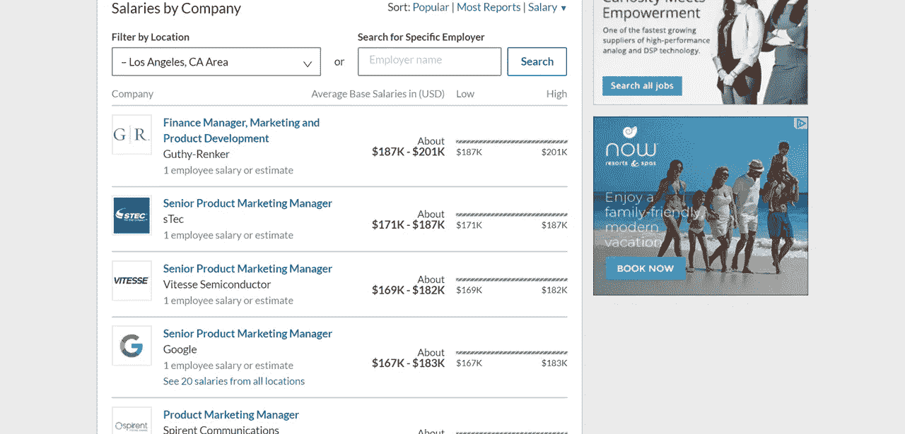

# 2019 年的 15 条薪资谈判建议:赚你应得的

> 原文：<https://medium.com/swlh/15-salary-negotiation-tips-for-2019-earn-what-youre-worth-c8740e17f47f>

Knowing what to say when negotiating salary could help you earn millions more over your career

让我问你一个问题。如果你走在街上，看到路边有 75 万美元，没有任何附加条件，你会捡起来吗？很有可能，你会。

但是当谈到工资谈判时，数百万美国人把几十万美元放在桌面上。根据[美国消费者新闻与商业频道](https://www.cnbc.com/2018/12/18/not-negotiating-salary-could-cost-you-750000-throughout-your-career.html)的说法，忽视协商你的薪水可能是一个代价高昂的错误，总计**75 万美元(！！)或更多的收入损失。**

这还没算上你因将资金撤出市场而失去的所有投资潜力。假设你在 45 年的职业生涯中平均投资这 750，000 美元，标准的升值幅度为 7%，你会看到**损失 500 万美元**！

所以，如果你没有从这份工作中得到什么，那就这样吧:在没有谈好你的薪水之前，永远不要接受工作邀请。这可能令人生畏，但它是如此不值得，下面包括的提示应该会使它变得容易得多。

哦，在我们开始之前还有最后一件事。如果你觉得这些内容有帮助，可以看看我的完整职业发展课程，*黑掉你的薪水:如何在一份理想的工作中让你的收入翻倍*。

*降薪*是一个从头到尾的职业发展计划，旨在帮助你在一家你引以为豪的公司找到一份你热爱的工作，并每两到五年让你的起薪翻一番。这门课程涵盖了从如何优化你的 LinkedIn 到如何仅仅通过改变你的职位来增加你的薪水。**我相信你会喜欢它的，所以看看下面吧。**

Udemy: [如何让收入翻倍](https://www.udemy.com/hack-your-salary-how-to-double-your-income/)

Skillshare: [如何让收入翻倍](https://www.skillshare.com/classes/Hack-Your-Salary-How-to-Double-Your-Salary-Land-Your-Dream-Job/130067495/projects)

好了，别再推销了。**以下是 2019 年必备的薪资谈判技巧。**

# 求职者的薪资谈判技巧

如果你目前正在找工作，在你踏进门之前，使用下面的建议来最大化你的收入。

## 了解你的价值

A little research can make you millions in the long run

就像你没有基本的语法知识就写不出伟大的小说一样，如果你对自己的价值没有一个基本的了解，你就不能恰当地协商你的薪水。

那么，你薪资谈判之旅的第一步应该是注册一个汇总和比较薪资的服务。Glassdoor 是一个很好的起点。在我的课程 [*削减你的薪水*](https://www.skillshare.com/classes/Hack-Your-Salary-How-to-Double-Your-Salary-Land-Your-Dream-Job/130067495/projects) 中，我有一整节的内容是关于如何使用 Glassdoor，通过只寻找薪水最高的职位来挖掘你最大的薪水潜力。但是对于我们今天的目的，你真正需要知道的是你的市场价值。

如果你正在使用 Glassdoor，请登录并向他们提供你的教育水平、你正在寻找的当前职位以及你的位置。如果你已经在这个行业工作，你可以使用附带的工具来看看你是否得到了你应得的报酬。如果你还在找工作，你可以在搜索栏中输入职位名称，看看这些职位对应的薪水是多少。

不做调查就不要谈薪水。

## 瞄准高端

通常，当你在 Glassdoor 等网站上搜索薪水时，你会看到一系列的薪水，而不是一个单一的数字。它看起来有点像这样:

You’ll see ranges of salaries for most job titles. Shoot for the higher end

看到这里，你可能会认为你应该给你的潜在雇主提供一个工资范围，因为这是大多数网站上显示的。但这实际上是一种非常低效的谈判方式。事实上，我从来不会给招聘经理提供一个范围。相反，我使用该范围最高端的具体数字。

为什么？两个原因。首先，你永远不要在没有一点谈判的情况下，给招聘经理一个降低你薪水的借口。第二，有可能招聘经理最终会试图通过谈判把你降下来。你希望起薪高，所以即使通过谈判降了几千美元，你也会对自己的薪水感到满意。

## 避免过早讨论薪水

如果可能的话，你应该把你的薪水要求延长到面试过程的中间或者最后。为什么？很简单——你希望招聘经理在你提出要求的时候尽可能地关注你。

如果你和你未来的经理谈谈，让他们完全了解你能给公司带来什么，整个招聘团队会更愿意满足你的薪资要求，因为你已经向他们展示了你的用处。

## 在面试中设定期望值

Give the hiring manager a clear idea of the salary you’re willing to accept

上面的建议可能很难实施，因为很多招聘经理会在你第一次面试时问你希望得到多少薪水。在这种情况下，很难回避这个问题。如上所述，给他们一个有研究支持的具体答案，看看他们如何回应。大多数招聘经理不会直截了当地说“不”，除非你给出的回答完全超出了他们期望的薪资范围。

你知道吗？如果你很难被拒绝，总会有其他工作等着你。

## 学习如何通过电子邮件(最终，通过电话)协商薪资

Learn how to negotiate salary by email, and you’ll be all set for your first day

当和潜在雇主谈判时，我总是喜欢直接和招聘经理通过电话交谈。然而，许多第一次谈判的人一想到在实时对话中向雇主索要更多的钱就会紧张，所以我通常建议我的客户选择他们最舒服的谈判形式。

对于那些对谈判薪水感到紧张的人来说，电子邮件是学习基本策略的绝佳媒介。通过电子邮件协商薪资时，记住基本原则。

利用你的研究来确保你得到了市场价值的报酬。如果招聘经理给你的薪水低于你的市场价值要求，你可以这样说:

“嗨[招聘经理]，

谢谢你的邀请——感谢你的信任和时间。我很高兴能在[公司]开始我的职业生涯，但在我接受邀请之前，我有几个问题希望向您请教。随着我求职的进行，我已经能够更好地了解我希望得到的薪水。我想讨论一下怎样才能把我的薪水提高到[要求的薪水]，这样我就能更好地为团队提供高质量的工作，我知道这是在这个职位上取得成功所必需的。"

确保在你帮助他们的时候提出你的要求。从“我怎么做才能超出你的预期”开始，公司会更容易在中间遇到你。

# 加薪的薪资谈判技巧

所以，你已经谈妥了一份不错的起薪，并且对你丰厚的新薪水非常满意。太棒了。但是让我告诉你，想要更多是人类的天性，一年后，你会梦到更多的数字。

下面的建议是为那些已经有一份轻松工作，但仍然希望在所有的艰苦工作和长时间工作中得到更多认可的人设计的。

## 先把工作放进去

Hard work is the surest way to drive your paycheck higher

我们都想要更多的钱，但是在你专注于你的工作之前专注于加薪是本末倒置的。谈到薪资谈判，这一切都是为了向你的经理(就此而言，也是你经理的经理)展示你提供了过多的价值。

一旦你完成了出色的工作，那么也只有到那时，你才会觉得有权力要求增加薪酬。让你的记录自己说话，你几乎不用说话。

## 追踪你的成就

Make a list of all of your achievements so you can easily reach for them come raise time

当然，如果没有人知道你在做，世界上所有的工作都不会给你加薪。到了要求加薪或升职的时候，你会想要一份你所有最大成就的清单，这样你就可以向你的经理证明你值得加薪。

现在就启动一个名为“工作成就”的谷歌文档，列出你在工作中负责的所有事情。每当你在其中一个部分取得成就时，就进去把它列出来。如果可能的话，尽量使用具体的数字，例如“在你做了一些事情之后，转化率增加了 25%”，或者“在你开发的应用中，排名第一”。

这不仅有利于加薪，而且在你试图换工作时也很方便。

## 选择合适的时间

Time is one factor that many employees underestimate when learning how to negotiate salary

大多数人通常会在工作的关键时期考虑加薪，比如每年的工作纪念日或绩效评估。但是如果你认为这是要求加薪的最佳时机，那你就大错特错了。

经理们必须提前计划好一切，这意味着公司高管会为明年制定预算，而且他们会希望坚持下去。如果你在他们已经为你预算了一定数量的钱之后要求他们加薪，他们更有可能拒绝你。

相反，在那个重要的周年纪念日或绩效评估前三个月走进你经理的办公室，利用下面的建议提前要求加薪。

## 学习在谈判薪水时该说些什么

Negotiating salary every year to year and a half will maximize your income

如果你一直按照上面的步骤去做，你已经有了一份出色的工作记录和一长串的成就，到了协商加薪的时候就可以利用了。在你去经理办公室之前，你也应该回到 Glassdoor，确保你的薪酬继续达到或超过你的职位的市场价值。

有了这些信息，你就能为加薪提出无可辩驳的理由。从展示你已经为公司提供的价值开始。然后，继续询问你的经理对你如何能够超越为你设定的期望的看法。确保你的经理知道你想超过平均水平，如果你实现了这个目标，你希望你的工资也相应增加。

开始对话的一个好方法是，“您可能还记得，去年我开始着手实现[您和您的经理之前设定的目标列表]。在这段时间内，我已经通过[列出您已经完成的创新流程和/或项目]超越了这些目标，从而实现了[列出您已经取得的成果]。基于这些结果，我想与您讨论如何让我在这个职位上继续超越您的期望。如果我能够继续超越这些期望，我认为上调我的工资是合理的，以反映和支持我在这个职位上的持续成功。”

## 以明确的截止日期和目标结束

Set clear deadlines for your goals, and match your salary discussions around those goals

通过使用上面的提示，你将能够清楚地了解你的经理期望你如何超越你的角色的期望。一定要争取具体的信息，比如要达到的关键数字，或者你可以承担的为公司增加价值的额外角色。

一旦你手头有了一个具体的项目清单，就为这些目标设定一个具体的截止日期，到那时你可以向你的经理汇报并要求“工资调整”。理想情况下，你可以将上述所有建议结合起来，在你的年度工作纪念日前三个月与你的经理进行初次会面，并设定届时到期的目标。这样，你的经理会提前知道你打算在工作纪念日前后要求加薪。

既然你已经有了目标和时间框架，你所要做的就是把这些目标敲出公园。

# 给经理的薪资谈判建议

员工不是唯一应该考虑薪资谈判的人。一个好的经理会鼓励和支持他们的员工，并帮助他们在工作中取得成功。如果你是一名经理，在你职业生涯的某个阶段，你将不可避免地与员工谈论他们的薪水。使用这些提示来顺利完成这个过程。

## 想想你的员工需要什么

As a manager, you have to put your employee’s needs before your own. That includes being open to giving performance-based raises

作为一名正式的受薪员工，你的负担要少得多。你来上班，担心你的任务和薪水，然后你回家。但后来你成了经理。突然间，你需要考虑的不仅仅是自己的幸福。

作为经理，你必须站在员工的角度，真正考虑他们需要什么才能茁壮成长。不要只考虑新的工作场所工具或漂亮的生产力软件——工资是人们工作的主要原因，健康的工资可以区分快乐、有生产力的员工和脾气暴躁、一事无成的员工。

## 考虑代际差异

Millennial and Gen Z employees have different attitudes towards work. Consider and support these attitudes to the extent that you can

如果你是一名经理，你可能是我们所说的“千禧一代”或者更老。与此同时，你的许多员工可能是千禧一代或 z 世代。当管理与你属于不同一代的员工时，重要的是要考虑他们对工作的态度可能与你不同。这也适用于薪资谈判。

[研究](https://www.forbes.com/sites/jefffromm/2017/11/27/what-you-need-to-know-about-gen-z-in-the-workplace/#7ad47fbb6e1d)表明，例如，Z 世代的员工希望工作场所的事情进展迅速，这可能是因为他们经历了智能手机培养的“即时满足”文化。许多 Z 世代员工甚至期望在开始新工作的六个月内加薪和升职。

由于这些代际差异，许多经理担心 Z 世代员工会破坏他们努力建立的企业文化。不要陷入妖魔化你的员工的陷阱，仅仅因为他们和你有不同的成长经历。我们中的许多人可能仍然对我们第一次进入工作场所感到痛苦，我们的一代是被妖魔化的一代(向我的千禧一代同胞大声疾呼)。

不要认为新一代有资格，做一点研究，试着理解他们来自哪里。坦率地说，如果整整一代员工走进你的办公室，期望在六个月内加薪，那你应该感到幸运。设定期望，努力的*和*聪明的工作对于进步是必要的，让他们放松以实现他们的全部潜力。

## 在必要时为你的员工辩护

Shout out your employees’ success stories — It makes you both look good

当我在一家大型科技公司找到第一份工作时，我感觉自己只是近 1000 名员工中的另一张面孔。但是我的经理，上帝保佑她，并不满足于让我在我们办公室这条懒散的人世间四处漂泊。相反，她鼓励我每月向我们的高管和产品经理报告我所完成的一切，这样他们就知道我的工作是有价值的。

与上级分享成就在很多方面都有帮助。首先，它让我走上了高薪的快车道。其次，我相信它帮助我度过了公司在我入职一年后的一系列裁员。

作为一名经理，你应该希望你的员工成功，但除此之外，你还希望他们在你身边，对吗？给你的员工一个正确的方向。这将有助于他们理解，当薪资谈判时间到来时，你是站在他们一边的。

## 鼓励你的员工成为自己的拥护者

Teach your employees to stand up and advocate for themselves, even when the going gets tough

当然，你不可能在每一次会议、每一次谈话、每一天都陪着你的员工。毕竟，你有自己的生活要过！因此，培训你的员工开始为自己辩护是很重要的。这样，即使你不在的时候，它们也会被盖住。

比你不得不为之奋斗的员工更好的是一个会为自己奋斗的员工。鼓励你的员工，给他们自主权。设定明确的期望，然后具体告诉你的员工如何超越这些期望。清楚地表明，如果他们超出了你的预期，工资调整将会等着他们——只要你有权力最终做出决定。

## 创造一条清晰的前进道路

Smash all of the obstacles that your employees face, and give them room to shine in the workplace

你的员工应该觉得你是老板中的老板。推平他们道路上的障碍，给他们空间来展示自己的优点。

为员工扫清道路可以采取多种形式。例如，它可以采取为员工提供新技术或参加与工作相关的课程的形式。无论你做什么，一定要不时地和你的员工的目标联系起来，并为他们实现这些目标设定现实的时间表。

请记住，每个员工都是不同的，他们的需求可能与你想象的不同。在对员工进行评估时，明确询问你的主管认为是什么阻碍了他们在工作场所的发展。清楚地表明他们的回答不会对他们不利，也不会有任何东西离开房间。毕竟，如果你不知道障碍是什么，你就不能消除它们。

## 这就是 2019 年基本的薪资谈判技巧。带着以上的知识，前进，并在今年剩下的时间里成功。

# 哦，还有…

**我的首要目标是帮你赚更多的钱。**对我来说，最好的方法就是通过课程、媒体和文章。因此，如果这些内容对你有所帮助，请继续使用**和 [Twitter](https://twitter.com/DanielLawMoney) 关注我，并在 [Udemy](https://www.udemy.com/hack-your-salary-how-to-double-your-income/learn/lecture/14530342#overview) 或 [Skillshare](https://www.skillshare.com/classes/Hack-Your-Salary-How-to-Double-Your-Salary-Land-Your-Dream-Job/130067495/projects) 上查看我的课程。将会有更多精彩的内容出现，我迫不及待地想与大家分享。**

在下面注册我的时事通讯，当我发布新的免费金融建议、新课程等等时，你会得到通知。记住——金钱=自由。你会用你的买什么？