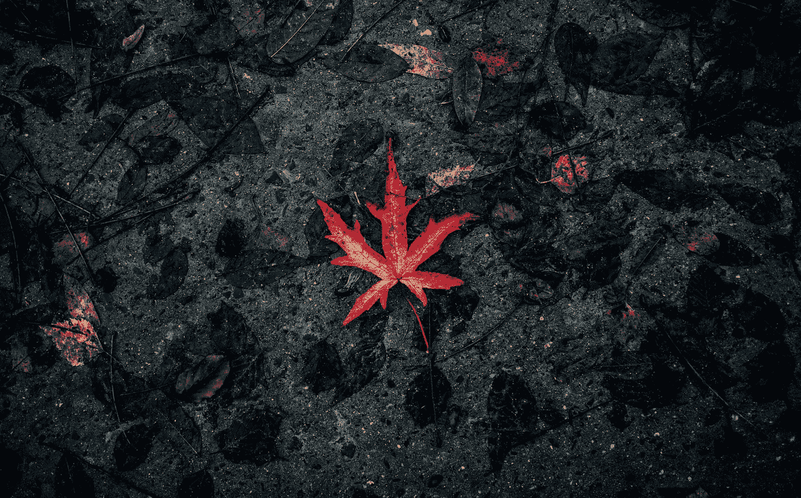

# 海洛因成瘾 15 年——15 个教训

> 原文：<https://medium.com/swlh/15-years-addicted-to-heroin-15-lessons-learned-e0bd7a725f24>

Photo by Nsey Benajah on Unsplash

## 当我喝完我的杯子，一切都变了

> “扔掉你自负的观点，因为一个人不可能开始学习他们认为已经知道的东西。”——***爱比克泰德***

我曾经认为我知道很多。我没有。我思想封闭，自我专注，害怕跳出自己的小天地。