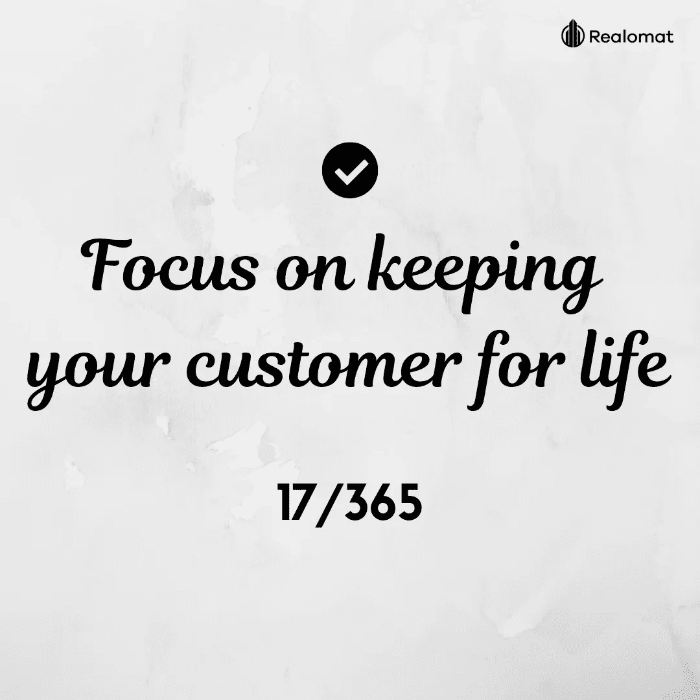

# 17/365 增加销售额的每日小贴士:专注于留住你的客户

> 原文：<https://medium.com/swlh/17-365-daily-tips-to-grow-your-sales-focus-on-keeping-your-customer-for-life-d7628c4f5c>

“一次是顾客，永远是顾客。”

你需要专注于让客户永久存在。第一次购买不应该是最后一次。与您的客户保持联系，这将加强关系，并为您的产品增加价值。

资料来源:briantracy.com

***订阅我们的社交网络:***

www.facebook.com/realomat/:[脸书](http://www.facebook.com/realomat/)

LinkedIn:https:[www.linkedin.com/company/realomat/](http://www.linkedin.com/company/realomat/)

推特:[twitter.com/realomat_biz](https://twitter.com/realomat_biz)

insta gram:[realomat _ biz](https://www.instagram.com/)

我们的网站:[***realomat.com***](https://www.realomat.com/)

## 这篇文章发表在 [The Startup](https://medium.com/swlh) 上，这是 Medium 最大的创业刊物，拥有+421，678 名读者。

## 在这里订阅接收[我们的头条新闻](https://growthsupply.com/the-startup-newsletter/)。

