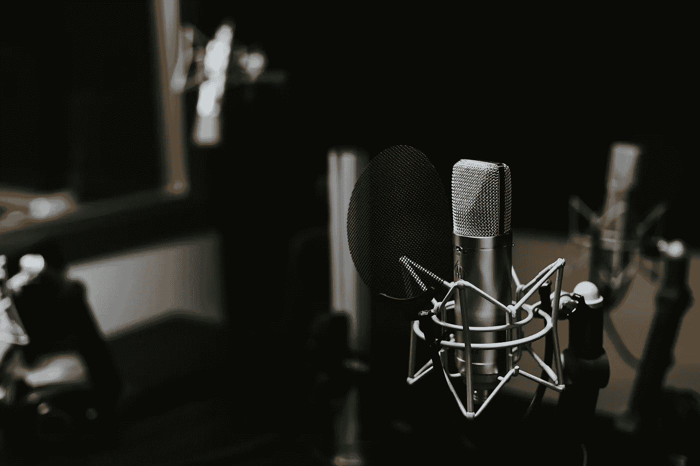

# 每个企业家都应该听的 18 个播客

> 原文：<https://medium.com/swlh/17-podcasts-every-entrepreneur-should-listen-to-5fad41a55156>

Photo by Jonathan Velasquez on Unsplash

播客现在很像一杯咖啡:它们不会让你从商业活动中分心，而是为一个非常小的承诺提供了一个很好的价值。在繁忙的一天，这是一个有用的习惯——你可以在同时处理多项任务或外出吃午饭时收听。对于许多成功人士来说，现在这是一种刺激他们大脑活动的日常食物，在例行公事耗尽魔力后推动他们前进。