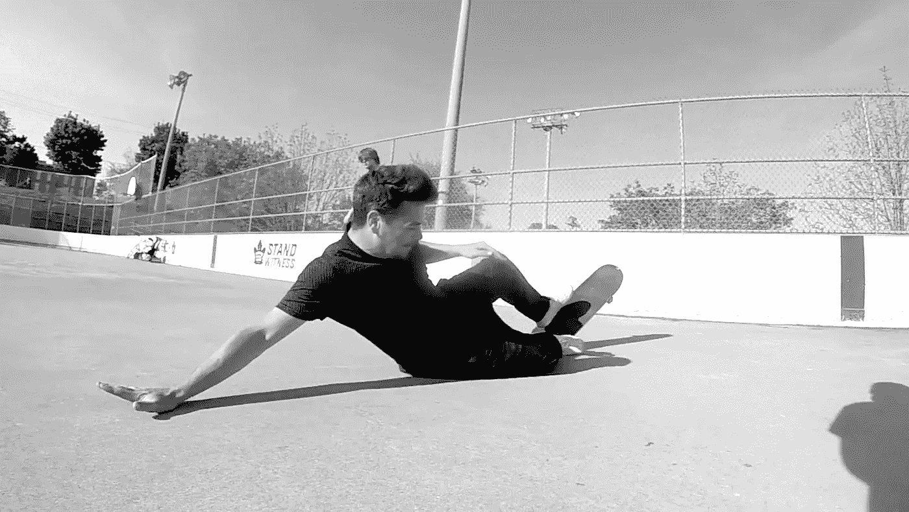
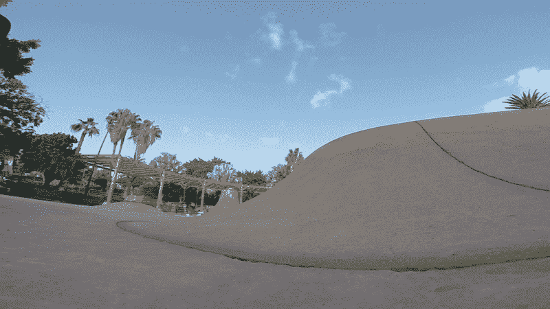
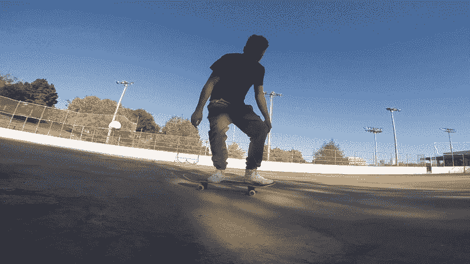
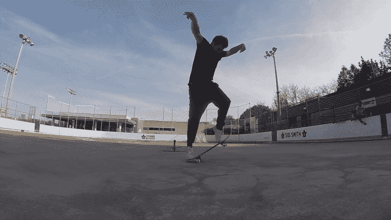
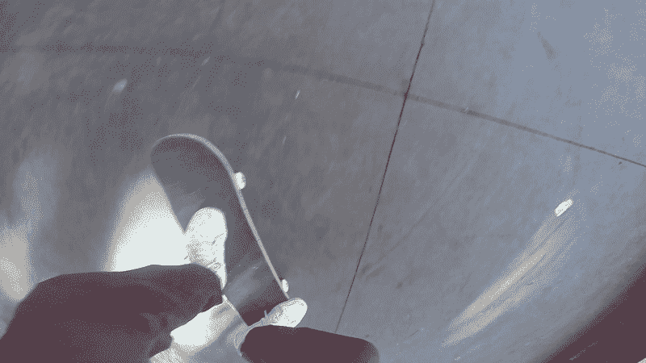

# 滑板可以教会你关于商业和生活的 18 个无价的教训

> 原文：<https://medium.com/swlh/18-invaluable-lessons-skateboarding-can-teach-you-about-business-and-life-67df1802c9bb>

## 这项活动让你为艰苦做好准备

Me falling on my butt for the millionth time.

作为一名单飞设计师，我经历了开办和运营一家企业不可避免的艰难，我决定反思一下这项活动在我的旅程中教会了我什么。我玩滑板已经超过 15 年了，虽然这是一项对身体要求很高的运动，但我确信如果我 70 岁了还站着，我会继续努力。以下是滑板在商业和生活中教给我的 18 条宝贵经验。这是一篇自我感觉良好的文章。

## 1)永远不要期望立即成功

我们的文化美化青年偶像，但现实是这些人是绝对的异类。成功、牵引和真正的“落地”通常需要一段时间，尤其是在创业和运营的时候。运动员和流行歌星因其年轻的品质而闻名，但大多数人不是通过参加体育比赛或塑造完美的身材来赚取收入或提供经济价值的。相反，我们大多数人是通过获取知识、技能和实践来做到这一点的。我们越老越聪明，这在西方/美国文化中是不受欢迎的。你知道 CEO 的平均年龄实际上是 58 岁吗？永远不要期待立即成功，因为困难的事情需要相当长的时间，希望他们很快到来只会导致失望。

## **2)和与你技能水平相当的人一起练习**

想象一下，你想要在篮球方面变得更好，而你唯一的练习就是和勒布朗·詹姆斯一对一。每一次，你都会被压垮。当你不断地将自己与巨头相比，甚至与他们竞争时，很难看到任何进步。不要将自己与比伯、扎克伯格或埃隆·马斯克相提并论，因为这些成功的崛起是极其罕见和幸运的。就像和勒布朗一起练习一样，用这些现象作为基准会导致习得性无助。拳击经理知道这一点，因为他们在试图建立自己的拳手记录时，会慢慢提高竞争水平。为了在某件事情上做得更好，你应该练习、学习，并和与你技能水平相当或相近的人“竞争”。慢慢成长。

Eating shit in Tenerife, Spain.

## **3)不断练习**

滑板和其他技能需要不断练习。想要变好甚至停滞不前，就要继续做下去。诚然，一旦你的肌肉记忆建立起来，重新学习那项技能会更容易——但适量的练习对你保持相同水平或变得更好是必要的。这也是为什么你永远不要相信那些言行不一的导师或教练。如果有人只靠当“教练”谋生，那么他们很有可能再也应付不了了。

## 照顾好你的身体

吃得好，你会表现得更好。就这么简单。伸展、移动、翻滚和锻炼——你的身体会感谢你的。在生理和心理上都有足够的活动范围会让你为意外做好准备。

## **5)迭代**

尝试新事物是生活和滑板运动进步的唯一途径。既有大的*又有小的*变化。滑板是一个不断失败迭代的过程。事实上，滑板是 98%的失败(如果不是更多的话)。你在专业视频或 Instagram feed 中看到的大多数技巧，在落地之前都需要花费数年时间和数百次尝试才能掌握。生活也是如此。你要失败很多次，爬起来，修改，再努力。一旦你掌握了某样东西，就去迎接新的挑战。

## **6)独一无二**

没有人喜欢模仿者或抄袭者。发展你自己的风格和一套技巧/技能是你作为一个商人、艺人或工匠的价值所在。也就是说，模仿他人是好的，实际上可以让你想象出难以置信的可能性。商业和体育就是这样发展的。

Skateboarding is 95% failure.

## 样式(质量)胜过数量

风格——你做事的方式和你做事的熟练程度总是胜过技术成就本身。想象一下，一个职业跳水运动员可以做一个完美的后翻天鹅跳水而不溅起水花，而另一个运动员做了两个后翻但是腹部着地。哪个真的更好看，得到的奖励更多？

## 做你自己

如果感觉不对，就无视社会压力。不要在意别人希望你成为什么样的人，因为那会让你做出错误的决定，产生生存焦虑。不要因为你觉得这是你生命中的一段时间，就决定和另一半结婚。如果你想旅行，不要买房子，因为你觉得这是社会规范。遵循常规会让你变得完全正常。

## **9)学习只有在经历中才能真正发生**

你可以花一生的时间去阅读、发表意见和教导他人，但这不会让你在生活和商业中有任何进展。学习是通过经验发生的——而不是你从书上读到的或从老师那里听到的。一个人可以花八年时间阅读关于如何骑自行车的书籍，但除非你跳上那个吸盘并尝试一下，否则你将一事无成。学习是通过痛苦、毅力和经历来实现的。

Me Bailing again.

## 10)慢慢成长

滑板，就像生活和商业一样，应该慢慢来，而不是马上冒险。我经常在年轻的创业者身上看到这个问题。他们有着难以置信的雄心和巨大的自我——因此他们认为他们可以在几个月内统治世界。最终发生的情况是，他们发展太快，并因高额管理费用而负债。缓慢增长确保低风险和坚实的基础。创始人必须知道企业的各个方面是如何成功运作的。千万不要快速招聘。

## **11)到场**

滑板要求一个人完全沉浸在活动中，这在某种程度上成为冥想。像生活一样，享受这该死的旅程，停止投射或不断沉思——这只会导致失望和遗憾。生活就像滑板——不可预测，但当你在的时候会很兴奋。

## **12)休息一下**

一直划红线会导致精疲力尽…相信我。“忙碌”文化教你一天 24 小时不停地工作，但是如果没有适当的思考和休息，你将会被烤熟。一旦你感觉你的表现下降，最好休息一下，休息一下，第二天再来。让自己在身体和精神上过度劳累会导致受伤和倦怠。

## **13)自由胜过权力**

唐纳德·特朗普可能是世界上最有权力的人之一，但你认为他是自由的吗？不。他必须每天醒来，执行一堆别人叫他做的任务。他必须参加新闻发布会、会议，而且通常总是对公众随心所欲。埃隆·马斯克也是如此。强大？当然可以。免费？绝对不行。

## 失败只是学习的机会

滑板运动员非常擅长出洋相——这让他们在生活中变得更加无畏和有韧性。失败对于成长来说是绝对必要的，重要的是你要把失败看作是不可避免和必要的学习课程。如果你害怕尝试新的东西，你就不会进化和发现新的激情。

## 有些恐惧是完全正常的

适度的恐惧是绝对没问题的，因为它阻止我们一直吃屎，阻止我们理解自己的极限。一旦你进步了，获得了更多的经验，你的恐惧就会消退，你就能征服更大更好的东西。冒险并不代表聪明，发展业务也不一定要冒太大的风险。

## 16)表达你该死的自我

滑板就是要逆潮流而动，挑战自我，表达自我。溜冰者一出生就被教导从不同的角度看待建筑、文化和社会。在这一生中，你有一个独一无二的机会留下印记——你唯一的机会。我的建议是尽量留个大胆的。

## 17)倒霉事时有发生

不是所有事情都是你的错。玩滑板的人知道这一点，因为他们可以滚下山坡，做任何事情，然后砰的一声——他们撞上了一块石头，脸朝下摔了下来(在坚硬的水泥地上)。不是所有的不幸都是你的错。意想不到的，不可改变的事情总是会发生，这只是生活的一部分。不要对自己太苛刻，因为有时失败、拒绝或不幸并不是你造成的。

## 18)你永远不会太老

弗雷德·阿斯泰尔，美国著名的舞蹈家、歌手、编舞家和演员，70 岁开始玩滑板，成为国家滑板协会的终身会员，78 岁时手腕骨折。你永远不会太老，去尝试新事物，去犯傻，去挑战你的极限。如果有人说你太老了，做不了什么，告诉他们去他妈的自己，继续努力！

···

# 我是杰夫·戴维森

我帮助公司设计有利可图的数字产品。项目咨询请联系 jeffdavidsondesign@gmail.com。还可以在我的网站**上免费获得***设计课。***

**[http://jeffdavidsondesign.com/](http://jeffdavidsondesign.com/)**

****

## **这篇文章发表在 [The Startup](https://medium.com/swlh) 上，这是 Medium 最大的创业刊物，拥有+413，678 名读者。**

## **在这里订阅接收[我们的头条新闻](http://growthsupply.com/the-startup-newsletter/)。**

****