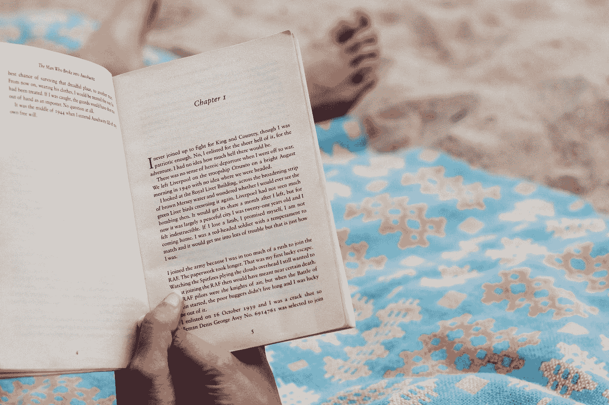

# 19 大夏日海滩读本(给不想关掉大脑的人)

> 原文：<https://medium.com/swlh/19-great-summer-beach-reads-for-people-who-dont-want-to-turn-their-brain-off-2c72279e7145>

Photo by [Rachel Lees](https://unsplash.com/@rachel_lees?utm_source=medium&utm_medium=referral) on [Unsplash](https://unsplash.com?utm_source=medium&utm_medium=referral)

你的大脑在夏天会关闭吗？

我的没有。你的没有。每个人都没有！

然而，我们中的许多人仍然认为夏日海滩读物应该是童话般的浪漫故事或者是由数字描绘的帕特森。