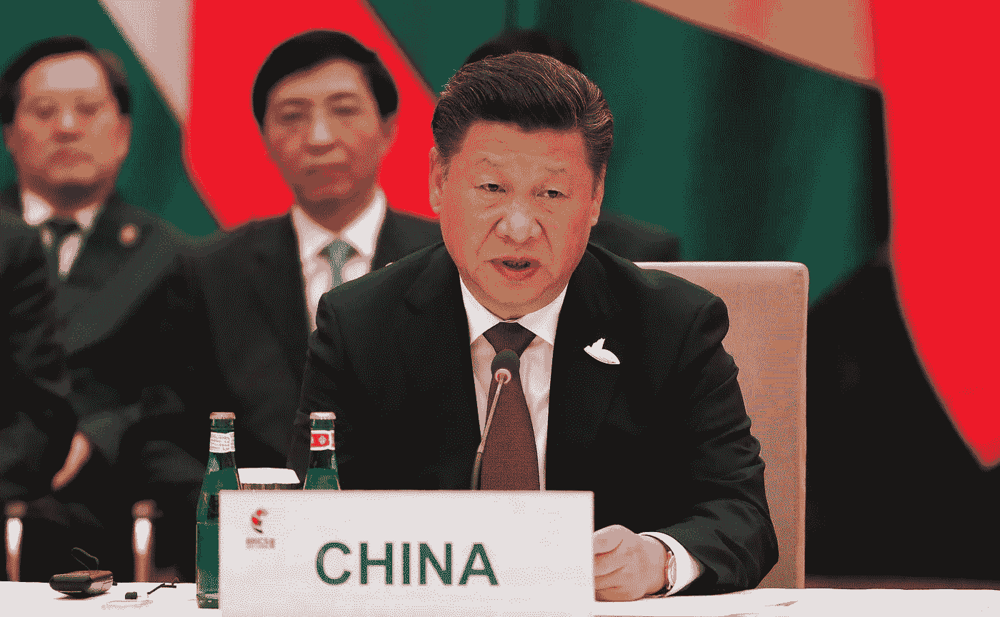

# 2018 年的 1984:中国特色的反乌托邦

> 原文：<https://medium.com/swlh/1984-in-2018-dystopia-with-chinese-characteristics-41f6c91302c0>

Abdusalam Muhemet 走在街上，安全摄像头跟踪他的脸，保安跟踪他的行动。他开车上路，每隔几公里，他的生物识别卡——包含他的眼睛颜色、指纹、声音特征和 DNA——就会在检查站被扫描。在那里，他手机上的数据被下载到一台政府电脑上，以检查是否有“极端分子”…