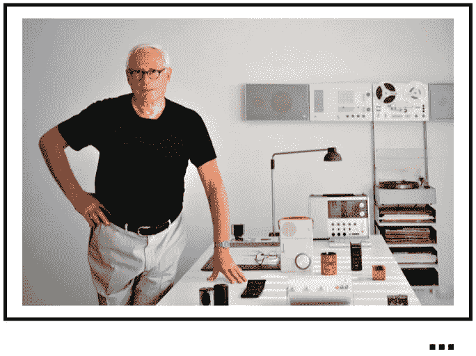
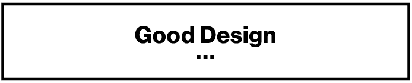
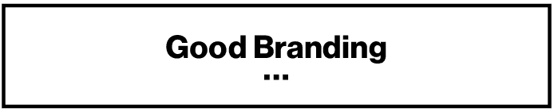

# 优秀品牌的 2 条不变法则

> 原文：<https://medium.com/swlh/2-immutable-laws-for-good-branding-2e1f433169e4>

从戴特·拉姆斯那里偷来的优秀设计的 10 条规则

今天，当我靠在 Aeron 的椅子上仰望天花板时，我的眼睛发现了一句我三年前写的老话。它被小心翼翼地放在我的白板墙顶部附近( [idea paint plug here](https://ideapaint.com) )。上面用亮蓝色写着:

> "质疑一切通常被认为是显而易见的事情."
> 
> —迪特·拉姆斯

这是我最喜欢的关于设计的名言之一。

这句话适用于各种学科和行业。

而且，这句话适用于生活的每一个角落。尤其是那些在意细节的人。

所以，我决定回头看看细节，回顾一下[戴特的优秀设计的 10 条规则](https://www.lifeofanarchitect.com/who-is-dieter-rams/)。我在职业生涯早期作为创意总监参考过的规则。

我不知道我在找什么。只是想重温一下。你知道的，看看有没有什么要被发现的或者我已经忘记的。你瞧，它就在纸上(好吧，不可否认，在谷歌上快速搜索后，它出现在一个网站上)。第二条和第四条规则让我印象深刻，就像字体上的[糟糕的字距调整](https://www.companyfolders.com/blog/13-tips-for-avoiding-a-font-kerning-disaster)。我发现了一些惊人的东西。

如果你用“人”来代替“产品”，你就拥有了一个有价值的标志性品牌的基础。憨厚；它就在我面前！

原始列表:

1.  …具有创新性
2.  … **让产品变得有用**
3.  …是审美的
4.  … **让产品易于理解**
5.  …不引人注目
6.  …是诚实的
7.  …经久耐用
8.  …深入到每一个细节
9.  …对环境友好
10.  …涉及尽可能少的设计

两条永恒不变的定律:

**# 1**……**使人有用:**

今天，我宣称这是优秀品牌的第一条不变法则。如果没有第一定律，再多的设计、精湛的信息传递、品牌战略或拙劣的模仿都无法掩盖人类在品牌塑造中扮演的重要角色。

第一法则是换位思考，理解每个员工和客户的独特视角。每个人都能在自己擅长的领域茁壮成长。让人们觉得自己有用是一种表达同理心的方式，这让他们觉得自己在塑造和发展品牌，进而发展业务方面发挥了积极作用。

人们需要觉得自己对一个品牌有用，才会去宣传它。这就是为什么，我把旗子插在地上——用这个在沙子上画一条线。你的品牌不是一个标志。从你的故事、人物、制度和行为中可以看出，这是文化的顶峰。

**# 2**……**让人看得懂:**

这向所有客户、员工、用户和利益相关者讲述了一个清晰的故事。一个简单、真实、清晰的故事是可以理解的，因此是非凡的！

> "被人注意并不等同于引人注目。"
> 
> ——塞思·戈丁

> 要想出类拔萃，你需要授权给你的员工。我相信这两条法律是一个好的开始。这两部法律共同作用，让人们觉得他们理解了核心价值观。

**最后，以下是我所看到的一切:**

如果你的员工感到被重视和有用，他们会有更大的能力去倾听和理解核心价值观。如果他们理解这些，他们最终会认同它们，并最终内化它们。

当人们将品牌内在化时，你就已经将他们转化为 Nicholas Ind 所说的“品牌公民”

Please clap up to 50x if you liked this article (click - click - click!)

## 这篇文章发表在 [The Startup](https://medium.com/swlh) 上，这是 Medium 最大的创业刊物，拥有+432，678 名读者。

## 在这里订阅接收[我们的头条新闻](https://growthsupply.com/the-startup-newsletter/)。

