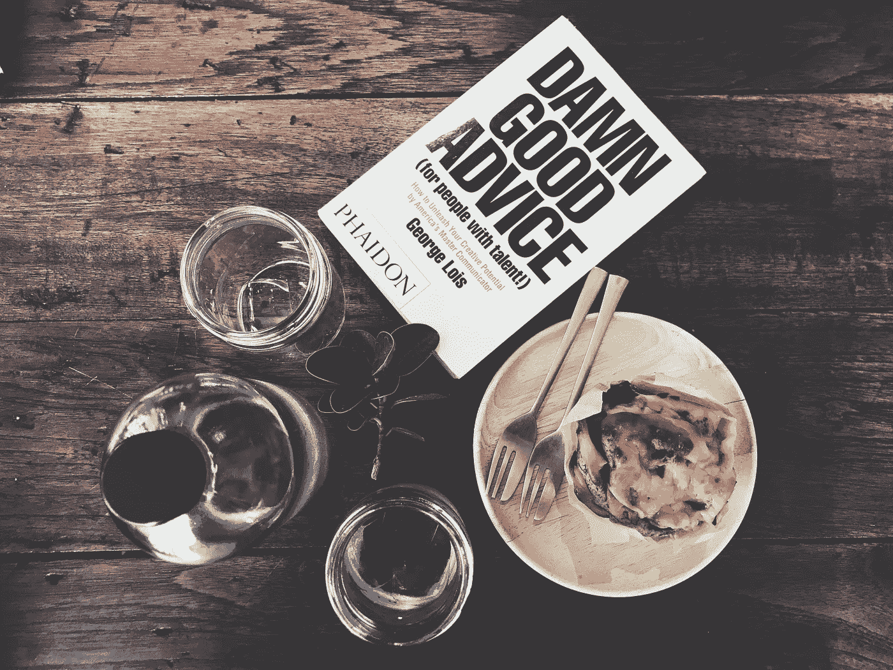

# 采纳我们自己的建议如此困难的两个原因

> 原文：<https://medium.com/swlh/2-reasons-why-its-so-hard-to-take-our-own-advice-c178f42fcd38>

最糟糕的事情是成为一个伪君子

Photo by [Frame Harirak](https://unsplash.com/photos/Ei_lQ6kTwiI?utm_source=unsplash&utm_medium=referral&utm_content=creditCopyText) on [Unsplash](https://unsplash.com/search/photos/advice?utm_source=unsplash&utm_medium=referral&utm_content=creditCopyText)

我非常支持人们追求自己的激情和梦想。没有什么比阅读关于人们如何坚持不懈地追逐梦想的故事更鼓舞人心的了，即使一切都与他们背道而驰。

但我必须承认，我很难遵循自己的建议，我讨厌做一个伪君子。这是最糟糕的…