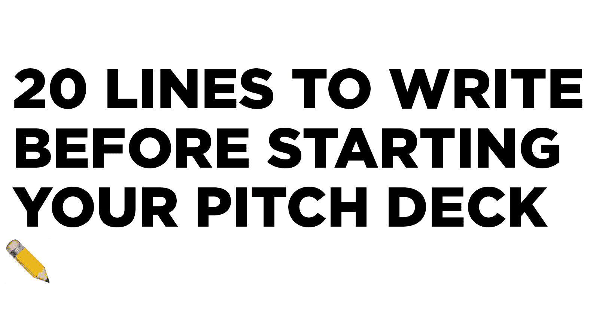

# 在开始推介之前要写 20 行

> 原文：<https://medium.com/swlh/20-lines-to-write-before-starting-your-pitch-deck-8dfb29208d78>

当准备向风投投资时，创始人通常会直接组装幻灯片。我认为这是一个错误。我建议你先写 20 个总结你创业的标题，然后再制作幻灯片。

原因如下:

很难消化大量的内容。记叙文更容易消化&简单记叙文比…