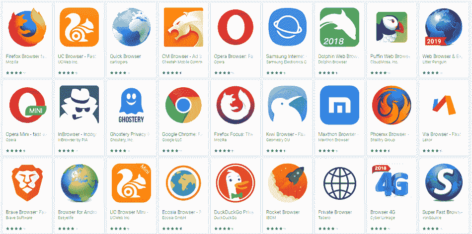
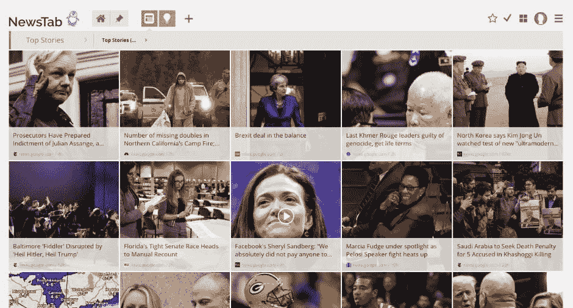

# 2019 年企业、中小企业和创业公司必备的 20 款 Chrome 扩展

> 原文：<https://medium.com/swlh/20-must-have-chrome-extensions-for-enterprises-smes-startups-in-2019-a4192dcb8083>

## 在这里，我记下了 20+个中小型企业和初创企业必须拥有的 chrome 扩展列表。做出你的选择！

不可否认，如今的企业需要一套合适的工具来完成工作。当你开始寻找合适的、最好的 chrome 扩展来添加到你的谷歌 Chrome 浏览器时，同样的规则也适用。

无论是关于具有分析功能的 chrome 扩展，还是可以成就或摧毁你的业务的工具，你所有的 chrome 扩展工具都必须能够在你工作的所有领域，即网站开发、市场营销、质量控制、数据分析、社会交流、运营管理等领域，给你带来良好的表现。

这就是为什么我在这里分享了 20 多个必不可少的 chrome 扩展来帮助企业实现他们的目标。不时会有新的最好的 chrome 扩展上市，这就是为什么它们值得与你分享。

这些 Chrome 的最佳扩展将有助于在浏览时加密你的所有数据，帮助你找到新客户，并帮助你就你的网络发展和商业战略做出明智的决定。

*所以，如果你是一家初创企业或中小企业，你需要雇佣网络开发服务来为你的公司设计开发 Chrome 扩展。但首先，我想给你一个* [*统计数据简介*](https://www.stetic.com/market-share/browser/) *关于为什么你应该在你的业务中使用谷歌浏览器。*

要用的浏览器太多了。这里列举几个——谷歌 Chrome、Mozilla Firefox、UC 浏览器、微软 Edge 和 Safari。

你可以在你的业务中使用它们中的任何一个，我将仔细看看谷歌浏览器的统计数据。在此之前，看看谷歌浏览器流行度和使用指数的重要数据。

全球市场统计数据显示，谷歌浏览器是商业社区中最受欢迎和使用最广泛的浏览器类型。

因此，在大约一半的使用差距下，你至少应该在你的业务中使用谷歌浏览器。

现在来说说 2019 年最好用的 chrome 扩展吧。最好的 chrome 扩展是提高浏览器性能和功能的工具。这就是我们来这里的目的。

在我开始列出 chrome 的最佳扩展之前，让我们以[***HTTPS Everywhere***](https://chrome.google.com/webstore/detail/https-everywhere/gcbommkclmclpchllfjekcdonpmejbdp?hl=en)*为例，这是一个流行且最好的 chrome 扩展工具，它通过在安装时将不安全的 HTTP 站点更改为加密的 HTTPS 来提高其安全性。*这是一个有用的 chrome 扩展工具，可以很容易地从[***Chrome 网上商店***](https://chrome.google.com/webstore/category/extensions)*找到并安装。联系业界最好的网络开发人员或租用开发人员来帮助解决设计&开发问题。*

**

## ***让我们从不同行业水平的企业必备的 20 个 chrome 扩展列表开始:***

> ***项目管理***
> 
> ***网页开发***
> 
> ***社交***
> 
> ***数据安全***
> 
> ***内容管理***

## *[Rapportive](https://chrome.google.com/webstore/detail/linkedin-sales-navigator/hihakjfhbmlmjdnnhegiciffjplmdhin?hl=en) Chrome 扩展获取完整的电子邮件信息*

**

*当你收到客户的电子邮件时，你通常只知道他们的名字和电子邮件。然而，一旦你安装了 Rapportive Chrome extension，你就可以直接从 LinkedIn 账户查看发件人和收件人的详细信息。Rapportive Chrome extension 是获取您想要联系的客户和顾客的详细信息的最佳选择。*

*给你的谷歌 chrome 添加 Rapportive 扩展，如果有任何问题，联系或雇佣业内最好的网络开发者来解决 Chrome 扩展工具的各种技术问题。*

**

*Rappotive Chrome Extension to Get the Complete Email Info Of Your Business Clients*

*该工具允许您直接在 Gmail 中搜索和查找公司联系人的 LinkedIn 数据。您还可以将这些联系人保存为电子邮件帐户中的多个潜在客户。*

## *[**缓冲**](https://chrome.google.com/webstore/detail/buffer/noojglkidnpfjbincgijbaiedldjfbhh?hl=en) **—必备 Chrome 扩展，在社交媒体上传播你的内容***

**

*在电子商务网站的几个很酷的 chrome 扩展中，Buffer 被证明是最好的 chrome 扩展之一。*

*Buffer 是 chrome 最好的扩展，可以帮助你在脸书、Twitter 和 LinkedIn 等社交媒体渠道上同时传播内容。只需几分钟就可以分享到你的社交媒体。*

**

*Buffer is the Best Chrome Extension tool to Spread Your Ideas & Content on Social Media*

*此外，你会惊讶地发现，将 Buffer chrome 扩展集成到你的电子商务网站、你的脸书账户和 Twitter 账户会变得多么容易。 [Buffer 易于安装](https://buffer.com/extensions)还能帮助您在多个社交媒体上分享图片和信息。*

*如果你想在谷歌浏览器中使用缓冲扩展工具，你可以从网络应用开发者或行业专家那里获得任何安装问题或错误的帮助。*

## *[**黑色菜单**](https://chrome.google.com/webstore/detail/black-menu-for-google/eignhdfgaldabilaaegmdfbajngjmoke?hl=de) **—电子商务零售商必备的 Chrome 扩展***

**

*如果你花大部分时间在网上寻找你的目标客户，客户位置，新的商业机会，等等。*

*黑色菜单 chrome 扩展帮助您在一个地方搜索所有想要的信息。对于电子商务行业的大多数企业主来说，这是最好的 chrome 扩展之一，他们希望有效地在网络上导航以获得他们需要的信息。*

*Black Menu Chrome Extension to Get All Of Google Services*

*黑色菜单，让您快速访问[谷歌的信息服务](https://en.wikipedia.org/wiki/Category:Google_services)，如谷歌搜索、谷歌翻译、谷歌+、谷歌地图、谷歌日历、谷歌保持、YouTube 等。*

## *[**click up**](https://chrome.google.com/webstore/detail/clickup-tasks-screenshots/pliibjocnfmkagafnbkfcimonlnlpghj?hl=en)**—B2B 营销人员必备的 Chrome 扩展***

**

*ClickUp 是 b2b 营销人员最好的 chrome 扩展。它确保您的所有业务项目都得到简化，以尽可能精确地完成每项任务。ClickUp chrome extension 为您提供了只需一次点击即可立即创建任务的新方法，并允许您通过双向日历同步、时间跟踪、时间视图和任务调度功能将网页截图附加到您的任务中。*

**

*Create Business Tasks With the ClickUp Chrome Extension*

*通过 ClickUp chrome 扩展，b2b 营销人员可以与他们最喜欢的[生产力工具](https://www.forbes.com/sites/pragyaagarwaleurope/2018/12/31/five-tools-for-maximum-productivity-in-2019/#2d829aa57769)进行本地连接。您可以开始在您的项目管理工作中使用这个工具，使您的工作更容易，更有效率，并节省您的时间。*

## *[**Todoist**](https://play.google.com/store/apps/details?id=com.todoist&hl=en_US) **—项目管理必备的 Chrome 扩展***

**

*Todoist 是项目管理最好的 chrome 扩展。它可以让你跟踪与你的项目相关的一切。你可以使用 Todoist 来组织和管理你的任务，访问 60 多个最受欢迎的应用集成，如[亚马逊 Alexa](https://play.google.com/store/apps/details?id=com.amazon.dee.app&hl=en_US) 、 [Dropbox](https://www.dropbox.com/?landing=dbv2) 、 [Zapier](https://zapier.com/) 、 [IFTTT](https://ifttt.com/) 、 [Slack](https://slack.com/) ，你可以从 Todoist 中获得更多。*

*Todoist Chrome Extension to Better Manage Your Business Projects*

*从简单的业务任务到多阶段项目，Todoist 通过实时同步为您提供清晰的概览。*

## *[**J2 team Security**](https://chrome.google.com/webstore/detail/j2team-security/hmlcjjclebjnfohgmgikjfnbmfkigocc?hl=en)**—必备 Chrome 扩展用于病毒防护***

**

*J2Team Security 是银行和金融机构的最佳 chrome 扩展。它通过实时安全功能保护您客户的数据免受网络钓鱼和恶意软件的攻击。这也是最好的 chrome 扩展之一，为您提供基本的病毒保护，还允许您在您的网站上使用“ [HTTPS](https://support.google.com/webmasters/answer/6073543?hl=en) ”启用的安全标签和阻止列表定制，这有助于防止您的网站受到垃圾邮件发送者的攻击。*

*这也是最好的 chrome 扩展，它为脸书隐私设置提供了各种额外的功能，例如——阻止评论的输入指示器，阻止脸书聊天的可见功能，隐藏你在脸书上的活跃时间，以及测试你在脸书上的安全设置。*

*希望将类似于 J2Team Security 的扩展添加到您的业务站点中吗？别担心，联系软件公司来帮助你的公司创建智能 chrome 扩展工具。*

## *[**FlowCrypt**](https://chrome.google.com/webstore/detail/flowcrypt-encrypt-gmail-w/bnjglocicdkmhmoohhfkfkbbkejdhdgc?hl=en)**—最好的隐私 Chrome 扩展工具之一***

**

*FlowCrypt Chrome Extension to Protect Your Business Emails*

*这个 chrome 扩展专门用于保护你的电子邮件，允许你发送和接收加密的电子邮件给你的客户。毫无疑问，它是最好的 chrome 扩展，只需点击几下鼠标，就能保护你的机密邮件的安全和隐私。FlowCrypt 致力于一个非常简单的电子邮件安全解决方案——PGP，代表着非常好的隐私。*

**

*这是最好的 chrome 扩展之一，适用于需要为大多数客户提供标准电子邮件加密的银行。该工具还通过为您的电子邮件添加“安全撰写”选项，与 Gmail 帐户完美集成。*

## *[**Evernote Web Clipper**](https://chrome.google.com/webstore/detail/evernote-web-clipper/pioclpoplcdbaefihamjohnefbikjilc?hl=en)**—医疗保健公司必备的 Chrome 扩展***

**

*如今，医疗保健公司面临着大量难以应对的繁重工作。然而，通过 Evernote chrome extension 这样的技术，你可以将数据链接保存到剪贴板上，供以后阅读和参考。*

*Evernote Chrome Extension to Bookmark and Clip Your Web Pages*

*Evernote Web Clipper Chrome 扩展对您的医疗保健业务大有裨益。它允许你使用 Evernote 帐户将书签添加到你的网站，以便你以后可以使用它们。简而言之，您可以将与重要医疗数据和信息相关的网页加入书签并进行剪辑。而且，您可以在任何设备上轻松访问这些页面。*

## *[**PaperPile 扩展**](https://chrome.google.com/webstore/detail/paperpile/pejaghaheejpgjbagbmpbmfhndlhofoh) **—下载文章必备的 Chrome 扩展***

**

*PaperPile Chrome Extension to Collect and Download Articles*

*Paperpile 是医疗保健专业人员的另一个最佳 chrome 扩展，它集成了 Google Chrome，并帮助您收集文章参考。此外，你可以下载 PDF 版本的文章，并以一种简单的方式将该文件同步到你的 Google Drive。*

**

*该工具还有助于整合主要的医疗保健和研究网站，如 [PubMed](https://www.ncbi.nlm.nih.gov/pubmed/) 、 [ArXiv](https://arxiv.org/) 和[谷歌学术](https://scholar.google.ae/)。*

## *[**BuzzSumo**](https://chrome.google.com/webstore/detail/buzzsumo/gedpbnanjmblcmlfhgfficjnglidndfo?hl=en)**—博客作者最好的 Chrome 扩展之一***

**

*BuzzSumo Chrome Extension To Enhance Your Professional Blogging Experience*

*如果你是一个专业的博客作者，并且正在寻找最好的 chrome 扩展来管理你的内容写作和博客工作，那么 BuzzSumo 是你最好的选择。它让你对你的博客的表现有一个全面的了解，你可以通过点击你的博客网页上的扩展来查看指标，如反向链接的数量，社交分享等。*

**

*BuzzSumo 也是一个很好的工具，可以对你的竞争对手的网站进行分析，帮助你改变策略，让你的内容更具共享性。*

## *[**语法上**](https://chrome.google.com/webstore/detail/grammarly-for-chrome/kbfnbcaeplbcioakkpcpgfkobkghlhen?hl=en) **—编辑、作家必备的 Chrome 扩展***

**

*Grammarly 是最好的，必须有博客的 chrome 扩展，帮助检查你的博客文章的正确语法、拼写错误和用词。*

**

*Grammarly Chrome Extension To Improve Your Grammar and Content Work*

*您可以通过将大块文本粘贴到 Grammarly 应用程序中来使用该工具，以便全面检查语法、拼写和句子结构错误。*

**

*Grammarly 对于那些希望确保他们的消息、word 文档、电子邮件和社交媒体帖子没有任何类型的语法或拼写错误的博客来说是一个完美的选择。该工具还可以添加到您的 Gmail 帐户、脸书个人资料、Tumblr、Linkedin 和 Twitter 帐户中。*

## *[**Momentum**](https://chrome.google.com/webstore/detail/momentum/laookkfknpbbblfpciffpaejjkokdgca?hl=en) **—媒体公司必备的 Chrome 扩展***

**

*对于媒体和娱乐公司来说，Momentum 是一个受欢迎和最好的 chrome 扩展，因为他们需要在所有工作中发挥创造力，无论是仪表板还是任何其他活动。这就是为什么 Momentum 是使用个性化仪表板定制您的新选项卡页面的正确选择，它可以提高您的工作效率。*

*Momentum Chrome Extension To Add Creativity To Your Work*

*这个 chrome 扩展工具将为您提供每日照片，允许您设置令人惊叹的图像、鼓舞人心的引言，并跟踪您当天的焦点。使用这个 chrome 扩展来添加你最喜欢的网站的照片和链接，以便于访问。*

**

*您还可以自定义字体颜色和主题，添加您自己的引用、背景照片，并添加更多的小部件，如注释、倒计时器和指标。天气也显示在动量窗口的右上角。*

## *[**Stay Focused**](https://chrome.google.com/webstore/detail/stayfocusd/laankejkbhbdhmipfmgcngdelahlfoji?hl=en)**—最好的 Chrome 扩展工具，让你专注于工作***

**

*StayFocused 是一个生产力 chrome 扩展，帮助你专注于你的工作。因此，如果你来自媒体和娱乐行业，那么你会很高兴知道 StayFocusd 通过限制你花在浪费时间的网站上的时间来帮助你更有效率。这是最好的 chrome 扩展工具，它将帮助你在一天的剩余时间里阻止那些你不想看到的烦人的网站，并且非常灵活地满足你的需求。*

*如果你愿意，你可以阻止特定的子域，网页，网站，甚至特定的网页内容。因此，通过访问谷歌 Chrome 网络商店，将 StayFocusd 免费添加到您的网站上。*

## ***必备 Chrome 扩展用于** [**Office 编辑文档、表格&幻灯片**](https://chrome.google.com/webstore/detail/office-editing-for-docs-s/gbkeegbaiigmenfmjfclcdgdpimamgkj?hl=en)*

**

*Office Editing chrome extension 适用于那些希望一起协作处理实时文档的人。这是最好的 chrome 扩展之一，可以让您轻松查看和编辑 MS Word、Excel 和 PowerPoint 文档，而无需在系统上安装 MS-Office。*

*Office Editing Chrome Extension To Edit and View MS-Word, Excel & PowerPoint Documents*

*Office 编辑 chrome 扩展支持格式包括-。doc，。xlsx，。pptx，。你可以使用这个最好的 chrome 扩展工具，将它安装到你的 Chrome 上，在你的 Gmail 中打开，查看和编辑你的电子邮件帐户中的文档、表格和幻灯片。*

## *[**快速编写文本编辑器**](https://chrome.google.com/webstore/detail/quick-write-text-editor/ngmbmhchieecdhfkpafcmnjonmckhdpj?hl=en) **—内容工作必备的 Chrome 扩展***

**

*QuickWrite Chrome Extension For Distraction-Free Online Writing*

*使用 Quick Write Text Editor 自由书写，这是最好的 chrome 扩展之一，可以获得不受干扰的在线写作体验。这个 chrome 扩展有一个中性的文本编辑器，当你在线工作需要休息时，它会自动保存你的内容。*

*所以，当你准备写下一篇文章的时候，试着用 Quick Write Text Editor 来管理内容，让工作变得更简单。*

## *[**awesome 截图**](https://chrome.google.com/webstore/detail/awesome-screenshot-screen/nlipoenfbbikpbjkfpfillcgkoblgpmj?hl=en) **—必备 Chrome 扩展管理你的照片编辑工作***

**

*Awesome ScreenShot Chrome Extension With Photo Editing Capabilities*

*AwesomeScreenshot 是一个屏幕捕获 chrome 扩展，具有在浏览器中进行注释和照片编辑的功能。一旦您对屏幕的选定区域或整个网页进行了屏幕截图，您就可以裁剪、突出显示、绘制形状和模糊敏感信息。*

## *[**谷歌词典**](https://chrome.google.com/webstore/detail/google-dictionary-by-goog/mgijmajocgfcbeboacabfgobmjgjcoja?hl=en) **—必备 Chrome 扩展查找词义***

*Google Dictionary Chrome Extension for Bloggers*

*Google Dictionary 是另一个最好的 chrome 扩展，尤其是对博客、企业和学生来说。*

*这是因为当你在网上冲浪时，遇到一个你不熟悉的单词，谷歌词典会迅速突出显示这个单词，并为你找到这个单词的正确定义。要安装谷歌字典扩展，请确保您的 chrome 浏览器必须高于 4.0 版本。强烈建议在你的博客活动中使用这个 chrome 扩展来获得想要的结果。*

## *[**HubSpot Collect**](https://www.hubspot.com/products/marketing/blog/collect)**—必备的 Chrome 扩展来剪辑内容创意***

**

*HubSpot Collect 是做内容研究的最好的 chrome 扩展，从网络上收集内容想法。chrome 扩展允许你从网络上截取内容，并将谷歌文档直接导入 HubSpot。*

**

*因此，如果你正在为你的商业项目进行任何研究，或者只是在网上搜索不同的文章，HubSpot Collect chrome extension 可以在你写博客、文章或网页时为你提供方便的参考。*

## *[**Ghostery**](https://chrome.google.com/webstore/detail/ghostery-%E2%80%93-privacy-ad-blo/mlomiejdfkolichcflejclcbmpeaniij?hl=en)**—最好的阻止广告的 Chrome 扩展之一***

**

*Ghostery 是一个强大的广告拦截工具。它也是最好的 chrome 扩展之一，可以在浏览和搜索特定内容时删除分散或打断网站访问者的广告。*

**

*Ghostery 为您提供多种显示方式，并伪装您的浏览数据，这样就没有人能够收集您希望保密的个人信息。该工具还提供了智能阻止功能，以加快网页的加载时间，从而改善您在网上的整体浏览体验。*

## *[**Twitter 列表生成器**](https://chrome.google.com/webstore/detail/list-builder-for-twitter/angdkjndobobaegbnhjaooedegkbibae?hl=en-US)**——你的 Twitter 账户的最佳 Chrome 扩展***

**

*如果你出于商业目的使用 Twitter，或者需要关注你的 Twitter 账户上的一些重要标签，那么你还需要列出一个用户列表，这些用户在 Twitter 上谈论与你的业务相关或者你感兴趣的话题。手动操作有时会很耗时。*

*然而，使用 Twitter 的 List Builder，你可以很容易地找到与你的业务相关的标签或趋势主题，你也可以将它们添加到你的列表中。*

> *谷歌浏览器的 5 个扩展列表*

## *****——新闻阅读器必备的 Chrome 扩展*****

******

***NewsTab a Must-Have Chrome Extension for News Readers***

***你是记者吗？或者说，你是学生吗？或者，寻找一个 chrome 扩展来获取每日新闻更新？如果是这样，那么 NewsTab 是一个受欢迎的新闻阅读器网站，它也有 chrome 扩展，名为“New Tab”。在[新闻标签](https://www.newstab.com/#page-allyournews)网站上找到这个扩展，你就可以获得你所在地区 130 种语言的新闻。***

***新闻选项卡是您阅读和分享您喜欢阅读的体育、科技、娱乐、美容、每日头条等新闻的地方。这是一个漂亮的新闻阅读器，所有新标签都以漂亮的图像打开。***

***创建您自己的新闻主题或新闻来源和许多其他事情都有可能与 NewsTab 扩展。例如，只需点击一下鼠标，你就可以下载所有的新闻文章，下载文章供离线阅读，关注 Twitter/RSS 上的社交订阅源，并将新闻组织成章节。***

***我必须说“新标签”对于那些想在谷歌浏览器上添加新闻阅读器的人来说是最好的扩展。租一个程序员为你工作，分享新的想法来构建你的下一个 chrome 扩展。***

## ***[**保存到脸书**](https://chrome.google.com/webstore/detail/save-to-facebook/jmfikkaogpplgnfjmbjdpalkhclendgd?hl=en) **—社交媒体爱好者必备的 Chrome 扩展*****

******

***Save to Facebook a Must-Have Chrome Extension for Social Media***

***保存到脸书浏览器扩展只是让你的东西组织成你喜欢的样子。我说的东西是什么意思？它指的是一个关于脸书的视频，或者互联网上关于脸书的文章。***

***保存到脸书 chrome 扩展允许你在一个地方保存所有你喜欢的新闻，有趣的视频，商业视频，以及所有你在网上看到的有趣的东西，这样你以后就可以找到它们并观看它们。***

***“保存到脸书”是一个完整的 chrome 扩展包，允许你快速访问你在脸书上的东西，并将你的项目保存在一个单独的列表中。因此，下次当你在办公室或外出开会时，只需使用“保存到脸书”来保存你想在脸书或互联网上看到的所有有趣的东西。***

## ***[**蜜糖**](https://chrome.google.com/webstore/detail/honey/bmnlcjabgnpnenekpadlanbbkooimhnj?hl=en) **—在线买家必备的 Chrome 扩展*****

******

***A Must-Have Chrome Extension for Online Buyers***

***蜂蜜铬延伸是一个最好的所有在线买家那里。是的，现在你可以在网上自由购物，并在网上购物时应用优惠券代码。不再需要搜索折扣优惠券代码。只需在你的谷歌浏览器上安装 Honey，它就会自动将优惠券代码应用到你的购物车上。***

***您可以在从服装到食品店的数千家商店使用代码，还可以在亚马逊、PizzaHut、梅西百货、耐克等网站上在线购买更多产品。***

***只需点击一下，即可免费安装 Honey chrome 扩展。还可以在购物车中获得最佳购买时间、购物提醒、销售提醒等历史图表。***

## ***[**user snap Classic**](https://chrome.google.com/webstore/detail/usersnap-classic-collect/khehmhbaabkepkojebhcpjifcmojdmgd?hl=en)**—开发者必备的 Chrome 扩展*****

******

***A Must-Have Chrome Extension for Developers***

***使用 Usersnap chrome extension 可以轻松快速地跟踪浏览器中的错误并查找网站错误。您可以使用 Usersnap 控制台记录器跟踪和记录客户端 JavaScript 错误。***

***这是一个屡获殊荣的 chrome 扩展，受到软件行业许多大公司的喜爱，如脸书、谷歌和微软。***

***在你的网络浏览器中标注所有重要的页面，截取屏幕截图并将所有页面发送给 Usersnap，以便从你的客户那里获得错误报告和反馈报告。Usersnap 附带了 [20 多个用于 bug 跟踪和项目管理的工具](https://usersnap.com/integrations)，包括 Trello、Asana、Redmine、Trac、Gemini 等等。***

## ***[**surf easy VPN**](https://www.surfeasy.com/vpn-browser-extension-chrome/)**—必须有 Chrome 扩展来保护你的在线隐私*****

******

***A Must-Have Chrome Extension To Improve Your Online Privacy***

***您必须使用 SurfEasy VPN chrome 扩展来保护您的在线隐私。这很重要，因为您的系统保存了大量数据以及您的个人详细信息、浏览历史记录和更多详细信息。***

***通过在你的 chrome 浏览器中添加 SurfEasy 扩展，你可以加密所有进出你系统的流量，保护你的在线隐私。而且，您可以不受限制地安全冲浪。***

***SurfEasy VPN chrome extension 支持包括 Android、iOS 和 Mac 在内的所有操作系统类型，让您不受任何限制地享受网上冲浪。***

## *****结论*****

***希望到现在为止，你已经决定了至少一个必备的 chrome 扩展来满足你特定行业或 web 应用程序开发的需求。***

***上面列出的选项是 20 个必不可少的 chrome 扩展，让你在网络上轻松工作，让你以更好的方式工作。***

***因此，无论你是在努力完成你的任务，搜索或者仅仅是想给你的客户发送加密的信息，都有大量的选项来选择最好的 chrome 扩展工具。你所要做的就是找到一个适合你的企业或行业，并帮助你取得成功，因为，有了一套正确的工具，你可以在你的工作和业务领域创造一个更好的世界。***

***对我列出的最好的 chrome 扩展工具有任何疑问或问题吗？欢迎在下面的评论区发表你的观点。***

******

## ***这篇文章发表在[《创业](https://medium.com/swlh)》上，这是 Medium 最大的创业刊物，有+443，678 人关注。***

## ***订阅接收[我们的头条新闻](https://growthsupply.com/the-startup-newsletter/)。***

******