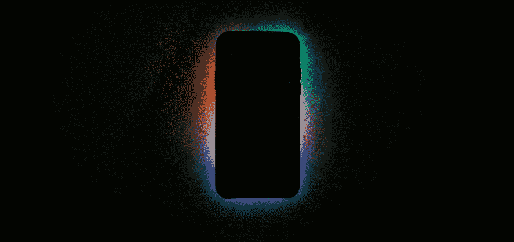

# 利用科技保持注意力的 20 个简单习惯

> 原文：<https://medium.com/swlh/20-simple-habits-to-preserve-your-attention-using-technology-95aac8481973>

## 如何使用技术，使它不劫持你的时间和注意力

Photo: [Unsplash](http://unsplash.com)

技术正在劫持我们的时间和注意力，越来越多的证据表明它会导致精神健康问题，如抑郁、焦虑和社会孤立。