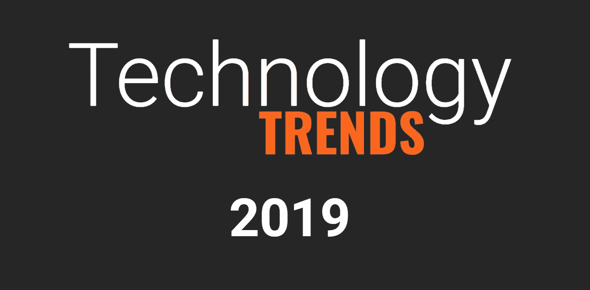

# 2019 年最大的科技趋势:大型科技、创业公司、社交媒体和游戏领域正在发生什么

> 原文：<https://medium.com/swlh/2018-19-tech-trends-860ac59781a>

每年，我都会收集去年最大的科技趋势和事件。最初，这是对我在里德工作过的团队的一种敬意，感谢他们一年来的辛勤工作。现在，它正趋向于一种痴迷。一部分[玛丽·米克尔](https://techcrunch.com/2018/05/30/internet-trends-2018)，一部分[黑镜](https://en.wikipedia.org/wiki/Black_Mirror)和一小撮[粗管](https://www.channel4.com/programmes/rude-tube)，这个总结就不赘述了…