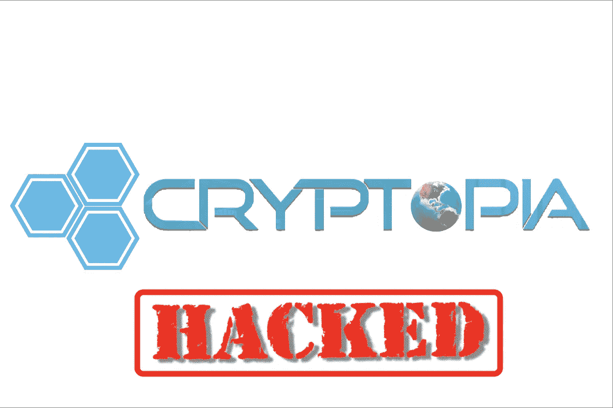
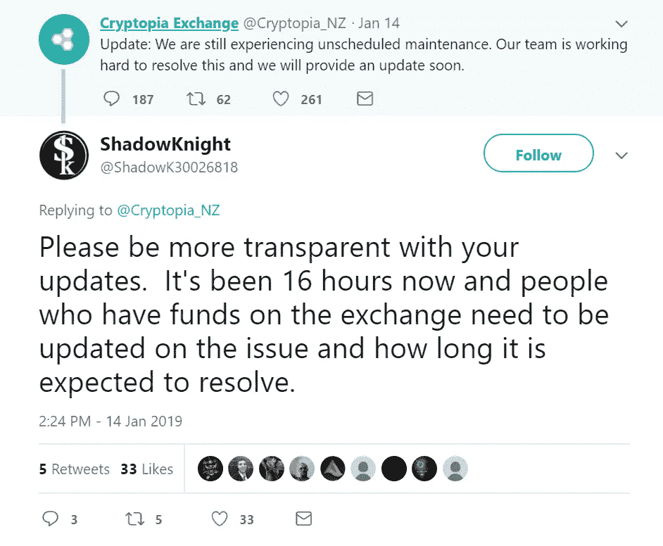
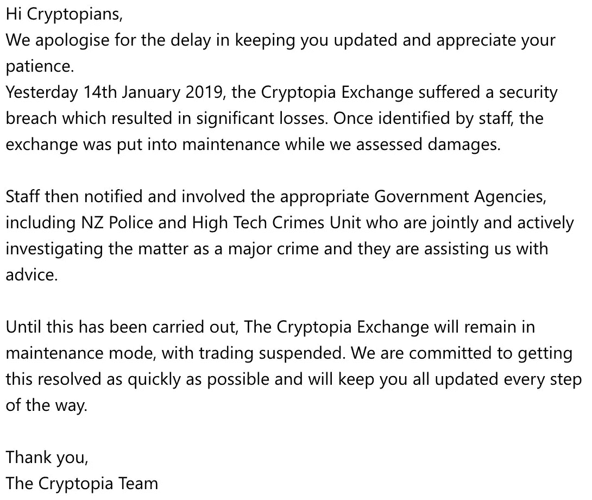

# 2019 年第一起密码抢劫案:Cryptopia 承认被黑。

> 原文：<https://medium.com/swlh/2019s-first-crypto-robbery-cryptopia-admits-being-hacked-1753c9ce63e0>

Cryptopia 是一个在线货币交易平台，它是由两位朋友亚当·克拉克和罗伯·道森在 2015 年作为爱好而创立的。

当比特币开始获得巨大的名声和成功时，神秘岛业务也开始了。2017 年初期间，Cryptopia 只有 3 万用户；这一数字在 2017 年 12 月升至 100 万。此外，在 2018 年 1 月的第一周之后，用户数量达到了 140 万。

就在去年，总部位于日本的 Coincheck exchange 目睹了价值约 530 美元的数字货币被盗，这不仅是数字货币历史上最大的加密盗窃案，这个数字如此重要，也是人类历史上最大的盗窃案。而类似这样的事件，这次又发生在隐域交换。

1 月 14 日，Cryptopia 在他们的社交媒体账户上发推文称，该交易所正在进行“计划外维护”。这将持续 12 个小时，交易所拼命向客户保证他们的团队正在努力解决问题。然而，客户抱怨交易所没有提供足够的信息。

Cryptopia 随后在推特上发布了一份官方声明，证实该交易所于 1 月 15 日遭到黑客攻击。Cryptopia 的 exchange 团队能够通过临时将平台离线来阻止攻击。然而，攻击者仍然设法造成了大量的破坏。

在处理攻击事件后，该小组立即通知了相关政府机构，如新西兰警方和高科技犯罪股，他们现在正在领导调查。

这次攻击已经被列为重大犯罪，这是交易所在接到进一步通知之前保持离线的原因。此外，该交易所承诺尽快解决这一问题，允许用户继续日常交易。

被盗金额目前尚不为公众所知，而且有可能交易所本身仍无法确定被盗的确切金额。然而，大量的 19，391 ETH(约 250 万美元)从 Cryptopia 交易所转移到一个未知的钱包，这可以作为关于被盗金额的指示。

*如果你想了解更多，请访问 BIDITEX 页面并提出你的问题，关注我们的* [*推特*](https://twitter.com/biditex_com) *，* [*脸书*](https://www.facebook.com/biditex/) *，* [*中型*](/@biditex) *，* [*电报*](https://t.me/biditex%20%28edited%29) *，*[*LinkedIn*](https://www.linkedin.com/company/biditex)*。投标变更用* [*投标变更用*](/@biditex/biditex.com) *。*

## 这篇文章发表在 [The Startup](https://medium.com/swlh) 上，这是 Medium 最大的创业刊物，拥有+412，714 名读者。

## 在这里订阅接收[我们的头条新闻](http://growthsupply.com/the-startup-newsletter/)。

