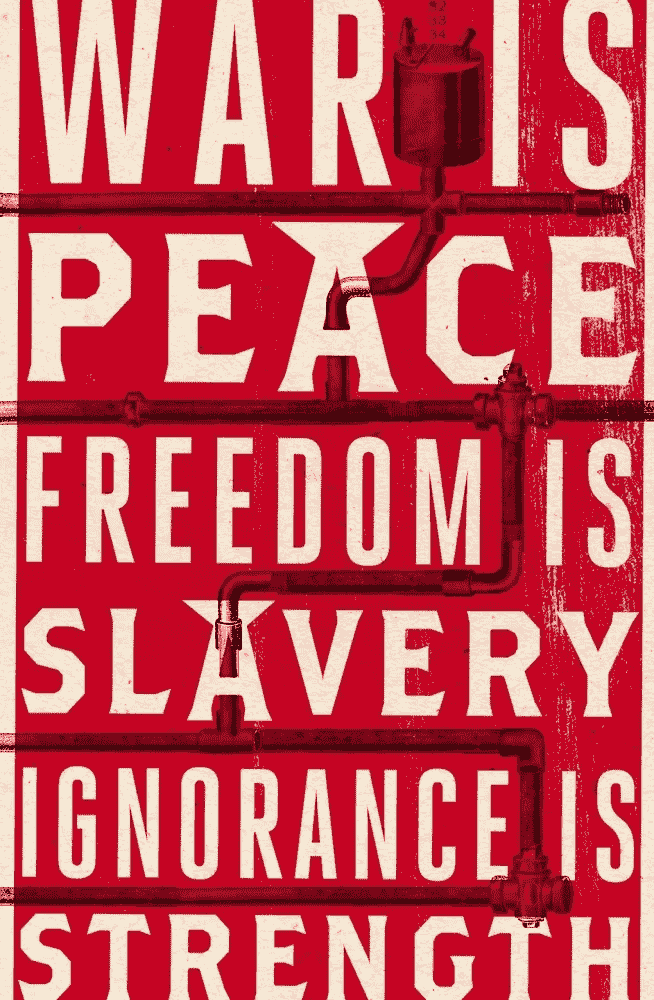

# 2024 年是新的 1984 年

> 原文：<https://medium.com/swlh/2024-is-mr-orwells-1984-60867cb67712>

我们现在都是温斯顿·史密斯了。

你不需要天气预报员来知道风向，你也不需要偏执地认识到，新技术已经使工业化世界的公民每天都被观察、测量、评级、判断和分析，甚至连乔治·奥威尔 1949 年有先见之明的小说《1984》中不幸的工蜂温斯顿·史密斯都可能觉得侵扰。