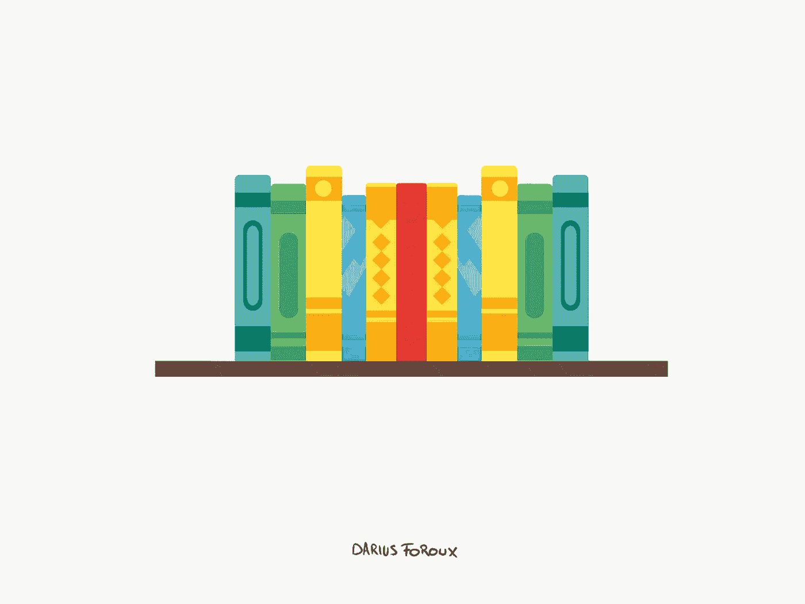

# 改变我生活的 22 本书

> 原文：<https://medium.com/swlh/22-books-that-changed-my-life-22bcdfc10886>

在过去的几年里，我养成了向每个人征求书籍推荐的习惯。这是真正改变我生活的习惯之一。

阅读是我最喜欢的开发思维的方式，因为这是学习东西最有效的方式。但并不是每本书都会改变你的思维方式。弗朗西斯·培根说得好:

> “有些书应该浅尝辄止，有些书应该狼吞虎咽，但是……