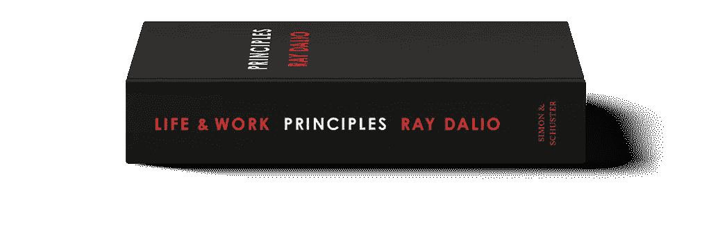

# 24 节选自《原则》一书的企业家要点

> 原文：<https://medium.com/swlh/22-excerpts-and-takeaways-for-entrepreneurs-from-principles-book-bac9e1be53c9>

这本[原则书](https://www.amazon.com/Principles-Life-Work-Ray-Dalio-ebook/dp/B071RBPKGR)在我的虚拟书架上放了一段时间，我终于读完了它。我想分享一些对我有帮助的笔记，也许对你也有帮助。

这本书为我提供了许多宝贵的指导和见解，我强烈推荐给每一位企业家和领导者。

在本书中，世界上最成功的投资者和企业家之一雷伊·达里奥分享了他在过去四十年中发展、完善和使用的非传统原则，这些原则在生活和商业中创造了独特的结果，任何人或组织都可以采用这些原则来帮助实现他们的目标。

在阅读这本书的过程中，我从所有章节中提取了一些要点，我会定期重读。我现在把这些给你，并强烈推荐你[得到这本书](https://www.amazon.com/Principles-Life-Work-Ray-Dalio-ebook/dp/B071RBPKGR)。但是如果你只有 10 分钟，读读这个吧。

> 十年来，我在犯了很多错误并花了很多时间反思它们的过程中学会了我的原则。我是一个好奇的思考者，追求大胆的目标。在追求这些目标的过程中，我经历了一些失败，从中我学到了防止我再犯同样错误的原则。作为一个独立思考者，我倾向于冒高风险来寻求高回报。比起失败，我更害怕无聊和平庸。—雷伊·达里奥

1.  **痛苦+反思=进步。不要让痛苦成为前进的绊脚石——痛苦是无法避免的，尤其是当你追求远大目标的时候。信不信由你，如果你正确地对待它，你很幸运能感受到那种痛苦，因为这是一个信号，你需要找到解决办法，这样你才能进步。大多数人在痛苦的时候很难思考。痛苦过去后，他们会关注其他事情，所以他们错过了提供教训的反思。如果你在痛苦中反思得很好，那很好。但如果你能记得在它过去后反思，那也是有价值的。**
2.  掌控你的结果。不要把糟糕的结果归咎于任何人，除了你自己——无论生活带给你什么样的环境，如果你为自己的决定负责，而不是抱怨超出你控制的事情，你将更有可能成功并找到幸福。
3.  彻底开放思想——做好决策的两个最大障碍是你的自我和你的盲点。总之，它们使你很难客观地看到你和你的环境的真实情况，也很难通过充分利用他人来做出最好的决定。
4.  了解你的自我障碍— 你的自我渴望表扬，对批评的反应是攻击。即使大脑的高级部分明白建设性的批评对你有好处，它们也会让你产生防御心理。
5.  **了解你的盲点障碍—** 你的盲点妨碍你准确地观察事物。正如我们所有人对音高和颜色的听觉范围不同，我们对事物的视觉和理解范围也不同。我们以自己的方式看待事物。有些人很自然地看到了大局而忽略了小细节，而有些人很自然地看到了细节而忽略了大局。
6.  **练习彻底的开放思维——**如果你能认识到自己有盲点，并开放思维地考虑别人可能比你看到更好的东西的可能性——以及他们试图指出的威胁和机会确实存在——你就更有可能做出好的决定。真诚地相信你可能不知道最好的路径，并认识到你处理好“不知道”的能力比你知道什么更重要。
7.  欣赏深思熟虑的分歧的艺术——当两个人相信相反的事情时，很可能其中一个是错的。在深思熟虑的分歧中，目标不是让对方相信你是对的，而是找出哪个观点是正确的，并决定如何应对。要做好这一点，就要用一种你只是想理解的方式来进行对话。使用问题而不是陈述。保持冷静、合作和尊重。记住，你不是在争论；你在公开探索真相。
8.  **透过他人的眼睛看世界，一起做出更好的决定—** 与其认为自己是对的，不如想想你如何知道自己是对的。认识到要获得从另一个角度看事物的视角，你必须暂停判断一段时间，只有通过换位思考，你才能正确地评估另一个观点。记住，你在寻找最佳答案，而不仅仅是你自己能想到的最佳答案。
9.  **组织是由两大部分组成的机器:文化和人—** 一个伟大的组织既有伟大的人，也有伟大的文化。伟大的人既有伟大的品格，又有伟大的能力。就性格而言，这意味着他们思想非常开放、透明，并深深地致力于组织的使命。伟大的文化将问题和分歧带到表面并很好地解决它们，他们喜欢想象和建造以前没有建造过的伟大事物。
10.  在精英制度的基础上建立一家公司，而不是创始人领导其他人跟随的专制制度，也不是每个人的投票都平等的民主制度。将公司建立在精英管理的理念之上，这种理念鼓励深思熟虑的不同意见，并根据人们的优点来衡量他们的意见。精英管理的理念要求人们做两件事:1)把他们诚实的想法放在桌子上让每个人都看到，2)有深思熟虑的分歧，有质量的来回，人们在其中发展他们的思维，以提出最佳的集体答案。
11.  要做得特别好，你必须突破自己的极限，如果你突破了极限，你就会崩溃，而且会很痛。当这种情况发生时，你能做的最重要的事情就是收集这些失败提供的教训，并获得谦逊和激进的开放思想，以增加你未来成功的机会。
12.  如果你努力工作并富有创造性，你可以得到你想要的任何东西，但不是你想要的一切。
13.  必须在领导者所处的环境中对他们进行评判。
14.  投资绝非易事。要想成为一名有效的投资者或成功的企业家，你必须与共识背道而驰，并保持正确。
15.  *梦想+现实+决心=成功的人生*
16.  当你有两个选择时(比如享受生活或产生影响)，问题不仅仅是每一个都要追求多少，而是要多努力才能两者都尽可能多。
17.  不要纠结于你对事物“应该”是什么样子的看法，因为你会错过了解它们真实样子的机会。重要的是不要让我们的偏见阻碍我们的客观性。为了得到好的结果，我们需要分析而不是情绪化。
18.  大多数人把对他们有害或对他们感同身受的人有害的事情称为坏，而忽略了更大的好处。通常情况下，人们相互冲突的信仰或相互冲突的利益使他们无法通过另一个人的眼睛看问题。
19.  我们没有人生来就知道什么是真的；我们要么发现对自己来说什么是真实的，要么相信并追随他人。彻底的开放思想和彻底的透明对于快速学习和有效改变是无价的。
20.  认识到决策是一个分两步走的过程。首先，收集所有相关信息，然后做出决定。
21.  不要担心长得好看；担心实现你的目标。
22.  要清楚你是在争论还是在寻求理解，并根据你和他人的可信度考虑哪一个是最合适的。
23.  与那些愿意持不同意见的可信的人一起三角分析你的观点。找到与你意见相左的最可信的人，并试着理解他们的推理。不只是有经验的人。没有经验的人也能有伟大的想法，有时比有经验的人好得多。那是因为有经验的思考者会陷入他们的老方法中。
24.  为最坏的情况做打算，让它变得尽可能好。

请在下面的评论中分享你的想法、想法或问题，如果你喜欢《外卖》这本书，我很乐意分享一些👏来帮助其他人找到它。

## 这篇文章发表在 [The Startup](https://medium.com/swlh) 上，这是 Medium 最大的创业刊物，有+411，714 人关注。

## 订阅接收[我们的头条](http://growthsupply.com/the-startup-newsletter/)。

