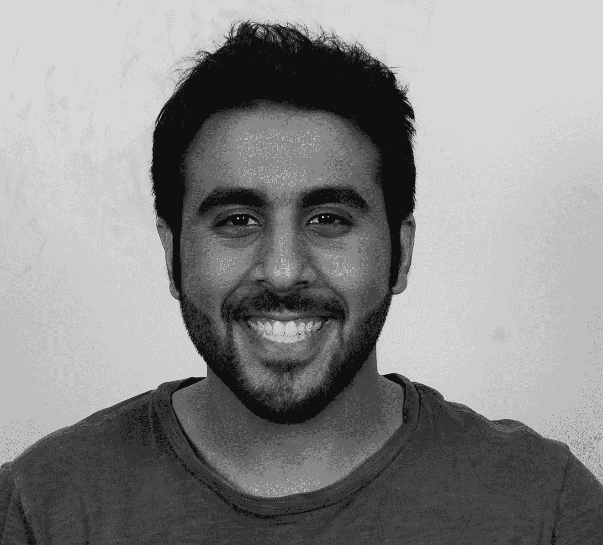
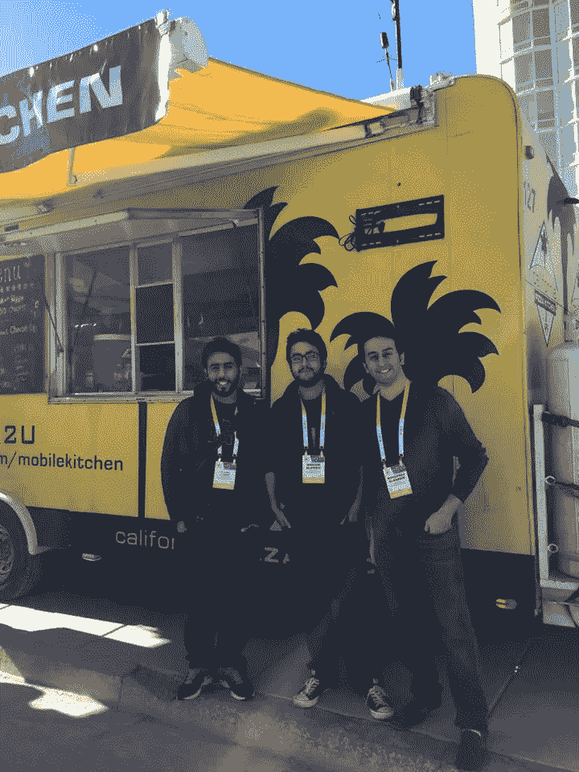

# 每周 7 天、每天 24 小时的工作日“我在淋浴下推销”——第五次采访科技创业文化

> 原文：<https://medium.com/swlh/24-7-workday-i-pitch-under-the-shower-interview-5-tech-startup-culture-e09886518421>

为了攻读 VU 阿姆斯特丹大学的人类学硕士学位，我正在旧金山进行为期三个月的实地考察，在那里我研究科技初创企业文化。通过像这样的观察、非正式谈话和采访，我试图发现创业背后人们的日常行为和动机。我的重点主要是工作-私人生活的情况以及人类和他们的业务之间的纠葛。

在我的第五次面试中，我去了外里士满，一个我还没怎么去过的地方。它靠近金门公园。我们在巴尔博亚街的一家咖啡馆见面。当我进去的时候，我注意到的第一件事是平静，背景是轻柔的音乐，几乎每张桌子上都有一个人在用笔记本电脑工作。我点的黑咖啡是迄今为止最便宜的。有一张桌子，人们在轻声交谈。这似乎是一个白天工作的好地方。

Khalid AlNasser 就住在附近，所以地理位置对他来说很好。他和其他在创业公司工作的人一起生活和工作在一所房子里。我们很快追上去。我们一周前在 [PitchForce](/swlh/the-startup-experience-watching-entrepreneurs-pitch-pitchforce-f034527ea885) 见过面。他与所有小组成员进行了一些跟进，并介绍了一些天使小组。然而，一切都还没有实现。今晚他将参加另一场 PitchForce 活动，这次是在门洛帕克。我去那里吃免费的食物。他笑了笑，然后解释说，他希望这将是有趣的，因为门洛帕克将与旧金山的活动不同。

这家创业公司是出于需要而创立的。Khalid 有医学背景。他在一家医院工作，注意到独自生活并正确服药的人有很多并发症。他们经常在阅读药物标签方面有困难，或者对他们必须服用的不同药物的数量感到困惑，这可能导致危险的错误。医院里有防止这种情况发生的系统，Khalid 申请了一项专利，将这种系统带进人们的家中。他获得了专利，从那时起，他开始获得一些资金，开发产品，全职从事这项工作。

Image provided by Khalid AlNasser

现在他们有一个飞行员要去。有很多令人兴奋的事情，产品到目前为止还在工作。在采访过程中，Khalid 的电话响了好几次。他为检查手机道歉。我问他工作多少。说实话 24/7。我知道很多人都这么说。但这是真的，作为首席执行长，没有时间限制。他在不同的时区工作，因为他来自沙特阿拉伯，这也导致他需要随时待命。

圣诞节前后，他休息了几天。这是可能的，因为当时没有多少工作在进行。对 Khalid 来说，自由时间真的取决于和他一起工作的人。他没有做太多的开发，他的大部分工作只是与人交谈。正常的一天从早上七八点左右开始。他醒来后做的第一件事是查看他的信息和电子邮件，并找出他当天要做的事情。然后他洗了个澡，在开始工作前泡了些茶。他们在车库里工作，车库被改造成了工作室，客厅的一部分被改造成了办公室。晚上 7、8 点左右，他们开始吃饭，首席技术官是一个非常棒的厨师，为每个人准备食物。晚饭后他们是自由的，除非他们有一个真正重要的截止日期。他说，一份正常的朝九晚五的工作，我们只是延长到了 7 点或 8 点，有时我们会在晚饭后工作到午夜，几秒钟后他补充道。

Photo provided by Khalid AlNasser

当我问他能不能一天不带手机，他立刻回答说“不能”。他想了一会儿，然后说:“嗯，出于个人原因，我可以不带手机。我不是社交媒体的粉丝。这让我很焦虑。它只会把你吸进去。如果是为了商业目的，是的，我需要我的手机。

我想知道他们怎么会在旧金山。Khalid 解释说，他的表弟从 2007 年起就一直住在这里。所以当 Khalid 有了这个想法，他联系了他的表弟，从那以后，他一有空就去旧金山一起工作。当他们得到投资后，他们决定全职从事这项工作，并永久搬到这里。

他喜欢旧金山:它有很多资本和网络，是一个充满活力的创业生态系统。他确实相信人与人之间有一条鸿沟，感觉上是断开的。由于显而易见的原因，每个人都感到压力很大，而且这座城市的消费很高。每个人都在想如何度过难关，但那是我的想法。我不是专家。

除了房子里的人之外，很难找到朋友。他不上课，也不在什么地方工作。起初，他性格内向，很难与人交谈。在面试中，他开了很多玩笑。我问他是如何克服与人交谈的困难的，他回答说:我渴望与人相处。这不是一个选择，我必须这样做。我喜欢这样，”

“有一项关于老鼠的有趣研究，”他说，“他们让老鼠对可卡因上瘾。他们总是服用可卡因而不是其他任何东西，除了，他们更喜欢的多巴胺是和其他老鼠玩耍。现在，Khalid 发现与人交谈是一种解放。这真的有助于他克服恐惧和焦虑。社交是他应对压力的最好方式。

当我问事情是否失败过，他回答说这是我对失败的看法。他们遇到了很多挫折，他解释道。一开始他们认为每个人都想要这个，但现在他们更现实了。他们从原型 A 到下一个，有许多反馈回路。我们从犯下的每一个错误中吸取教训。例如，他在 PitchForce 得到的批评是，“赞美是好的，但只有批评是有成效的。它画了一条路。

他笑着说他梦想着球场。我不在淋浴时唱歌，我在淋浴时投球。他练习了很多，公司的其他人也给了很好的批评性反馈。哈立德并不害怕，他知道这不是个人恩怨。去球场比赛是非常重要的，因为如果他只在家里练习，他们就会呆在泡泡里。第三方意见很重要。他试图每周至少投球一次。大多数时候他都会被邀请。他警告我有一些抢现金的事件。他说，另外，我认为投资者不会喜欢你花 150 美元去推销。'

Photo provided by Khalid AlNasser

对 Khalid 来说，创业经历是基于问题的学习。处理你试图解决的问题，尽可能多地与人交流。你的网络是解决问题的一部分。愿景也是解决问题的一部分，如果你不知道你要去哪里，你什么也解决不了。湾区的人们非常乐于助人。

哈立德将创业经历与《星球大战》进行了比较，因为它也有黑暗的一面。有人在撒谎，他给我举了一个著名的 Fyre Festival 的例子(这是一部关于网飞的纪录片，我在采访后两天看了)。有些人是非常恶意的，在那里欺骗人们。或者硬币的另一面，人们不想欺骗别人，但相信他们是每个人的救世主。谷中有些人有成熟的优越感。哈立德承认，有时他甚至会为此而挣扎，但之后他会后退一步并记住:“我花了一段时间才走到今天，我不是什么特别的人。”

在你成功之前，有一种巨大的造假文化。这是非常有害的。人们说他们有 A，B，C 在进行，而他们离它很远。作为一个不是来自湾区的人，Khalid 觉得他必须超级透明，并且比那些获得交易的人更努力，因为他们是哈佛或斯坦福团队。

他认为，创业文化中的精疲力竭就像任何其他工作一样:如果你工作太多，而且没有太多的前景，你就会精疲力竭。他说，无止境的工作会导致精疲力竭，人们需要有所期待。我问他是否有过倦怠。哦，我明白了。“有几次，”现在他不再接近精疲力竭，这主要是因为他的伟大团队。

五年后，哈利德认为自己是“亿万富翁！”他笑着说，“不，我在开玩笑。”如果他在这家公司获得成功，他会乐意投资其他公司。他想投资于帮助人们的事情。例如，他真的想投资骨髓移植。世界上有很多孩子应该更好地接触捐赠者，并全面了解人们可以如何提供帮助。

面试后，我得到一个消息，面试感觉不太好。他想补充更多关于联合创始人的内容，因为他们是他的故事中不可或缺的一部分。所以我被邀请去他们的创业公司，和他们交谈。这里看采访[。](/swlh/living-in-your-office-tech-startup-culture-interview-7-cbb8a2374092)

薇薇恩·施罗德
推特 领英

